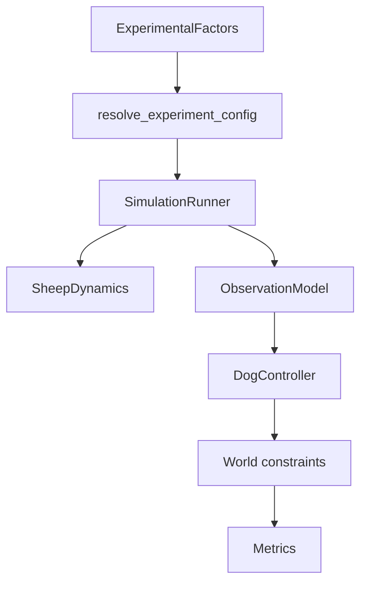

# HerdSim: clean herdability platform architecture

## Verdict on the suggestion

The research framing is sound. Adopt the thesis:

> What makes a flock herdeable, and how robust are shepherding strategies when classical assumptions are relaxed?

Keep Strombom / Kubo / Jadhav as **experimental instruments** (Layer 1 reproduction + Layer 2 benchmark). Build Layer 3 (discovery) on a **clean** core, not on compatibility layers.

## Clean-cut decision (no legacy)

**Do not** keep dual APIs, adapters, optional hooks, or "bundle wrappers" that preserve `BaseAlgorithm.step(full_state, config)`.

**Do** replace the contract in one coordinated redesign:

- Delete the monolithic algorithm step as the engine entrypoint.
- Migrate every shipped controller onto the new interfaces.
- Update docs and tests in the same change sets so they describe only the live API.
- Prefer extraction and shared helpers over copy-paste forks.
- Remove dead packages, unused config keys, and obsolete tests once callers are gone.

Behaviour fidelity for paper models is enforced by **tests**, not by leaving old code paths alive.

---

## Current blockers (why a clean cut)

| Problem | Today | After redesign |
|---------|-------|----------------|
| Global-only control | `step(SimulationState, config)` sees everything | Controllers receive `ShepherdObservation` only |
| Bundled physics + policy | One plugin owns sheep + dogs | Orthogonal `SheepDynamics` x `DogController` |
| Plugin explosion | `heterogeneous`, `strombom_noise` as separate algos | Flock / noise **factors** on shared Strombom dynamics + controller |
| Flat config + 2-param sweep | [`api/benchmark_sweep.py`](api/benchmark_sweep.py) | `ExperimentalFactors` + factor grids |
| Docs drift risk | Architecture describes algorithm plugins only | Docs describe factors + tick pipeline only |

---

## Design principles

- **One contract:** engine calls only the new pipeline; no fallback to full-state controllers.
- **DRY:** shared sheep/dog math lives once under `core/` or `dynamics/` / `controllers/`; plugins are thin registrations + paper default factor sets.
- **No dead code:** delete superseded packages (`algorithms/heterogeneous/` as a fork, unused Kubo `use_advanced_vision`, etc.) when logic is absorbed into factors or shared modules.
- **Factors are the experiment API:** Arena, REST, CLI, and benchmarks all resolve through the same factor schema.
- **Docs = code:** every public module mentioned in [`docs/architecture.md`](docs/architecture.md) exists; removed APIs are not documented.
- **Tests = code:** goodpath / correctness / smoke target new types; remove tests that only assert deleted registries or old `BaseAlgorithm` shapes.
- **Determinism:** all randomness via `state.rng`.
- **Metrics unchanged in role:** algorithm-agnostic, after obstacle/wall resolution.

---

## Target architecture



### Canonical tick

```text
state(t)
  -> apply_environment_updates(state, env_factors)   # e.g. moving goal
  -> sheep_dynamics.step(state, dynamics_cfg)
  -> for each active dog: obs_i = observation.observe(state, i, obs_cfg)
  -> dog_controller.step(state, observations, ctrl_cfg)
  -> resolve obstacles / walls
  -> metrics(state(t+1))
```

### Core interfaces (replace `BaseAlgorithm`)

New modules (names illustrative; keep package layout consistent with repo style):

- [`core/experimental_factors.py`](core/experimental_factors.py) -- typed factor groups + validation
- [`core/sheep_dynamics.py`](core/sheep_dynamics.py) -- `BaseSheepDynamics`
- [`core/observation.py`](core/observation.py) -- `BaseObservationModel`, `ShepherdObservation`
- [`core/dog_controller.py`](core/dog_controller.py) -- `BaseDogController`
- Registries: dynamics, observation modes, controllers (replace single algorithm registry as the *engine* selector)

[`core/simulation_runner.py`](core/simulation_runner.py) constructs dynamics + observation + controller from factors.

[`core/base_algorithm.py`](core/base_algorithm.py) is **removed** once migration completes (or reduced to a docs-only historical note -- prefer delete).

### Factor groups (sole config surface)

- **Flock:** `n_sheep`, `initial_layout`, `initial_spread`, `stubborn_fraction`, `stubborn_rs_scale`, ...
- **Shepherds:** `n_shepherds`, per-dog or shared speed, `failure_mode` / failure schedule, active mask
- **Observation:** `obs_mode` (`global` | `local_positions` | `bearing_only`), `sensing_range`, `noise_sigma`, `comms` (none initially)
- **Environment:** existing world keys + `goal_mode` (`static` | `moving`)
- **Dynamics:** `sheep_model` (`strombom` | `kubo` | `jadhav`)
- **Controller:** `dog_controller` (`collect_drive` | `kubo_forces` | `v_formation` | `obstacle_aware_drive`, ...)

Paper / teaching presets become **named factor bundles** (e.g. `preset=strombom_2014`), not alternate config pipelines.

---

## Plugin consolidation (remove duplication)

| Today | After |
|-------|--------|
| `strombom` | `sheep_model=strombom` + `dog_controller=collect_drive` |
| `strombom_multi` | same + multi-dog assignment as controller variant or factor `assignment=multi` |
| `strombom_noise` | same + `noise_strength` flock/dynamics factor (delete separate package) |
| `heterogeneous` | same + `stubborn_fraction` (delete separate package) |
| `flocking_dog` | `sheep_model=jadhav` + `dog_controller=collect_drive` |
| `kubo` | `sheep_model=kubo` + `dog_controller=kubo_forces` |
| `v_formation` | `sheep_model=strombom` + `dog_controller=v_formation` |
| `obstacle_aware` | `sheep_model=strombom` + `dog_controller=obstacle_aware_drive` |

Shared Collect/Drive heuristics stay in one place ([`algorithms/strombom/heuristics.py`](algorithms/strombom/heuristics.py) or moved under `controllers/collect_drive/`). Sheep force/heading updates live once per sheep model.

Frontend algorithm picker becomes a **preset / instrument** picker that sets factor bundles; advanced UI can expose factor axes directly over time.

---

## Implementation phases (still sequenced, but each leaves the tree clean)

### Phase A -- Core contracts + runner

1. Introduce factors, dynamics, observation, controller interfaces.
2. Rewire `SimulationRunner` to the canonical tick.
3. Migrate Strombom sheep + Collect/Drive and Kubo pair first (minimum vertical slice).
4. Delete `BaseAlgorithm.step` usage from runner; fail CI if any plugin still subclasses the old base.

### Phase B -- Finish migration + delete dead code

1. Port Jadhav sheep, V-formation, obstacle-aware drive.
2. Fold noise + stubbornness into factors; delete `strombom_noise` and `heterogeneous` packages.
3. Update API routers, session manager, Arena/Analytics param plumbing to factors/presets.
4. Grep-remove dead keys (`use_advanced_vision` if still unused), unused imports, orphaned `info.json` entries.

### Phase C -- Observation modes + agent/env factors

1. Implement all `obs_mode` values; every dog controller consumes `ShepherdObservation` only (even `global` is an observation object, not raw `SimulationState`).
2. Dog active mask + failure factor; moving goal update hook.
3. Extend state schema once for per-sheep / per-dog attributes (no parallel metadata-only and typed systems -- pick one structured approach and use it everywhere).

### Phase D -- Factor grids + discovery scripts

1. Replace 2-param sweep with allowlisted factor grids (cell cap for safety).
2. Add `scripts/run_factor_grid.py`; keep `run_fair_compare.py` as a thin preset over the same factor runner (no duplicated trial loop).
3. First discovery grids: N x M herdability, sensing degradation, stubborn fraction.

### Phase E -- Docs and tests lockstep

Done **throughout** A--D, not as an afterthought:

**Docs to rewrite to the new model only:**

- [`docs/architecture.md`](docs/architecture.md) -- tick pipeline, factors, three plugin kinds
- [`README.md`](README.md) -- platform thesis + how to run factor experiments
- [`docs/research/comparison_framework.md`](docs/research/comparison_framework.md) -- Layer 2 fair compare + Layer 3 factor grids
- [`docs/research/related_work.md`](docs/research/related_work.md) -- instruments + open questions (herdability, information, heterogeneity)
- [`docs/research/algorithms/README.md`](docs/research/algorithms/README.md) -- map to sheep_model x dog_controller (rename path/docs if packages move)
- User / developer guides that mention `BaseAlgorithm` or algorithm-only registration

**Tests:**

- Correctness: sheep model and controller unit tests; observation purity tests
- Fidelity: known-config / paper-ish regressions for Strombom, Kubo, Jadhav under `obs_mode=global`
- Goodpath: factor resolve, factor grid, fair compare via shared runner
- Smoke: API create/step with presets
- Delete tests that import removed algorithm ids or old base class

Update [`.cursor/plans/herding_algorithm_roadmap.plan.md`](.cursor/plans/herding_algorithm_roadmap.plan.md) to point at this architecture (no conflicting "BaseAlgorithm forever" guidance).

---

## Discovery experiments (after clean stack)

| Experiment | Factors | Outcomes |
|------------|---------|----------|
| Herdability phase diagram | `n_sheep` x `n_shepherds` | P(success), ticks, fragmentation |
| Sensing degradation | `obs_mode` x `noise_sigma` | P(success), path |
| Heterogeneity threshold | `stubborn_fraction` | P(success), fragmentation |
| Dog failure | `failure_mode`, M | post-failure success |
| Generalization | scenario holdout set | generalization gap |

No new paper ports (FAT / Li / RL) until this stack is stable.

---

## Explicit non-goals

- No legacy adapter layer, dual `step` APIs, or temporary "algorithm bundle" wrappers left in tree.
- No FAT / Li / RL implementation in this redesign.
- No physical-robot Level 5.
- No herdability theory certificates; empirical grids only.
- No drive-by unrelated refactors outside the migration path.

---

## Realism ladder (after redesign)

| Level | Status |
|-------|--------|
| 0--1 Abstract / behavioural | Strombom + Kubo dynamics/controllers |
| 2 Heterogeneous | Flock + shepherd factors |
| 3 Partial observation | `ObservationModel` modes |
| 4 Empirical sheep | Jadhav as `sheep_model` |
| 5 Physical robot | Out of scope |

---

## Why clean-cut instead of adapters

Adapters double the surface area (old + new), invite dead code, and force docs/tests to explain two worlds. A single coordinated migration costs more upfront but yields one DRY pipeline, one factor API, and documentation that matches what researchers actually run.
