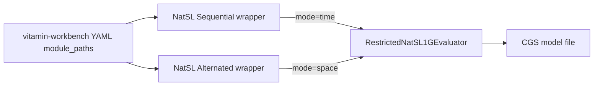

# Adapt workbench to Marco’s NatSL PR (and trim compat)

## Verification of Marco’s changes (done in planning)

### Algorithm / fixtures: correct

Ran locally on current `main`:

- `pytest model_checker/tests/unit/algorithms/natsl/ model_checker/tests/integration/algorithms/natsl/` → **18 passed**
- Broader NatSL/CGS-related parser smoke → **141 passed** (filtered)
- Fixture smokes under `model_checker/tests/fixtures/CGS/NatSL/` match documented verdicts:

| Model | Formula | Result |
|-------|---------|--------|
| `restricted_two_agent.txt` | `E{1}xA{1}y:(x,1)(y,2)Fgoal` | True |
| `bounded_opponent.txt` | `E{1}xA{1}y:(x,1)(y,2)Fgoal` | True |
| `bounded_opponent.txt` | `E{1}xA{2}y:(x,1)(y,2)Fgoal` | False |
| `bounded_controller.txt` | `E{1}x:(x,1)Fgoal` | False |
| `bounded_controller.txt` | `E{2}x:(x,1)Fgoal` | True |
| `logistics_robot.txt` | `E{2}xE{1}zA{1}y:(x,1)(z,3)(y,2)Foptimal` | True |

Conclusion: the restricted NatSL[1G] checker and test fixtures are good enough to ship **after** the release gates below.

### Runnable `examples/NatSL/`: bug to fix before release

All four example models use the misspelled header `Unkown_Transition_by` instead of `Unknown_Transition_by`. The CGS parser does not recognize that section, so following lines are swallowed into `Transition` and loading fails with inhomogeneous matrix errors. Fixtures already have the correct spelling.

**Release gate:** fix `examples/NatSL/*.txt` (prefer sync from fixtures), re-smoke the formulas in `formulas.txt` / `logistics_robot.formula.txt`, then promote the release.

## What Marco changed (PR #6, merged into vitamin-model-checker)

PR `#6` (`MarcoAruta/feat/natsl-restricted-1g` → `main`, merge `f12e0f8`). Still tagged **`[Unreleased]`**; package version remains **`1.6.3`**.

Core behavior change:
- New shared engine: [`model_checker/algorithms/explicit/NatSL/core.py`](file:///home/quyen/vitamin-model-checker/model_checker/algorithms/explicit/NatSL/core.py) (`RestrictedNatSL1GEvaluator`)
- [`Alternated/natSL.py`](file:///home/quyen/vitamin-model-checker/model_checker/algorithms/explicit/NatSL/Alternated/natSL.py) / [`Sequential/natSL.py`](file:///home/quyen/vitamin-model-checker/model_checker/algorithms/explicit/NatSL/Sequential/natSL.py) are thin wrappers (`mode="space"` / `"time"`)
- Parser rewritten to regex + dataclasses (`parse_formula` → `NatSLFormula`); PLY path gone
- Mixed `E* A*` prefixes evaluated with **ordered** quantification (no NatATL split)
- Exact action pruning (no idle repair)
- Goals: `F` / `G` / `X` (±neg); multi-char strategy vars and propositions
- **Closed bindings**: every model agent exactly once

Public entry points workbench already uses are unchanged:
- `NatSL_Sequential` → `...Sequential.natSL:model_checking`
- `NatSL_Alternated` → `...Alternated.natSL:model_checking`
- Parser entry still `NatSLParser`



## Result shape decision: keep `Satisfiability`, also emit standard `res` / `initial_state`

### Why `Satisfiability` was used (and it is a good reason)

NatSL (like NatATL / NatATLF / LTL Nash helpers) answers a **strategy-existence decision**, not a CTL-style “set of states where φ holds”:

- Old NatSL returned only `{"Satisfiability": bool}` because the algorithm’s native answer is yes/no (a winning strategy profile exists or not).
- Marco kept that key and added diagnostics (`Mode`, `Decisive assignment`, counters).
- The same pattern is documented for NatATL: *“boolean `Satisfiability` plus `res` / `initial_state` (not a full CTL-style winning-set report)”* ([`docs/NatATL/algorithm.md`](file:///home/quyen/vitamin-model-checker/docs/NatATL/algorithm.md)).
- NatATL Memoryless/Recall already implement the dual contract explicitly:

```68:72:model_checker/algorithms/explicit/NatATL/Memoryless/solver.py
    # Add standard result fields for backend compatibility
    initial_state = cgs.initial_state if hasattr(cgs, "initial_state") else "s0"
    is_sat = result.get("Satisfiability", False)
    result["res"] = f"Result: {is_sat}"
    result["initial_state"] = f"Initial state {initial_state}: {is_sat}"
```

So the gap is not that `Satisfiability` is wrong — **NatSL never got the NatATL-style backend-compatibility fields**. Inventing a fake winning-state set would be less honest than `Result: True/False`.

### Chosen approach (match NatATL)

In NatSL `core.run()` (or Sequential/Alternated wrappers), **keep** `Satisfiability` and NatSL stats, **and add**:

```python
result["Satisfiability"] = satisfiable
result["res"] = f"Result: {satisfiable}"
result["initial_state"] = f"Initial state {initial}: {satisfiable}"
# Mode, Decisive assignment, counters remain extra keys
```

Effects:
- **Model-checker consumers / experiments** that read `Satisfiability` keep working (`experiments/natsl/run.py`, NatSL tests).
- **Workbench HTTP execute** needs **no Satisfiability special-case**: executor already accepts any `res` starting with `Result:` and reads True/False from `initial_state` (same path as NatATL today).
- Optional later: copy `Satisfiability` / decisive assignment into `ModelCheckResult.metadata` for richer UI — not required for contract compatibility.

**Do not** replace `Satisfiability` with a fake state-set `Result: {s0}`. Prefer NatATL’s `Result: True/False`.

Update NatSL tests to assert **both** `Satisfiability` and `res`/`initial_state`. Workbench examples helper can keep preferring `Satisfiability` when present (already does) or rely on `initial_state` — either is fine once dual keys exist.


## Critical semantic mismatch (workbench is wrong today)

| Topic | Old workbench assumption | New checker |
|-------|--------------------------|-------------|
| `E{2}x` | “agents in `{2}`” / agent id in braces | **strategy-complexity bound** `k=2` on variable `x` |
| Bindings | Often only one agent on a 2-agent model | Must bind **every** model agent exactly once |
| Goals | Only `F` / `!F`; props `a`–`h` | `F`/`G`/`X`; multi-char props like `goal` |
| Checking | “reduce to NatATL subproblems” | Direct restricted NatSL[1G] enumeration |

Concrete breakage: workbench examples like `E{2}x:(x,1)F p` on a 2-agent CGS will raise closed-binding errors; generation guides emit the same pattern.

## Backward compatibility in model-checker — what can go

**Keep (public API, not optional shims):**
- `Alternated` / `Sequential` wrappers + entry-point names (workbench YAML depends on them)

**Safe to remove after workbench stops relying on them (recommended cleanup in a follow-up model-checker PR):**
- Orphaned pre-PR algorithm: `shared_recall.py`, largely unused `conversion.py` / `utils.py`, leftover PLY `generated/`
- Narrow translation helpers: `convert_natsl_to_natatl*`, no-op `skolemize_formula`
- Tuple-AST helpers only used by old callers (`do_parsingNatSL`, etc.) once nothing imports them

**Migrate then remove:**
- [`NatSLParser`](file:///home/quyen/vitamin-model-checker/model_checker/parsers/formulas/NatSL/parser.py) wrapper that (1) rewrites spaced `E x` → `E{1}x` and (2) returns legacy `(quantifiers, bindings, temporal)` tuples
- Workbench validation only needs `parsed is not None` + `ast_to_dict`; today the tuple AST serializes poorly. Switch factory/`NatSLParser.parse` to return `NatSLFormula` (or call `parse_formula` directly) and teach `ast_to_dict` dataclasses

**Do not require bound-omission forever:** `parse_formula` already defaults missing `{k}` to `1`; the spaced `E x` rewrite is the only real legacy syntax. Plan: require explicit `E{k}x` in workbench docs/UI; then drop the rewrite.

**Keep dual keys** (`Satisfiability` + `res`/`initial_state`), matching NatATL. Do not drop `Satisfiability`.

## Release step (model-checker) — only after gates

**Version: `1.6.4`** (not 1.7.0). Strict semver could argue for a minor bump (new NatSL engine + result-key change), but this repo already shipped larger Added/Changed work under `1.6.2` / `1.6.3`, so stay on the `1.6.x` line.

**Gates before promoting Unreleased:**
1. Fix `examples/NatSL/` `Unkown_Transition_by` → `Unknown_Transition_by` (sync from fixtures) and re-smoke runnable examples
2. Land NatSL dual result keys: keep `Satisfiability`, add `res` / `initial_state` (+ NatSL test updates)
3. Optional: orphan NatSL cleanup if still unused
4. Re-run NatSL unit + integration tests (expect green)

**Then cut 1.6.4:**
1. Move CHANGELOG `## [Unreleased]` NatSL notes into `## [1.6.4] - YYYY-MM-DD` (leave an empty `[Unreleased]` stub)
2. Add changelog bullets for: example typo fix; NatSL dual `Satisfiability`+`res`/`initial_state`; **removal of Sequential/Alternated** in favor of `NatSL` + `mode`
3. Bump [`pyproject.toml`](file:///home/quyen/vitamin-model-checker/pyproject.toml) `version` from `1.6.3` → **`1.6.4`**
4. Publish / tag as usual for this repo
5. Pin workbench [`pyproject.toml`](file:///home/quyen/vitamin-workbench/pyproject.toml) + [`requirements-api.txt`](file:///home/quyen/vitamin-workbench/requirements-api.txt) to `vitamin-model-checker==1.6.4`

Defer deleting `NatSLParser` tuple shim until workbench AST/validation is updated in the same coordinated cut (can be 1.6.4 or immediately after).

Do **not** release 1.6.4 while runnable `examples/NatSL/` still fail to load.

## vitamin-workbench changes required

### 1. Backend execute path

**No Satisfiability adapter in the executor.** After NatSL emits NatATL-style dual keys, [`model_checking_executor.py`](file:///home/quyen/vitamin-workbench/vitamin_api/features/model_checking/services/core/model_checking_executor.py) keeps using `res` / `initial_state` only — same as NatATL today.

Keep [`examples/helpers.extract_actual_verdict`](file:///home/quyen/vitamin-workbench/vitamin_api/tests/features/examples/helpers.py) Satisfiability branch (already correct for strategy logics).

No change needed in `checker_invoker` signature: wrappers still expose `model_checking(formula, model)`.

### 2. Examples (must-have): remove old, adopt Marco’s new ones

The current workbench NatSL demos are incorrect under the new checker (wrong bound-vs-agent meaning, incomplete bindings). **Delete them** and replace with the verified model-checker examples.

**Remove** from workbench:
- [`vitamin_api/examples/CGS/NatSL_Sequential/natsl_sequential_2agents_3states_minimal*`](file:///home/quyen/vitamin-workbench/vitamin_api/examples/CGS/NatSL_Sequential/)
- [`vitamin_api/examples/CGS/NatSL_Alternated/natsl_alternated_2agents_3states_minimal*`](file:///home/quyen/vitamin-workbench/vitamin_api/examples/CGS/NatSL_Alternated/)
- Stale README wording that shows legacy syntax / wrong semantics

**Port from** [`vitamin-model-checker/examples/NatSL/`](file:///home/quyen/vitamin-model-checker/examples/NatSL/) into a **single** workbench tree `CGS/NatSL/` (after logic collapse; see below):

| Model-checker source | Workbench pairing |
|----------------------|-------------------|
| `restricted_two_agent.txt` + `E{1}xA{1}y:(x,1)(y,2)Fgoal` | closed 2-agent shortcut (True) |
| `bounded_opponent.txt` + bound-1 / bound-2 formulas from `formulas.txt` | True then False |
| `bounded_controller.txt` + `E{1}x` / `E{2}x` formulas | False then True (1-agent model) |
| `logistics_robot.txt` + `logistics_robot.formula.txt` | 3-agent closed binding demo |

Workbench needs one model file + matching `*_formula.txt` per example id (discovery convention). Split `formulas.txt` into per-model formula files with `# True` / `# False` annotations so the examples catalog tests can verify verdicts. Update READMEs to describe complexity bounds, closed bindings, and that schedule mode does not change the verdict on these demos.

Graph/model text format stays **plain CGS** — no serializer/graph schema change for NatSL.

### 3. Docs / syntax catalogs (must-have)

Update outdated NatSL copy that still says “translate to NatATL”, “only F/!F”, “props a–h”, “`E{A}x` = agents in A”, or that Sequential cannot mix E/A:
- [`formula_syntax_docs.yaml`](file:///home/quyen/vitamin-workbench/vitamin_api/data/config/formula_syntax_docs.yaml) → single `NatSL` key
- [`logic_semantics.yaml`](file:///home/quyen/vitamin-workbench/vitamin_api/features/ai/prompts/logic_semantics.yaml)
- User-guide troubleshooting “logic variants” for NatSL
- Generation / operator blurbs if they imply agent-in-braces

### 4. Agent extraction / warnings (must-have)

[`_extract_natsl_agents`](file:///home/quyen/vitamin-workbench/vitamin_api/features/model_checking/services/utils/logic_config.py) and frontend [`extractNatSLAgents`](file:///home/quyen/vitamin-workbench/frontend/src/features/formula/business/warnings.ts) currently treat `E{2}` as agent `2`. Fix to use **binding pairs only** `(var, agent)` (and multi-char vars). Same for generation guides:

```ts
// wrong today: agent id used as bound
E{${agent}}x:(x,${agent})F prop
// correct for 2-agent closed prefix (example)
E{1}xA{1}y:(x,1)(y,2)F prop
```

### 5. Frontend (with collapse)

- One `NatSL` in `LogicType` / families / Blockly registry
- Schedule control: Space-efficient (`space`, former Alternated) vs Time-efficient (`time`, former Sequential)
- Blockly [`natslParser.ts`](file:///home/quyen/vitamin-workbench/frontend/src/features/blockly/business/textToBlockly/natslParser.ts): extend goals for `G`/`X` if needed
- [`generationGuides.ts`](file:///home/quyen/vitamin-workbench/frontend/src/features/formula/business/generationGuides.ts): closed bindings + bound ≠ agent
- **Graph designer**: still plain CGS; no incomplete-binding templates

### 5b. Rich NatSL results UI (in scope)

NatSL success payloads include diagnostics beyond the boolean verdict. Surface them in the existing verification results UI (Overview/Details), not only in raw JSON.

**Backend:** in [`model_checking_executor.py`](file:///home/quyen/vitamin-workbench/vitamin_api/features/model_checking/services/core/model_checking_executor.py) / [`create_metadata`](file:///home/quyen/vitamin-workbench/vitamin_api/features/model_checking/services/processing/result_handler.py), when the checker dict has NatSL keys, copy them into `ModelCheckResult.metadata` (keep top-level `result` / `initial_state` / `verification` as the standard contract):

- `Satisfiability`
- `Mode`, `Algorithm`, `Supported fragment`, `Backend reduction`
- `Normalized formula`, `CTL goal`
- Counters: existential candidates, universal profiles, unrestricted-opponent checks/shortcuts, complete-profile checks, inadmissible/incompatible profiles
- `Decisive assignment` (serialized strategy profile)
- `Materialized domain sizes` (time schedule only)

**Frontend:**
- Detect NatSL via `metadata.logic === "NatSL"` (or presence of `Decisive assignment` / `Mode`)
- Add a compact **NatSL analysis** block in [`ResultsDisplay`](file:///home/quyen/vitamin-workbench/frontend/src/features/verification/components/ResultsDisplay.tsx) / Details or Overview tab: verdict + mode, CTL goal reduction, decisive assignment (readable), and a small stats grid for the counters
- Keep Raw results viewer as fallback for full dump
- Unit test: enhance/display path with a fixture metadata blob

### 6. Tests

- Model-checker NatSL tests: assert both `Satisfiability` and `res` / `initial_state`
- Workbench example catalog after formula rewrite
- Keep examples helper dual verdict extraction (`Satisfiability` or `initial_state`)
- Frontend: NatSL Blockly round-trip / warnings / generation guide tests

### 7. Collapse to one `NatSL` and remove Sequential/Alternated (clean cut)

**Why safe:** Both wrappers are already thin calls into `core.model_checking(..., mode=)`. Experiments already import core. Parser/metadata already have a `NatSL` entry; only algorithm entry points are split. In-repo callers of Sequential/Alternated are tests + docs + workbench YAML.

**Model-checker (1.6.4):**
- Delete packages:
  - `model_checker/algorithms/explicit/NatSL/Sequential/`
  - `model_checker/algorithms/explicit/NatSL/Alternated/`
- Point `vitamin.algorithms` entry **`NatSL`** → `model_checker.algorithms.explicit.NatSL.core:model_checking`
- Remove entry points `NatSL_Sequential` / `NatSL_Alternated` from `vitamin.parsers`, `vitamin.algorithms`, and `vitamin.metadata`
- Rewrite [`NatSL/__init__.py`](file:///home/quyen/vitamin-model-checker/model_checker/algorithms/explicit/NatSL/__init__.py) to export `model_checking` from `core` (drop `model_checking_sequential` / `_alternated` aliases)
- Update integration tests to call `core.model_checking(..., mode="space"|"time")`
- Update [`test_model_checker_api.py`](file:///home/quyen/vitamin-model-checker/model_checker/tests/integration/interface/test_model_checker_api.py) expected module map
- Refresh API docs that mkdoc `Sequential.natSL` / `Alternated.natSL`
- Changelog: note removal of Sequential/Alternated public entry points; use `NatSL` + `mode`

Error handling that lived only in the thin wrappers (`create_error_response` on FileNotFoundError/ValueError) moves into `core.model_checking` or a single public wrapper beside core so the public API stays fail-soft like other logics.

**Workbench:**
- Single logic id **`NatSL`**
- Execute field **`schedule`**: `space` | `time` (default `space`), passed as `mode=`
- YAML `module_paths.NatSL` → `model_checker.algorithms.explicit.NatSL.core`
- Examples under `CGS/NatSL/` only; delete `NatSL_Sequential` / `NatSL_Alternated` dirs and FE/AI duplicates
- Optional one-release HTTP aliases: old logic names → `NatSL` + schedule (no MC packages required). Prefer documenting a clean break if no external clients depend on the old ids.

**Do not keep** Sequential/Alternated directories “just in case” — they add no semantics beyond `mode`.

### 8. What else does **not** need changing

- CGS graph serialize/parse pipeline (`GraphSerializerService`, model factory)
- Non-NatSL logics
- Workbench executor success contract (`Result:` prefix) once dual keys exist

## Recommended execution order

1. **Model-checker fix examples typo** + re-smoke `examples/NatSL`
2. Land NatSL dual result keys + **remove Sequential/Alternated packages**; single `NatSL` entry → core (+ tests/docs/entry points)
3. **Promote release:** CHANGELOG Unreleased → `[1.6.4]`, bump pyproject, publish/tag
4. **Workbench:** single `NatSL` + schedule; delete old NatSL_* examples/ids; port fixed MC examples; docs/agent-extraction; pin `==1.6.4`
5. Confirm example suite + HTTP execute for NatSL (both schedules); confirm rich NatSL panel shows diagnostics from metadata
6. Follow-up: remove `NatSLParser` tuple shim / spaced-bound rewrite once validation uses `NatSLFormula`

## Out of scope (intentionally not part of this work)

- **Marco’s `experiments/natsl/` and NatSL docs:** keep them. This plan only fixes broken `examples/NatSL/` models and updates workbench/docs that are wrong. We are not deleting experiment or documentation trees.
- **Dropping `Satisfiability`:** keep the NatATL-style dual contract (`Satisfiability` + `res` / `initial_state`).
