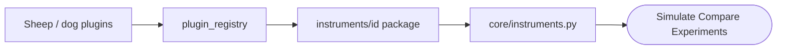

# HerdSim

HerdSim is a research platform for **multi-agent sheep herding**: a few dogs (or shepherds) guide a larger flock toward a goal under controlled, repeatable conditions. Named **instruments** (sheep + dog setups) and shared **metrics** let you measure when herding works, when it fails, and how methods compare when flock size, sensing, scenario, and seeds are held fair.

## Getting started

Requires [uv](https://docs.astral.sh/uv/) and Node.js.

```bash
make install   # Python venv via uv + frontend deps
make dev       # API + Vite together
```

Open http://localhost:5173

Useful targets: `make test`, `make help`.

## What you can do

| Feature | What it is for |
|---------|----------------|
| **Simulate** | Run one instrument live; scrub history; inspect agents; download a run report |
| **Compare** | Side-by-side A/B runs (fair shared settings, or independent) with live metric deltas |
| **Experiments** | Multi-seed batches and factor grids; charts; CSV / JSON / Markdown export |
| **NetLogo** | Open desktop NetLogo twins for instruments that have a counterpart |
| **Guide** | In-app docs: overview, instruments, scenarios, metrics, how-tos |

Larger claim-oriented **shepherding-budget** campaigns use the CLI (`make budget-help`) and `results/budget/`, separate from the Experiments tab.

## Instruments

An instrument is a ready-made `sheep_model` x `dog_controller` bundle with paper-style defaults. Pick one in Simulate, Compare, or Experiments; vary sensing, counts, noise, and other factors around it without changing the method.

| Id | Name | Role |
|----|------|------|
| `strombom` | Strombom 2014 | 50 sheep, 1 shepherd; if flock is spread, Collect the farthest straggler, else Drive from behind the flock toward the goal |
| `strombom_multi` | Strombom Multi-Dog | Same sheep rules; 3 dogs share Collect / Drive assignments instead of stacking |
| `strombom_noise` | Strombom Noise | Same as Strombom 2014 (50 sheep, 1 shepherd) but noise_strength 0.9 (vs 0.3) |
| `heterogeneous` | Heterogeneous Sheep | Strombom Collect / Drive (50 sheep, 1 shepherd); 20% stubborn sheep (weaker dog response) |
| `v_formation` | V-Formation | Strombom sheep; 2 dogs drive on a V-arc behind the flock (no classic Collect switch) |
| `obstacle_aware` | Obstacle-Aware | Strombom Collect / Drive (50 sheep, 1 shepherd); Drive target bends around obstacles / gates |
| `kubo` | Kubo 2022 | Force-based sheep and dogs (not Collect / Drive); defaults 40 sheep, 4 dogs |
| `flocking_dog` | Flocking Dog 2024 | Jadhav neighbour sheep + Collect / Drive; small flock default (14 sheep, 1 dog) |
| `fat` | FAT | Strombom sheep; 2 dogs each chase the farthest sheep they can see (local sensing) |
| `communication_free` | Communication-Free | Strombom sheep; 3 dogs; each dog Collect/Drives only from sheep it can see (no team assignment, no shared GCM/target) |
| `adaptive` | Adaptive | Strombom sheep; 2 dogs; switch by outlier count: Collect if some stragglers, Recover (stand back at 2*r_a behind flock) if many, Lead/Drive if cohesive |

### Adding an instrument

Most new instruments reuse existing sheep and dog plugins. You package defaults and metadata, then register one catalog entry; only new behaviours need a plugin implementation and registry hook first.



1. Reuse or implement plugins under `plugins/sheep/` and `plugins/dogs/`, then register them in `core/plugin_registry.py` if they are new.
2. Add `instruments/<id>/` with `info.json` and paper defaults.
3. Add a `_bundle(...)` entry to `INSTRUMENTS` in `core/instruments.py`.

Details: [docs/architecture.md](docs/architecture.md).

## How a run works

Each tick:

```text
environment -> sheep motion -> observation -> dog decisions
  -> constraints / walls -> metrics
```

You choose an **instrument**, a **scenario**, a **seed**, and optional **factors**. Same instrument + scenario + seed replays the same way.

Hard conditions that always apply: rectangular arena with wall bounce (Drive to Goal default 150 x 150, goal radius 15; not an open field), solid obstacles when the scenario has them, a max-tick timeout (3000 on Drive to Goal; other scenarios differ), and scenario-defined success. Details: in-app Guide under Overview and Environment.

## Project layout

- `core/`: engine, factors, instrument catalog
- `plugins/`: sheep, dogs, scenarios, metrics
- `instruments/`: named packages (`info.json`, paper defaults)
- `api/`: HTTP and WebSocket for the UI
- `services/`: Experiments engine and budget campaign runners
- `frontend/`: Vite app
- `docs/`: architecture and Guide pages
- `integrations/`: NetLogo and MATLAB references
- `configs/budget/`, `scripts/budget/`, `results/budget/`: budget campaigns

## Shepherding-budget campaigns

```bash
make budget-help
# or: make -f Makefile.budget help
```
