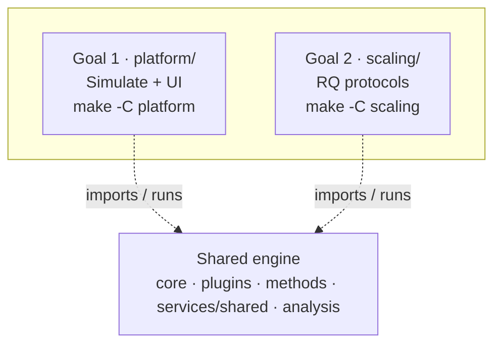

# HerdSim

HerdSim is a research platform for multi-agent sheep herding. A few dogs (or shepherds) try to guide a larger flock toward a goal, under conditions you can control and repeat.

The point of the platform is fairness and comparison. You pick a named setup (a method: how the sheep move plus how the dogs decide), put it in a scenario, fix a random seed, and measure what happens with shared metrics. That way you can see when herding works, when it fails, and how methods compare when flock size, sensing, and other settings are held fair.

HerdSim has **two goals** on one shared engine:

1. **Simulate + frontend** (`platform/`) -- interactive UI: Simulate, Compare, Experiments, NetLogo, Guide.
2. **Scaling research** (`scaling/`) -- CLI protocols that answer the scaling / control-demand research questions.

## Getting started

You need [uv](https://docs.astral.sh/uv/) and Node.js.

```bash
make install   # Python environment via uv, plus frontend dependencies
make dev       # API and Vite together
```

Then open http://localhost:5173 in your browser.

Other useful targets: `make test`, `make help`, and `make scaling-help`.

## What you can do

The web app has several tabs:

- **Simulate.** Run one method live. Scrub through history, inspect agents, and download a run report.
- **Compare.** Run two setups side by side. You can keep settings matched (fair A/B) or let each side differ. Metric deltas update as the runs go.
- **Experiments.** Run multi-seed batches and factor grids. Look at charts, then export CSV, JSON, or Markdown.
- **NetLogo.** For methods that have a desktop twin, open the NetLogo model from here.
- **Guide.** In-app documentation: overview, methods, scenarios, metrics, and how-tos.

Larger claim-oriented scaling protocols live outside the Experiments tab. They use the CLI (`make scaling-help`) and write under `scaling/results/`.

## Methods

A method is a ready-made sheep plus dog package with paper-style defaults. You pick one in Simulate, Compare, or Experiments. Around that package you can still change sensing, counts, noise, and other factors.

For the glossary (Collect, Drive, inertia, arena, timeout, and more), open the in-app Guide, Overview, then Terms.

Here are the methods currently in the catalog.

| ID | Name | Defaults |
|----|------|----------|
| `strombom` | Strombom 2014 | 50 sheep, 1 shepherd |
| `strombom_multi` | Strombom Multi-Dog | same sheep rules, 3 dogs |
| `strombom_noise` | Strombom Noise | same as 2014, noisier motion |
| `heterogeneous` | Heterogeneous Sheep | 50 sheep, 1 shepherd |
| `v_formation` | V-Formation | Strombom sheep, 2 dogs |
| `obstacle_aware` | Obstacle-Aware | 50 sheep, 1 shepherd |
| `fat` | FAT | Strombom sheep, 2 dogs |
| `communication_free` | Communication-Free | Strombom sheep, 3 dogs |
| `adaptive` | Adaptive | Strombom sheep, 2 dogs |
| `kubo` | Kubo 2022 | 40 sheep, 4 dogs |
| `flocking_dog` | Flocking Dog 2024 | 14 sheep, 1 dog |

### What each method does

**Strombom family** (Collect / Drive sheep unless noted)

- **`strombom`** : If the flock is spread out, Collect the farthest straggler. If it is tight, Drive from behind toward the goal.
- **`strombom_multi`** : Same sheep rules as Strombom 2014. The dogs share the work (who Collects which sheep, where to Drive) so they do not all pile on the same spot.
- **`strombom_noise`** : Same rules and counts as Strombom 2014, but stress-tested: heading noise is tripled (0.9 instead of 0.3) and inertia is lowered (0.3 instead of 0.5). Agents keep less memory of their previous facing, jitter more, and smooth the wobble less.
- **`heterogeneous`** : Same Collect / Drive as Strombom 2014. At the start of the run, 20% of sheep are marked stubborn and then feel only about 25% of the usual push from the dog for the whole trial. The shepherd does not know which sheep those are.
- **`v_formation`** : Dogs stay on a V-shaped arc behind the flock and Drive. They do not switch into classic Collect of a single straggler.
- **`obstacle_aware`** : Same Collect / Drive as Strombom 2014, but when Driving the aim point bends around walls, obstacles, or a gate instead of pointing straight through them.
- **`fat`** : Each dog only uses sheep it can see locally, and always heads for the farthest visible sheep (no Collect / Drive mode switch).
- **`communication_free`** : Each dog runs Collect / Drive using only the sheep it can see. Dogs do not share a common target or tell each other who is Collecting what.
- **`adaptive`** : Each tick counts how many sheep are far from the group centre. A few stragglers: Collect. Many stragglers: Recover (stand farther back behind the whole flock to press it together). Tight flock: Lead ahead toward the goal, or Drive from behind if leading is off.

**Other sheep physics**

- **`kubo`** : Sheep and dogs move by continuous forces (attraction, repulsion, goal pull), not Collect / Drive modes.
- **`flocking_dog`** : Sheep use neighbour-based flocking. The dog still uses Collect / Drive and slows when already inside the group.

### Adding a method

Most new methods reuse existing sheep and dog plugins. You package defaults and metadata, then register one catalog entry. Only new behaviours need a plugin implementation and a registry hook first.

Flow in short:

1. Sheep and dog plugins live under `plugins/sheep/` and `plugins/dogs/`. Register new ones in `core/plugin_registry.py`.
2. Those plugins are packaged as `methods/<id>/` with `info.json` and paper defaults.
3. Add a `_bundle(...)` entry to `METHODS` in `core/methods.py`.
4. The catalog then shows up in Simulate, Compare, and Experiments.

More detail: [docs/architecture.md](docs/architecture.md).

## How a run works

Each tick follows the same loop:

```text
environment -> sheep motion -> observation -> dog decisions
  -> constraints / walls -> metrics
```

You choose a method, a scenario, a seed, and optional factors. Same method, scenario, and seed replay the same way.

Hard conditions that always apply:

- A rectangular arena with wall bounce. Drive to Goal defaults to 150 x 150 with goal radius 15 (not an open field).
- Solid obstacles when the scenario has them.
- A max-tick timeout (3000 on Drive to Goal; other scenarios differ).
- Scenario-defined success.

Details live in the in-app Guide under Overview and Environment.

## Project layout



| Area | Path | Entry |
|------|------|-------|
| Shared engine | `core/`, `plugins/`, `methods/`, `integrations/`, `services/shared/`, `analysis/` | used by both goals |
| Goal 1 -- Simulate + UI | `platform/` | `make install` / `make dev` |
| Goal 2 -- scaling RQs | `scaling/` | `make scaling-help` |
| Cross-cutting docs | `docs/architecture.md`, `docs/papers/` | engineering overview + PDFs |
| Tests | `tests/` | `make test` |

Rule of thumb: the UI **Experiments** tab is for interactive batch studies. Claim-oriented scaling protocols use `scaling/` and write under `scaling/results/`.

## Scaling protocols

```bash
make scaling-help
# or: make -C scaling help
```
