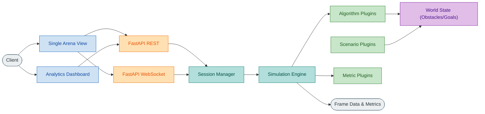
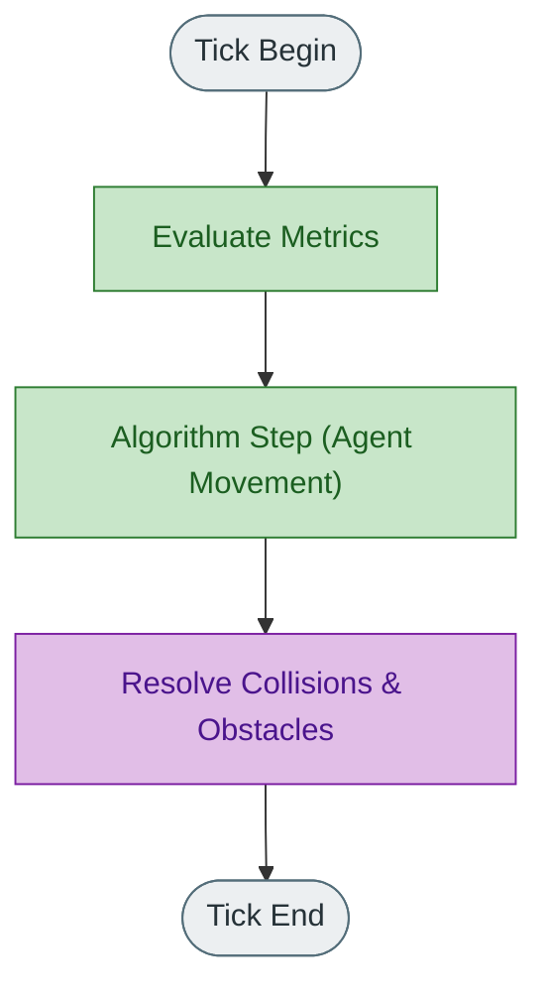

# HerdSim Architecture & Design

Welcome to the HerdSim architecture documentation. This document serves as the single source of truth for the system architecture, core simulation loop, codebase organization, and instructions for extending the platform with new plugins.

## 1. Introduction & Background

HerdSim is a highly modular platform for simulating and analyzing agent-based herding and flocking behaviors. By decoupling the simulation engine from the specific algorithmic logic and the frontend presentation layer, HerdSim provides a flexible environment to test different theories of collective motion.

The platform is designed to allow researchers and developers to compare the behaviors of different herding models (e.g., Strombom, Kubo, and standard flocking models) under identical conditions, providing analytical metrics on herd cohesion, target acquisition, and obstacle avoidance.

## 2. Design Requirements

The system is built around several core requirements:
- **Modularity:** Algorithms, scenarios, and metrics must be plug-and-play without requiring modifications to the core engine.
- **Reproducibility:** The simulation must execute in discrete, deterministic ticks so that identical starting states yield identical outcomes.
- **Scalability:** The engine must efficiently handle large numbers of agents (sheep and shepherds).
- **Separation of Concerns:** The backend is solely responsible for state and simulation logic, while the frontend handles rendering and user interaction.

## 3. HerdSim Architecture

HerdSim is built as a decoupled system: a Python-based simulation engine backend and a JavaScript/PixiJS frontend. The backend handles the heavy lifting of the tick-based simulation, while the frontend handles rendering and user interaction via REST and WebSockets.

### High-Level Data Flow

The following diagram illustrates how the frontend interacts with the backend components, and how the simulation runner drives the various plugins.



## 4. The Simulation Engine

The core of HerdSim is the simulation runner (`core/simulation_runner.py`). It manages the state of the world and advances the simulation in discrete time steps (ticks).

### Tick Lifecycle

During each tick, the engine guarantees a strict execution order to ensure reproducible and deterministic behavior:



Algorithms are responsible for calculating intent (velocity vectors for sheep and shepherds). The engine applies obstacle resolution and environment constraints *after* the algorithm has run, ensuring agents don't move out of bounds or overlap illegally.

### Configuration & Overrides

Simulation configurations are layered. When a new simulation session starts, the engine merges configs in the following priority (highest to lowest):

1. **User Overrides**: Explicit parameters passed via the API (e.g., custom sheep count, specific algorithm params).
2. **Scenario Defaults**: The scenario plugin can dictate specific agent counts or world layouts.
3. **Paper/Preset Defaults**: Replications of research papers often define specific parameters.
4. **Algorithm Defaults**: Fallback parameters defined by the algorithm implementation.
5. **Global Shared Defaults**: Base world settings defined in `core/shared_defaults.py`.

## 5. The Algorithm Interface

HerdSim is designed around a plugin architecture. Algorithms control the behavior of the agents (sheep and shepherds).

### Deep dive into implemented families
HerdSim currently integrates several herding models, which act as discrete algorithm plugins:
- **Flocking (Dog/Sheep):** Classic boids-based models utilizing separation, alignment, and cohesion.
- **Kubo:** Focuses on specific mathematical abstractions of sheep-dog interaction.
- **Strombom:** A robust, biologically-inspired model modeling how a shepherd drives a cohesive group toward a target.

### Adding an Algorithm
- Subclass `core.base_algorithm.BaseAlgorithm`.
- Implement the `step(self, state)` method.
- Register your algorithm in `algorithms/registry.py`.
- Define any custom configuration parameters in your algorithm's `default_config`.

## 6. Scenarios and Environments

Scenarios define the initial state of the world, such as arena boundaries, obstacles, targets, and starting positions of agents. 

### Adding a Scenario
- Subclass `core.base_scenario.BaseScenario`.
- Implement `create_world()` and `initial_positions()`.
- Register the scenario in `scenarios/registry.py`.

## 7. Metrics & Analytics

Metrics evaluate the state of the simulation at each tick (e.g., center of mass, success conditions, agent stress).

### Adding a Metric
- Subclass `core.base_metric.BaseMetric`.
- Implement the evaluation logic using the current state.
- Register it in `metrics/registry.py`.

## 8. Implementation Details

- **`api/`**: FastAPI routers, REST endpoints, and WebSocket session handlers.
- **`core/`**: The simulation engine, base classes (e.g., `BaseAlgorithm`), state definitions, and config resolution.
- **`algorithms/`**, **`scenarios/`**, **`metrics/`**: Plugin directories. Each implements specific interfaces defined in `core/`.
- **`frontend/`**: Vanilla JavaScript SPA using Vite. The main view router is in `src/main.js`. Rendering is handled by PixiJS.
- **`docs/`**: Project documentation (this architecture guide).
- **`tests/`**: Pytest suite for the backend and Node tests for the frontend.

## 9. End-to-End Workflows

### Development Workflow: Starting the Stack
```bash
# 1. Install all dependencies (Python 3.10+ and Node.js required)
make install

# 2. Start both the FastAPI backend and Vite dev server
make dev
```

### Running Tests
Ensure changes don't break determinism or core logic.
```bash
# Run backend and frontend tests (excludes heavy stress tests)
make test
```
