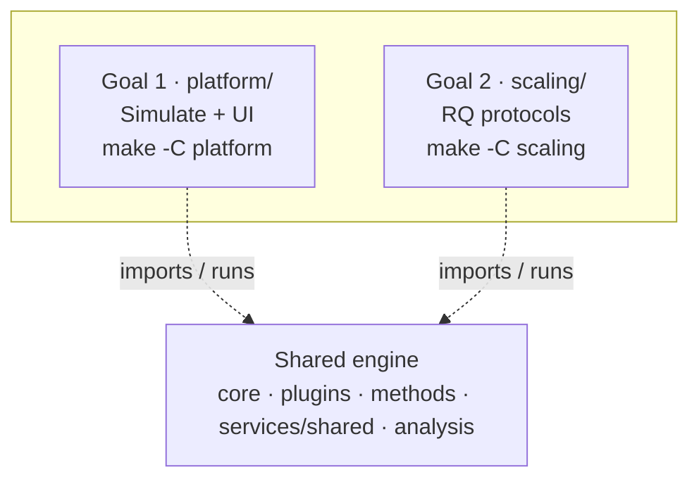

# HerdSim Architecture and Design

HerdSim is a factor-based platform for simulating and analyzing multi-agent shepherding. The engine separates sheep dynamics, shepherd observation, and dog control so experiments can vary information, heterogeneity, environment, and controller architecture independently.

## Design requirements

- **Modularity.** Sheep models, dog controllers, observation modes, scenarios, and metrics plug in without rewriting the runner.
- **Reproducibility.** Discrete deterministic ticks with seeded random number generation (RNG).
- **Factorial experiments.** Herdability and sensing studies are first-class factor grids.
- **Separation of concerns.** Backend owns state and logic. Frontend owns rendering.

## High-level data flow


## Tick lifecycle

```text
state(t)
  -> environment updates (moving goal)
  -> failure factors
  -> sheep_dynamics.step
  -> observation.observe_all
  -> dog_controller.step(observations)
  -> robot constraints
  -> resolve obstacles/walls
  -> metrics(state(t+1))
```

## Experimental factors

Defined in `core/experimental_factors.py`:

- Flock: `n_sheep`, layout, cohesion, stubborn fraction
- Shepherds: `n_shepherds`, speed scale, failure mode, kinematic limits
- Observation: `obs_mode`, sensing range, noise, communication
- Environment: world keys, `goal_mode`
- Model: `sheep_model`, `dog_controller`, scenario, preset

Named methods in `core/methods.py` are factor bundles (for example `strombom` equals Strombom sheep plus Collect/Drive).

## Plugin interfaces

- `BaseSheepDynamics` in `core/sheep_dynamics.py`
- `BaseObservationModel` / `ShepherdObservation` in `core/observation.py`
- `BaseDogController` in `core/dog_controller.py`
- Registries in `core/plugin_registry.py`
- Named methods (catalog) in `core/methods.py`

New sheep models, dog controllers, and observation modes register in `core/plugin_registry.py`. Scenarios and metrics register in their package registries. Named methods are factor bundles in `core/methods.py` with package metadata under `methods/<id>/`.

## Config composition

`resolve_experiment_config` merges:

1. shared world defaults
2. sheep and dog defaults
3. method paper params
4. scenario overlay (`paper`/`custom`: world keys; `scenario`: full overlay)
5. explicit algorithm_params / world_overrides / agent counts

## Implementation layout

HerdSim is one repo with a shared engine and two goal trees:



- **Shared:** `core/`, `plugins/`, `methods/`, `integrations/`, `services/shared/`, `analysis/` (failure taxonomy plus `analysis/scaling/` packages A-G)
- **Goal 1 (`platform/`):** `api/`, `frontend/`, UI Experiments engine (`services/experiments/`), Guide docs (`docs/guide/`), `Makefile`, `scripts/dev.sh`
- **Goal 2 (`scaling/`):** protocol runner (`services.scaling`), `configs/`, `scripts/`, science docs (`docs/`), `results/`, `Makefile`
- **Cross-cutting docs:** `docs/architecture.md`, `docs/papers/`
- **Tests:** `tests/` (backend pytest + frontend node tests)

Python imports keep the historical package names (`api`, `services.experiments`, `services.scaling`, `analysis.scaling`). The `services` package is a namespace split across `services/shared/`, `platform/services/`, and `scaling/services/`.

## Scaling stack

Separate from the Experiments **UI** tab: a CLI protocol layer for the
scaling research program (Size / Structure / Mechanism / Generality,
then follow-ons). Science and status live under `scaling/docs/`. This
section is the engineering shape.

### What exists now

| Piece | Role |
|-------|------|
| `scaling/configs/canonical_grid.yaml` | Frozen protocol defaults (task, theta, N/D grids, T0/T1, seeds, methods) |
| `scaling/configs/protocols/*.yaml` | Per-run subsets (pilot, scout, state, factor sweep) with WHY comments |
| `scaling/services/scaling/runner.py` | Expand grid, run trials, resume via `manifest.jsonl`, write timeseries |
| `scaling/services/scaling/layout.py` | Path conventions (`phase{k}/{slug}/`, cell keys, package dirs) |
| `analysis/scaling/` | Frontier, regimes, export, plots, plus modules for later packages |
| `scaling/scripts/` | `run_grid.py`, `run_factor_sweep.py`, `analyse.py` |
| `scaling/Makefile` | `scaling-pilot`, `scaling-scout`, `scaling-pilot-state`, `scaling-factor-sweep`, `scaling-analyse` |
| `scaling/results/phase{k}/{slug}/` | `protocol.yaml`, provenance, `trials.csv`, `timeseries/`, `packages/{a-g}/`, optional `REPORT.md` |

Operator entry: `make -C scaling help` (or `make scaling-help`). Layout
detail: [scaling/results/README.md](../scaling/results/README.md).

### Target design (after the scaling plan is finished)

The research plan drives a phase sequence. When the program is complete, the same
layout should support claim-grade work end to end, not only smoke/scout runs:

| Phase focus | Formal research questions (RQs) | Evidence package | Engineering outcome |
|-------------|---------------------------------|------------------|---------------------|
| Protocol freeze | S8 | all | Locked `canonical_grid.yaml` plus provenance on every protocol |
| Herdability maps | RQ2 (plus data for RQ6) | A | Reliability maps, D_min frontier, regimes, figures |
| Structure beyond N | RQ1 | B | All four X0 layouts; state vs (N, D) predictors |
| Overcrowding mechanism | RQ3 | C | I_dir / coverage timeseries plus mechanism tests |
| Cross-method transfer | RQ4 | D | Same grids on transfer methods; transfer table |
| Information vs shepherds | RQ5 | E | Factor sweeps; substitution curves |
| Scaling fits | RQ6 | F | Model comparison on real (non-flat) frontiers |
| Early warning | RQ7 | G | Lead-time / AUROC from failure trajectories |

Caps I1 to I14 in the plan are the capability checklist (grid runner, frontier,
regimes, X0 generators, predictors, interference/coverage, mechanism tests,
transfer, substitution, scaling fits, early warning, dossier export, timeseries).
Several Caps are already built and unit-tested. Claim-grade use follows the
protocol waves in the progress tracker.

### Where to read the science

- Program framing: [scaling/docs/herdsim_research_program.md](../scaling/docs/herdsim_research_program.md)
- Detailed plan (RQs, claims, Caps, protocol): [scaling/docs/main_scaling_plan.md](../scaling/docs/main_scaling_plan.md)
- Status, hardware, ordered run plan: [scaling/docs/progress_tracker.md](../scaling/docs/progress_tracker.md)

Do not treat the Experiments UI exports as a substitute for this protocol stack.
UI batch studies stay in the browser. Scaling protocols write under `scaling/results/`
and are meant to stay with the repo.

## HTTP API (methods)

Discovery and UI payloads use **method** wording:

- `GET /api/methods` lists named methods (from `core/methods.py`, with package metadata from `methods/<id>/info.json` where present)
- Related routes under `/api/methods/...` (for example models meta used by Experiments)

There is no `/api/algorithms` route. Prefer `method` / `methods` in new API fields and clients.

Scaling protocols are CLI/Makefile driven today. They wrap the same
simulation runner and methods, not a separate HTTP surface.
