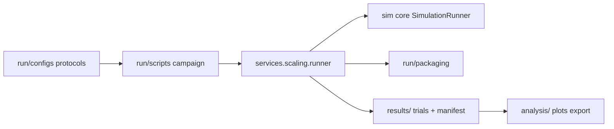

# HerdSim Architecture (scaling-cli)

Purpose-split tree for scaling research. Platform GUI is on `main`.

## Layout

```text
sim/        Tick engine: core, plugins, methods
run/        Campaigns: configs, scripts, services.scaling, packaging
analysis/   Post-run: frontiers, regimes, plots, export
results/    Trial artifacts (data)
docs/       Architecture, science, codes, report package
```

## Tick lifecycle

```text
state(t)
  -> environment updates
  -> failure factors
  -> sheep_dynamics.step
  -> observation.observe_all
  -> dog_controller.step
  -> constraints / walls
  -> metrics(state(t+1))
```

## Campaign data flow


```mermaid
flowchart LR
  proto["run/configs protocols"]
  camp["run/scripts campaign"]
  runner["services.scaling.runner"]
  engine["sim core SimulationRunner"]
  pack["run/packaging"]
  out["results/ trials + manifest"]
  analysis["analysis/ plots export"]

  proto --> camp
  camp --> runner
  runner --> engine
  runner --> pack
  runner --> out
  out --> analysis
```

## Import rules

- `sim` packages keep historical names (`core`, `plugins`, `methods`) via package-dir maps.
- Campaign code imports as `services.scaling` and `run.packaging`.
- `analysis` may read `results/` and import math helpers; it must not step the simulation.

## Key paths

| Piece | Path |
|-------|------|
| Engine | `sim/core/simulation_runner.py` |
| Protocols | `run/configs/protocols/*.yaml` |
| Runner | `run/services/scaling/runner.py` |
| Packaging | `run/packaging/` (failure labels, trial aggregates, provenance) |
| Analysis | `analysis/scaling/` |
| Results | `results/phase{k}/{slug}/` |
| Science docs | `docs/science/` |
| Report package | `docs/report/` (published content; leave as-is) |

Operator entry: `make scaling-help` or `make -C run help`.
