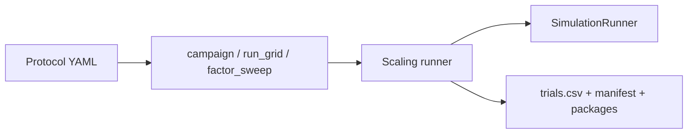
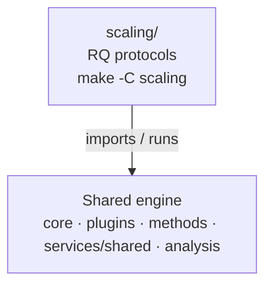

# HerdSim Architecture (scaling-cli)

This branch is the **scaling research** tree: CLI protocols, results, and analysis.
The platform GUI is intentionally absent (see `main`).

HerdSim's engine separates sheep dynamics, shepherd observation, and dog control so
experiments can vary information, heterogeneity, environment, and controller
architecture independently.

## Design requirements

- **Modularity.** Sheep models, dog controllers, observation modes, scenarios, and metrics plug in without rewriting the runner.
- **Reproducibility.** Discrete deterministic ticks with seeded RNG.
- **Factorial experiments.** Herdability and sensing studies are first-class factor grids.
- **Purpose split.** This branch owns RQ campaigns. Interactive UI lives on `main`.

## Tick lifecycle

```text
state(t)
  -> environment updates (moving goal)
  -> failure factors
  -> sheep_dynamics.step
  -> observation.observe_all
  -> dog_controller.step(observations)
  -> robot constraints
  -> resolve obstacles/walls
  -> metrics(state(t+1))
```

## High-level data flow (CLI)


```mermaid
flowchart LR
  proto["Protocol YAML"]
  camp["campaign / run_grid / factor_sweep"]
  runner["Scaling runner"]
  engine["SimulationRunner"]
  out["trials.csv + manifest + packages"]

  proto --> camp
  camp --> runner
  runner --> engine
  runner --> out
```

## Experimental factors

Defined in `core/experimental_factors.py`:

- Flock: `n_sheep`, layout, cohesion, stubborn fraction
- Shepherds: `n_shepherds`, speed scale, failure mode, kinematic limits
- Observation: `obs_mode`, sensing range, noise, communication
- Environment: world keys, `goal_mode`
- Model: `sheep_model`, `dog_controller`, scenario, preset

Named methods in `core/methods.py` are factor bundles (for example `strombom`
equals Strombom sheep plus Collect/Drive).

## Plugin interfaces

- `BaseSheepDynamics` in `core/sheep_dynamics.py`
- `BaseObservationModel` / `ShepherdObservation` in `core/observation.py`
- `BaseDogController` in `core/dog_controller.py`
- Registries in `core/plugin_registry.py`
- Named methods (catalog) in `core/methods.py`

Scenarios and metrics register in their package registries. Method packages live
under `methods/<id>/`.

## Config composition

`resolve_experiment_config` merges:

1. shared world defaults
2. sheep and dog defaults
3. method paper params
4. scenario overlay
5. explicit algorithm_params / world_overrides / agent counts

## Implementation layout (this branch)


```mermaid
flowchart TB
  scale["scaling/<br/>RQ protocols<br/>make -C scaling"]
  engine["Shared engine<br/>core · plugins · methods · services/shared · analysis"]
  scale -->|imports / runs| engine
```

| Area | Path | Role |
|------|------|------|
| Engine | `core/`, `plugins/`, `methods/` | Tick loop and method bundles |
| Shared helpers | `services/shared/`, `analysis/` | Trial aggregates, failure labels, RQ analysis |
| Campaigns | `scaling/` | Protocols, runner, docs, results |
| Docs | `docs/` | Architecture + CLI/RQ code map |
| Tests | `tests/backend/` | Engine correctness + scaling stack |

Python import names: `services.scaling`, `services.shared`, `analysis.scaling`.
The `services` package is a namespace split across `services/shared/` and
`scaling/services/scaling/`.

## Scaling stack

| Piece | Role |
|-------|------|
| `scaling/configs/canonical_grid.yaml` | Frozen protocol defaults |
| `scaling/configs/protocols/*.yaml` | Per-run protocol specs |
| `scaling/services/scaling/runner.py` | Grid expand, trials, resume via `manifest.jsonl` |
| `scaling/services/scaling/layout.py` | Path conventions and status helpers |
| `analysis/scaling/` | Frontier, regimes, export, plots, RQ packages |
| `scaling/scripts/` | `campaign.py`, `run_grid.py`, `run_factor_sweep.py`, planners |
| `scaling/Makefile` | Campaign Make aliases |
| `scaling/results/phase{k}/{slug}/` | `protocol.yaml`, provenance, `trials.csv`, packages |

Operator entry: `make scaling-help` or `make -C scaling help`.

### Research phases (summary)

| Focus | RQs | Package |
|-------|-----|---------|
| Herdability maps | RQ2 (+ data for RQ6) | A |
| Structure beyond N | RQ1 | B |
| Overcrowding mechanism | RQ3 | C |
| Cross-method transfer | RQ4 | D |
| Information vs shepherds | RQ5 | E |
| Scaling fits | RQ6 | F |
| Early warning | RQ7 | G |

Science docs: `scaling/docs/` (plan, tracker, final report).
Code map: [docs/codes/map_codes.html](codes/map_codes.html).

## Relation to `main`

`main` keeps the platform GUI and the same engine. This branch drops GUI code so
RQ work has a smaller tree. Merge engine changes from `main` into `scaling-cli`
regularly; keep RQ-only commits off `main` until you intentionally port them.
