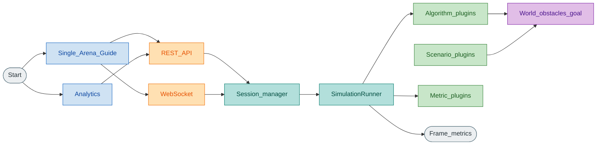
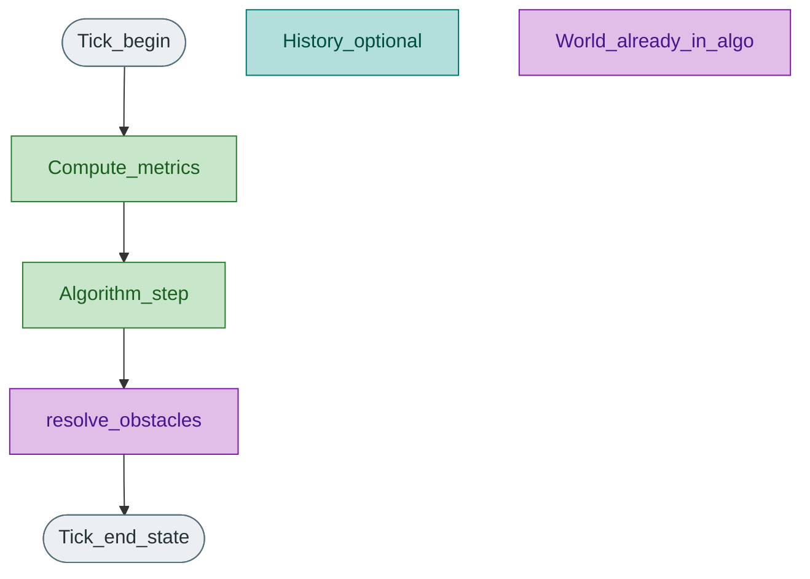

# Architecture

HerdSim is a plugin-oriented herding simulator: algorithms, scenarios, and metrics register independently; a shared runner advances ticks; FastAPI + WebSocket serve Single/Arena/Analytics; PixiJS renders the arena.

## System context

Legend: blue = UI, teal = wiring/config, green = domain models, purple = shared core, orange = transport, yellow = decision, grey = start/end.

## One simulation tick

Legend: blue = UI, teal = wiring/config, green = domain models, purple = shared core, orange = transport, yellow = decision, grey = start/end.

Exact metric/algorithm ordering lives in `core/simulation_runner.py`. Algorithms own sheep and shepherd updates inside `step()`. Runner applies obstacle resolution afterward. Velocity conventions differ by family (see [../research/environment.md](../research/environment.md)).

## Plugin surfaces

| Kind | ABC | Registry |
|------|-----|----------|
| Algorithm | `core/base_algorithm.py` | `algorithms/registry.py` |
| Scenario | `core/base_scenario.py` | `scenarios/registry.py` |
| Metric | `core/base_metric.py` | `metrics/registry.py` |

## Frontend

Vanilla JS + Vite + PixiJS 8. View router: `frontend/src/main.js` (Single, Arena, Analytics, NetLogo, Guide). REST: `frontend/src/api/rest.js`. Guide loads markdown from `GET /api/docs/{slug}`.

## Non-goals

- General ABM language or NetLogo replacement for arbitrary models
- GIS / 3D / heterogeneous robot kinds beyond sheep+shepherds without a new design
- CBF / QP / RL training loops inside the interactive `step()` path (separate plan if needed)
- Deleting `docs/papers/` or keeping obsolete doc archives
