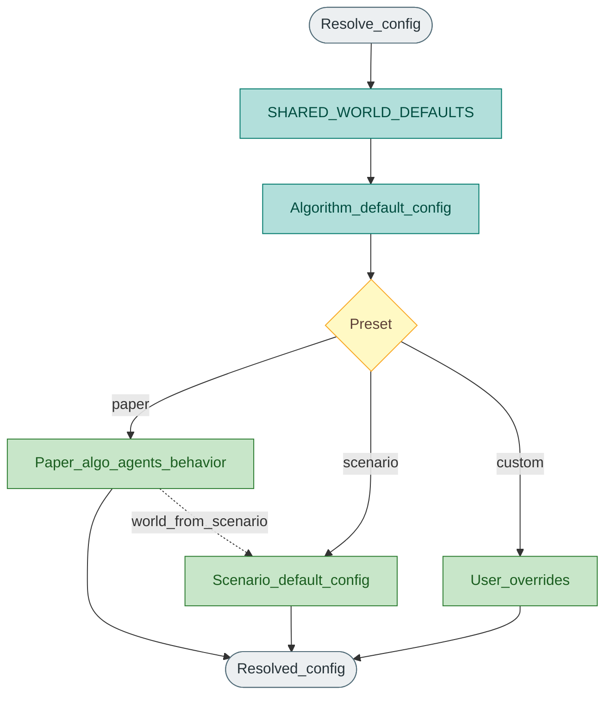

# Config and presets

`resolve_experiment_config` merges layers into one resolved config for a session or benchmark trial. Code: `core/experiment_config.py`, `core/shared_defaults.py`.

## Merge order

## Presets

| Preset | Behaviour |
|--------|-----------|
| `paper` | Algorithm agent counts + behaviour defaults; world/layout from the selected scenario |
| `scenario` | Scenario `default_config` for agents + world |
| `custom` | Explicit `algorithm_params` / `world_overrides` / agent counts |

Session create accepts `preset`, optional `num_sheep` / `num_shepherds`, `algorithm_params`, and `world_overrides`.
