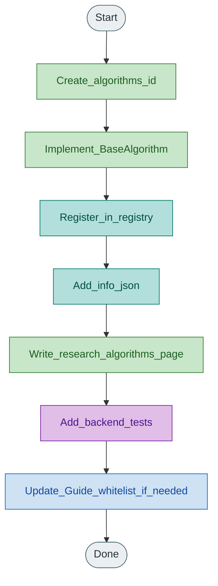

# Contributing plugins

## Add an algorithm

1. Create `algorithms/<id>/` with `algorithm.py`, a config module, optional helpers, and `info.json` (optional `param_groups`).
2. Subclass `BaseAlgorithm` (`id`, `name`, `default_config`, `step`). Use `state.rng`; prefer `state.world.goal`.
3. Register in `algorithms/registry.py` `_auto_register()`.
4. Write `docs/research/algorithms/<page>.md` (cite paper, write out the algorithm, full param accounts, fidelity, code pointers, tests). Link a PDF under `docs/papers/` when present. Add a row to `docs/research/algorithms/README.md`.
5. Add tests under `tests/backend/` (see [testing.md](testing.md)).
6. If the Guide should list the page, add the slug to `DOC_SLUGS` in `api/routers/docs.py` and to `NAV` in `frontend/src/components/GuideView.js`.

## Add a metric

1. `metrics/<id>.py` subclassing `BaseMetric`
2. Register in `metrics/registry.py`
3. Document in `docs/research/metrics.md` and add a unit test

## Add a scenario

1. `scenarios/<id>.py` subclassing `BaseScenario`
2. Implement `create_world`, `initial_positions`, `is_success`, `max_ticks`, `default_config`
3. Register in `scenarios/registry.py`
4. Document in `docs/research/scenarios.md`; add layout keys to `core/shared_defaults.WORLD_KEYS` and frontend `SCENARIO_WORLD_KEYS`

## Decision checklist (new algorithm)

1. Which paper (DOI) and figures/settings?
2. Fits sheep + shepherd `step()` without a solver or trainer?
3. Which scenarios and metrics stay valid?
4. What adaptations (goal, walls, `dt`)?
5. Paper preset and success criterion?
6. Fair comparison notes vs Strombom / Kubo?
