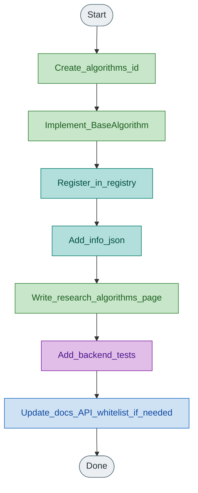

# Contributing plugins

## Add an algorithm

Legend: blue = UI, teal = wiring/config, green = domain models, purple = shared core, orange = transport, yellow = decision, grey = start/end.

1. Create `algorithms/<id>/` with `algorithm.py`, config module, optional helpers, `info.json` (optional `param_groups`).
2. Subclass `BaseAlgorithm` (`id`, `name`, `default_config`, `step`). Use `state.rng`; prefer `state.world.goal`.
3. Register in `algorithms/registry.py` `_auto_register()`.
4. Write `docs/research/algorithms/<page>.md` using the self-contained template (cite, write out algorithm, full param accounts, fidelity, code, tests). Link PDF under `docs/papers/` when present.
5. Add tests under `tests/backend/`.
6. If the Guide should list the page, ensure the slug is in the docs API whitelist.

## Add a metric

1. `metrics/<id>.py` subclassing `BaseMetric`
2. Register in `metrics/registry.py`
3. Document in `docs/research/metrics.md` and add a unit test

## Add a scenario

1. `scenarios/<id>.py` subclassing `BaseScenario`
2. `create_world`, `initial_positions`, `is_success`, `max_ticks`, `default_config`
3. Register in `scenarios/registry.py`
4. Document in `docs/research/scenarios.md`; add layout keys to `core/shared_defaults.WORLD_KEYS` and frontend `SCENARIO_WORLD_KEYS`

## Decision checklist (new algorithm)

1. Which paper (DOI) and figures/settings?
2. Fits sheep+shepherd `step()` without solver/trainer?
3. Which scenarios/metrics stay valid?
4. What adaptations (goal, walls, `dt`)?
5. Paper preset and success criterion?
6. Fair comparison notes vs Strombom/Kubo?
