# Protocol configurations

YAML run recipes frozen with this report package. Each file sets method, flock sizes N, shepherd counts D, layouts, seeds, and grade for one stage.

## Conventions

- `canonical`: pulls frozen defaults from the project's canonical grid config.
- `extends`: inherits from a parent protocol YAML; only overrides are listed.
- `grade`: `SMOKE` (5 seeds), `SCOUT` (30 seeds), or `CLAIM` (100 seeds).
- `output`: destination folder under `scaling/results/` when the run was produced.

## Files in this folder

```
.
|-- phase1_claim.yaml
|-- phase1_pilot.yaml
|-- phase1_scout.yaml
|-- phase1_t1.yaml
|-- phase2_claim.yaml
|-- phase2_pilot_state.yaml
|-- phase2_scout.yaml
|-- phase4_fat_size_claim.yaml
|-- phase4_fat_size_scout.yaml
|-- phase4_fat_structure_claim.yaml
|-- phase4_fat_structure_scout.yaml
|-- phase4_kubo_size_claim.yaml
|-- phase4_kubo_size_scout.yaml
|-- phase4_kubo_structure_claim.yaml
|-- phase4_kubo_structure_scout.yaml
|-- phase5_comm_claim.yaml
|-- phase5_comm_scout.yaml
|-- phase5_factor_sweep.yaml
|-- phase5_obs_claim.yaml
|-- phase5_range_claim.yaml
`-- phase5_range_scout.yaml
```

**Config**
- All `*.yaml` in this folder: frozen stage recipes (method, N, D, layouts, seeds, grade, output). Nothing here is auto-generated by a sim run.

## Dependencies

Scout YAML then claim YAML for each chain (same relationship as the stage runs):

```mermaid
flowchart LR
  p1p["phase1_pilot.yaml"] --> p1s["phase1_scout.yaml"] --> p1c["phase1_claim.yaml"] --> p1t["phase1_t1.yaml"]
  p2p["phase2_pilot_state.yaml"] --> p2s["phase2_scout.yaml"] --> p2c["phase2_claim.yaml"]
  kss["phase4_kubo_size_scout.yaml"] --> ksc["phase4_kubo_size_claim.yaml"]
  ksts["phase4_kubo_structure_scout.yaml"] --> kstc["phase4_kubo_structure_claim.yaml"]
  fss["phase4_fat_size_scout.yaml"] --> fsc["phase4_fat_size_claim.yaml"]
  fsts["phase4_fat_structure_scout.yaml"] --> fstc["phase4_fat_structure_claim.yaml"]
  fs["phase5_factor_sweep.yaml"] --> oc["phase5_obs_claim.yaml"]
  rs["phase5_range_scout.yaml"] --> rc["phase5_range_claim.yaml"]
  cs["phase5_comm_scout.yaml"] --> cc["phase5_comm_claim.yaml"]
```



**Config**

### RQ2: size map (YAML names: phase1)

- `phase1_pilot.yaml`: SMOKE on reduced N and D
- `phase1_scout.yaml`: SCOUT full N x D grid
- `phase1_claim.yaml`: CLAIM reseed on boundary cells around `D_min`
- `phase1_t1.yaml`: Longer deadline (20,000 ticks) on overcrowding cells if any

### RQ1: start shape (YAML names: phase2)

- `phase2_pilot_state.yaml`: SMOKE across four layouts
- `phase2_scout.yaml`: SCOUT 3 N x 4 layouts x D
- `phase2_claim.yaml`: CLAIM reseed on boundary cells

### RQ4: transfer (YAML names: phase4)

- `phase4_kubo_size_scout.yaml` / `phase4_kubo_size_claim.yaml`: Kubo compact size map
- `phase4_kubo_structure_scout.yaml` / `phase4_kubo_structure_claim.yaml`: Kubo four-layout structure map
- `phase4_fat_size_scout.yaml` / `phase4_fat_size_claim.yaml`: FAT compact size map
- `phase4_fat_structure_scout.yaml` / `phase4_fat_structure_claim.yaml`: FAT four-layout structure map

Scout YAMLs set `store_timeseries: false` to reduce disk I/O. Claim YAMLs set `store_timeseries: true` where trajectories were needed for boundary cells.

### RQ5: information ladders (YAML names: phase5)

- `phase5_factor_sweep.yaml`: Observation-mode scout (bearing, local, global)
- `phase5_obs_claim.yaml`: Observation claim windows
- `phase5_range_scout.yaml` / `phase5_range_claim.yaml`: Sensing-range ladder
- `phase5_comm_scout.yaml` / `phase5_comm_claim.yaml`: Communication-mode ladder
