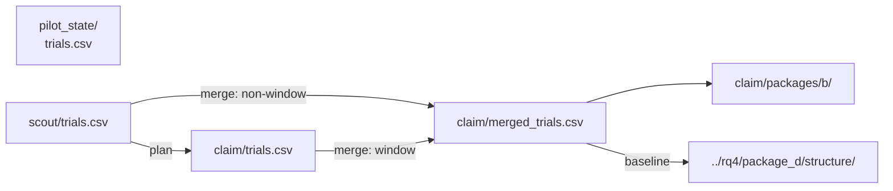

# RQ1: start shape

At the same flock size, does the starting layout of the sheep change how many dogs you need?

Method: `strombom_multi`. Layouts: compact, wide, split, outlier_rich. Protocol: `scaling_v2`.

## This folder

| Path | Grade | What is here |
|------|-------|--------------|
| `pilot_state/` | SMOKE | Layout / metrics smoke check (600 trials) |
| `scout/` | SCOUT | Scout reliability map: 3 N x 4 layouts x D (3,600 trials) |
| `claim/` | CLAIM | Reseed near reliability edges (2,400 trials; merge 5,280) |

Each stage folder has its own run ledger (`protocol.yaml`, `status.json`, `manifest.jsonl`, `trials.csv`) and a Package B analysis export under `packages/b/`.

## Dependencies

Pilot is smoke only; scout does not need it to run. Claim plan reads `scout/trials.csv`. Merge writes `claim/merged_trials.csv`. Downstream, RQ4 Package D structure also reads that merge as the Strombom baseline.

| Step | Reads | Writes |
|------|-------|--------|
| Scout run | protocol YAML + frozen grid | `scout/trials.csv` |
| Claim plan | `scout/trials.csv` | `boundary_cells.csv`, `boundary_plan.json` |
| Claim reseed | `boundary_cells.csv` | `claim/trials.csv` |
| Claim merge | scout + claim `trials.csv` | `merged_trials.csv` |

## Takeaway

On the baseline, `D_min = 1` for all four layouts at N in {50, 100, 200}. Start shape changes time and path cost, not the fewest-dogs answer at the 90% bar.

## Claims

| Claim | What it asks (supported when) | Verdict |
|-------|-------------------------------|---------|
| C1a | For at least one N, `D_min` differs by at least one D-grid step across layouts at theta 0.90 | REJECTED |
| C1b | The early-state model has lower leave-one-N-out negative log-likelihood than the `(N, D)` model | INCONCLUSIVE |
