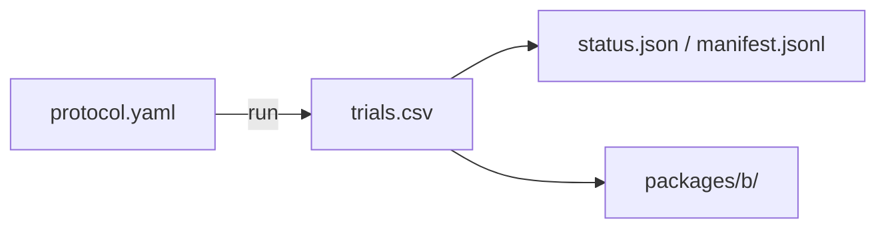

# phase2_pilot_state

## Purpose

SMOKE check for the RQ1 start-shape path: four layouts and state metrics on a reduced grid. Pipeline check only. Not for claims.

## Setup

- Protocol: `scaling_v2` (`phase2_pilot_state`)
- Depends on: none for running. Starts the RQ1 chain.
- Method: `strombom_multi`
- Layouts: compact, wide, split, outlier_rich
- N: {5, 10, 25, 50, 100}
- D: {1, 2, 3, 4, 6, 10}
- Seeds: 5
- Package export: B
- Command: `make -C scaling scaling-pilot-state WORKERS=16`

## Completeness

600 / 600 trials (`status.json` complete).

## Runtime

Started:  25 Sep 2026, 09:18 UTC
Finished: 25 Sep 2026, 09:25 UTC
Total:    7m

## Results

Smoke-only. Package B shows layout contrasts on this reduced grid; do not update claims from this folder.

## Files in this folder

### Dependencies



```
.
|-- manifest.jsonl
|-- protocol.yaml
|-- status.json
|-- trials.csv
`-- packages/
    `-- b/
```

**Config**
- `protocol.yaml`: Run settings (method, layouts, N/D grid, seeds, grade).

**Auto-generated (run)**
- `manifest.jsonl`: Per-cell progress log; enables resume without re-running ok cells.
- `status.json`: Planned vs done counts, complete flag, start/finish, elapsed.
- `trials.csv`: One row per seed (success, ticks, path/effort, layout, N, D, ...).

**Auto-generated (analysis packages)**
- `packages/b/`: Package B (structure / layout tables).

Trajectory parquet written during the run is not retained here.

## Limits

SMOKE (5 seeds). Not for claims.
