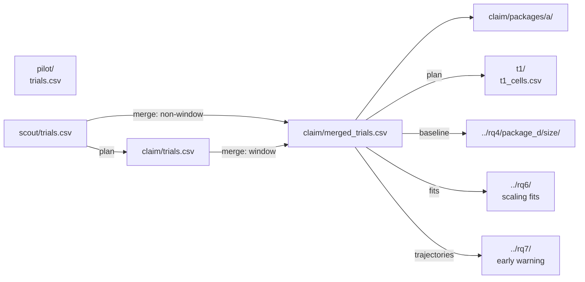

# RQ2: flock size map

On a tight (compact) start with the baseline dog rule, how many dogs do we need as the flock gets larger?

Method: `strombom_multi`. Layout: compact. Protocol: `scaling_v2`.

## This folder

| Path | Grade | What is here |
|------|-------|--------------|
| `pilot/` | SMOKE | Pipeline check (150 trials) |
| `scout/` | SCOUT | Scout full N x D map (3,000 trials) |
| `claim/` | CLAIM | Reseed near the fewest-dogs edge (2,200 trials; merge 4,540) |
| `t1/` | plan only | Longer deadline for overcrowding (0 cells; no sims) |

Each sim stage has its own run ledger and a Package A size-map export under `packages/a/`.

## Dependencies

Pilot is smoke only; scout does not need it to run. Claim plan reads `scout/trials.csv`. T1 plan reads `claim/merged_trials.csv` (0 overcrowding cells here). RQ4 Package D size, RQ6, and RQ7 all hang off the same claim merge (RQ7 also needs claim trajectory parquet, not copied into this report tree).

| Step | Reads | Writes |
|------|-------|--------|
| Scout run | protocol YAML + frozen grid | `scout/trials.csv` |
| Claim plan | `scout/trials.csv` | `boundary_cells.csv`, `boundary_plan.json` |
| Claim reseed | `boundary_cells.csv` | `claim/trials.csv` |
| Claim merge | scout + claim `trials.csv` | `merged_trials.csv` |
| T1 plan | `claim/merged_trials.csv` | `t1_cells.csv`, `t1_plan.json` |

## Takeaway

`D_min = 2` for N in {5, 10}; `D_min = 1` for N >= 25. No overcrowding inside D <= 35. Extra dogs mostly add walking (waste), not failure.

## Claims

| Claim | What it asks (supported when) | Verdict |
|-------|-------------------------------|---------|
| C2a | The baseline method has `D_overcrowd` at theta 0.90 for at least one N | REJECTED |
| C2b | At least one D above `D_overcrowd` remains below theta at T = 20000 | SKIPPED |
