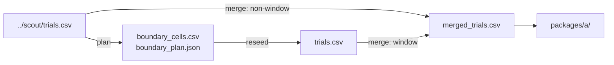

# phase1_claim

## Purpose

CLAIM reseed on reliability-window cells for the RQ2 size map. Claim-grade `D_min` and regimes on compact + `strombom_multi`.

## Setup

- Protocol: `scaling_v2` (`phase1_claim`); upstream scout `phase1_scout`
- Depends on: RQ2 scout.
  - Reads (plan): `../scout/trials.csv`
  - Writes: `boundary_cells.csv`, `boundary_plan.json`, then `trials.csv`
  - Merge: `merged_trials.csv` = claim-window rows from `trials.csv` + non-window rows from `../scout/trials.csv`
- Method: `strombom_multi`
- Layout: compact
- N: full freeze grid (claim windows only)
- D: reliability window (22 cells in `boundary_cells.csv`)
- Seeds: 100 on window cells
- Theta: 0.90
- T0: 10000
- Package export: A (on `merged_trials.csv`)
- Commands (run in this order):
  1. Plan: `make -C scaling scaling-claim-plan`
     Must run after this method's scout. Chooses scout cells near the reliability edge and writes `boundary_cells.csv` / `boundary_plan.json` (no claim sims yet).
  2. Reseed: `make -C scaling scaling-claim-reseed WORKERS=16`
     Runs the claim sims (100 seeds) on those planned cells.

## Completeness

2,200 / 2,200 claim trials (`status.json` complete). First attempt stopped at 73; resume finished the rest (`n_pending_at_start` 2127). Merge has 4,540 rows (22 x 100 claim + 78 x 30 scout).

## Runtime

Started:  22 Sep 2026, 12:07 UTC
Finished: 22 Sep 2026, 13:05 UTC
Total:    57m

Elapsed covers the resumed run that finished the remaining trials, not a sum of the aborted first attempt.

## Results

- Merged overall success 0.963 (4371 wins / 4540); under-resource failures at small N with D=1; rare failures are oscillation (111) or stuck (58)
- `D_min` = 2 for N in {5, 10}; `D_min` = 1 for N >= 25; no `D_overcrowd`; `d_max` = 35
- Regimes: wasteful_overspend 88, efficient_operation 10, under_resourced_failure 2
- Bootstrap: `d_min_ci_low` == `d_min_ci_high` for all N at 100 seeds

## Interpretation

One dog is enough for N >= 25 on a compact start under T0; N=5 and N=10 need at least 2 dogs. High dog counts are wasteful rather than overcrowded, so C2a is rejected. T1 has no overcrowding cells to run, so C2b is skipped.

## Claims update

| Claim | What it asks (supported when) | Verdict | Evidence |
|-------|-------------------------------|---------|----------|
| C2a | The baseline method has `D_overcrowd` at theta 0.90 for at least one N | REJECTED | `packages/a/`: no overcrowding cells / no `D_overcrowd` at theta=0.90 |
| C2b | At least one D above `D_overcrowd` remains below theta at T = 20000 | SKIPPED | needs T1; no overcrowding cells |

## Files in this folder

### Dependencies



```
.
|-- boundary_cells.csv
|-- boundary_plan.json
|-- dmin_bootstrap.csv
|-- manifest.jsonl
|-- merged_dmin_bootstrap.csv
|-- merged_trials.csv
|-- protocol.yaml
|-- status.json
|-- trials.csv
`-- packages/
    `-- a/
```

**Config**
- `protocol.yaml`: Run settings (method, layouts, N/D grid, seeds, grade).

**Planning (auto before claim / T1)**
- `boundary_cells.csv`: Cells chosen for 100-seed claim reseed (from scout).
- `boundary_plan.json`: Planner metadata for the claim window (theta, params).

**Auto-generated (run)**
- `manifest.jsonl`: Per-cell progress log; enables resume without re-running ok cells.
- `merged_trials.csv`: Claim-window 100-seed rows + non-window scout 30-seed rows.
- `status.json`: Planned vs done counts, complete flag, start/finish, elapsed.
- `trials.csv`: One row per seed (success, ticks, path/effort, layout, N, D, ...).

**Auto-generated (analysis)**
- `dmin_bootstrap.csv`: Bootstrap of D_min / CI from claim trials only.
- `merged_dmin_bootstrap.csv`: Same bootstrap schema on merged_trials.csv.

**Auto-generated (analysis packages)**
- `packages/a/`: Package A (size-map tables).

Trajectory parquet written during the run is not retained here.

## Limits

Single method, single layout. Merge mixes 100-seed claim cells with 30-seed scout cells elsewhere (by design). No overcrowding window for T1.
