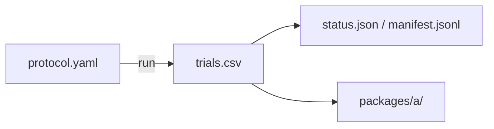

# phase1_pilot

## Purpose

SMOKE check for the RQ2 size map. Confirms the run, resume files, and Package A export look healthy. Not for claims.

## Setup

- Protocol: `scaling_v2` (`phase1_pilot`)
- Depends on: none for running. Starts the RQ2 chain.
- Method: `strombom_multi`
- Layout: compact
- N: {5, 10, 25, 50, 100}
- D: {1, 2, 3, 4, 6, 10}
- Seeds: 5
- Theta: 0.90
- T0: 10000
- Package export: A
- Command: `make -C scaling scaling-pilot WORKERS=16`

## Completeness

150 / 150 trials (`status.json` complete).

## Runtime

Started:  22 Sep 2026, 10:45 UTC
Finished: 22 Sep 2026, 10:46 UTC
Total:    less than 1m

## Results

- Overall success 0.947; weak cells only at N=5 D=1 (R=0.0) and N=10 D=1 (R=0.4)
- `D_min` = 2 for N in {5, 10}; `D_min` = 1 for N in {25, 50, 100}; no overcrowding
- Regimes: wasteful_overspend 23, efficient_operation 5, under_resourced_failure 2

## Files in this folder

### Dependencies



```
.
|-- manifest.jsonl
|-- protocol.yaml
|-- status.json
|-- trials.csv
`-- packages/
    `-- a/
```

**Config**
- `protocol.yaml`: Run settings (method, layouts, N/D grid, seeds, grade).

**Auto-generated (run)**
- `manifest.jsonl`: Per-cell progress log; enables resume without re-running ok cells.
- `status.json`: Planned vs done counts, complete flag, start/finish, elapsed.
- `trials.csv`: One row per seed (success, ticks, path/effort, layout, N, D, ...).

**Auto-generated (analysis packages)**
- `packages/a/`: Package A (size-map tables).

Trajectory parquet written during the run is not retained here.

## Limits

SMOKE (5 seeds, reduced N/D). Not for claims.
