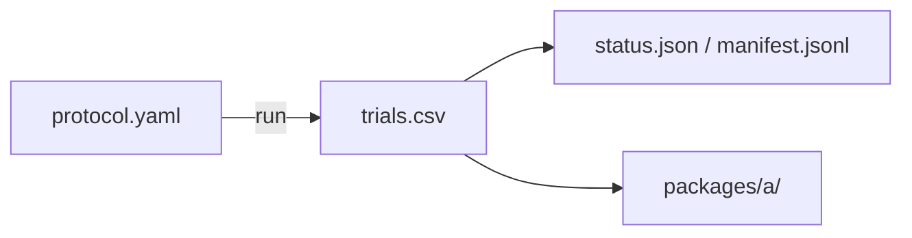

# phase1_scout

## Purpose

SCOUT full size map on compact starts. Used to pick claim reseed windows. Not claim-grade by itself.

## Setup

- Protocol: `scaling_v2` (`phase1_scout`)
- Depends on: none required for running (pilot is smoke only). Writes `trials.csv`.
- Method: `strombom_multi`
- Layout: compact
- N: {5, 10, 25, 50, 75, 100, 150, 200, 300, 400}
- D: {1, 2, 3, 4, 6, 10, 15, 20, 25, 35}
- Seeds: 30
- Theta: 0.90
- T0: 10000
- Package export: A
- Command: `make -C scaling scaling-scout WORKERS=16`

## Completeness

3,000 / 3,000 trials (`status.json` complete).

## Runtime

Started:  22 Sep 2026, 10:50 UTC
Finished: 22 Sep 2026, 12:02 UTC
Total:    1h 12m

## Results

- Overall success 0.983; R=1.0 for all N>=25; lower only at N=5 (0.903) and N=10 (0.927) from D=1 under-resourcing
- `D_min` = 2 for N in {5, 10}; `D_min` = 1 for N >= 25; `d_max` = 35; no `D_overcrowd`
- Regimes: wasteful_overspend 88, efficient_operation 10, under_resourced_failure 2
- Bootstrap: `d_min_ci_low` == `d_min_ci_high` for every N

## Files in this folder

### Dependencies



```
.
|-- manifest.jsonl
|-- protocol.yaml
|-- status.json
|-- trials.csv
`-- packages/
    `-- a/
```

**Config**
- `protocol.yaml`: Run settings (method, layouts, N/D grid, seeds, grade).

**Auto-generated (run)**
- `manifest.jsonl`: Per-cell progress log; enables resume without re-running ok cells.
- `status.json`: Planned vs done counts, complete flag, start/finish, elapsed.
- `trials.csv`: One row per seed (success, ticks, path/effort, layout, N, D, ...).

**Auto-generated (analysis packages)**
- `packages/a/`: Package A (size-map tables).

Trajectory parquet written during the run is not retained here.

## Limits

SCOUT (30 seeds). Not for claims.
