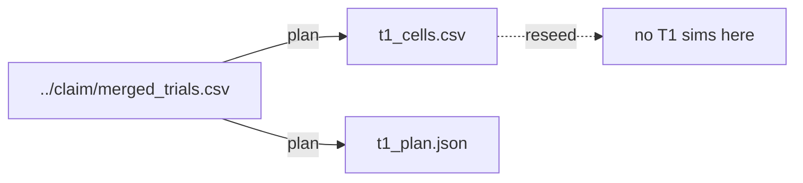

# phase1_t1

## Purpose

T1 asks whether overcrowding at the usual deadline still holds when the clock is raised to 20,000 ticks. The planner ran against the RQ2 claim merge and selected 0 overcrowding cells, so no T1 simulations ran.

## Setup

- Protocol: `scaling_v2`
- Depends on: RQ2 claim merge.
  - Reads (plan): `../claim/merged_trials.csv`
  - Writes: `t1_cells.csv`, `t1_plan.json` (0 cells on this map; no T1 sims)
- Theta: 0.90
- Max ticks: 20000
- Commands (run in this order):
  1. Plan: `make -C scaling scaling-t1-plan`
     Chooses overcrowding cells from the claim merge into `t1_cells.csv` (may be empty; no T1 sims yet).
  2. Run: `make -C scaling scaling-t1 WORKERS=16`
     Reseeds those cells at the longer deadline T = 20000.

## Completeness

- Planned T1 cells: 0
- Done: n/a (nothing to run)
- `t1_plan.json`: `n_t1_cells=0`, `max_ticks=20000`
- `t1_cells.csv`: header only, no rows

## Runtime

No simulation runtime. Planner only; no `status.json` for a T1 grid.

## Results

No overcrowding window on compact + `strombom_multi` at theta=0.90 in the claim merge. Planner message: no overcrowding cells; T1 has nothing to run.

## Interpretation

The size map does not show two consecutive sub-theta dog counts after `D_min`, so the T1 protocol has no cells. That is evidence against overcrowding on this method/layout/task, not a pipeline failure.

## Claims update

| Claim | What it asks (supported when) | Verdict | Evidence |
|-------|-------------------------------|---------|----------|
| C2a | The baseline method has `D_overcrowd` at theta 0.90 for at least one N | REJECTED on this map | no `D_overcrowd`; empty T1 plan |
| C2b | At least one D above `D_overcrowd` remains below theta at T = 20000 | SKIPPED | no T1 cells to reseed |

## Files in this folder

### Dependencies



```
.
|-- t1_cells.csv
`-- t1_plan.json
```

**Planning (auto before claim / T1)**
- `t1_cells.csv`: Cells to reseed at T1. Empty when no overcrowding window.
- `t1_plan.json`: T1 planner output (cell count, theta, max ticks, upstream merge).

## Limits

Single method and layout. Structure or transfer maps might still show overcrowding elsewhere.
