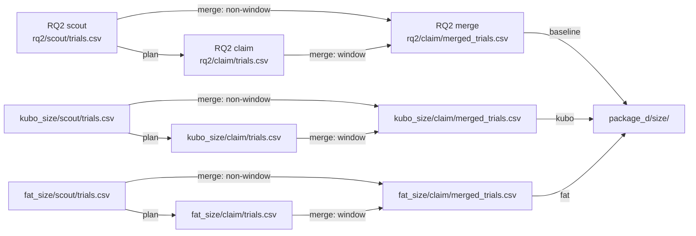
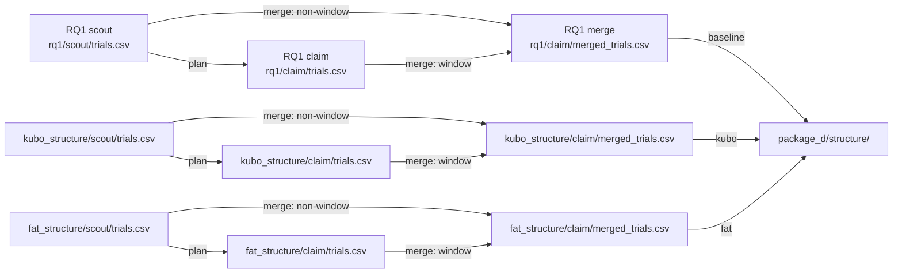

# RQ4: transfer across methods

If we switch herding method, which parts of the size and structure pattern stay the same?

Methods: baseline `strombom_multi` (reference from RQ1/RQ2), then `kubo` and `fat` on the same grids. Protocol: `scaling_v2`.

## This folder

| Path | What is here |
|------|--------------|
| `kubo_size/` | Kubo compact size map: scout (3,000) + claim (2,100; merge 4,470); Package A and F |
| `kubo_structure/` | Kubo four-layout structure map: scout (3,600) + claim (4,000; merge 6,670); Package B |
| `fat_size/` | FAT compact size map: scout (3,000) + claim (2,000; merge 4,400); Package A and F |
| `fat_structure/` | FAT four-layout structure map: scout (3,600) + claim (2,400; merge 5,280); Package B |
| `package_d/` | Side-by-side transfer tables (size + structure) |

Each scout/claim folder has a stage README with the same structure (Purpose, Setup, Completeness, Runtime, Results, Files, Limits).

## Dependencies

Each method chain is scout then claim. Claim **plan** reads that method's scout `trials.csv`. Claim **reseed** writes claim `trials.csv`, then **merge** builds `merged_trials.csv` (claim-window 100-seed rows + non-window scout 30-seed rows). Package D reads the three methods' claim merges (baseline from RQ2 size / RQ1 structure).

### Size map

### Structure map

### File roles

| Step | Reads | Writes |
|------|-------|--------|
| Scout run | protocol YAML + frozen grid | `scout/trials.csv` |
| Claim plan | `../scout/trials.csv` | `boundary_cells.csv`, `boundary_plan.json`, `scout_dmin_bootstrap_preview.csv` |
| Claim reseed | `boundary_cells.csv` | `claim/trials.csv` |
| Claim merge | scout `trials.csv` + claim `trials.csv` | `merged_trials.csv` |
| Package D size | RQ2 + kubo_size + fat_size claim merges | `package_d/size/*` |
| Package D structure | RQ1 + kubo_structure + fat_structure claim merges | `package_d/structure/*` |

Kubo/FAT scout runs do not need RQ1/RQ2 finished to start. Package D does need the baseline claim merges from RQ1/RQ2 plus both transfer methods.

## Takeaway

On compact starts, Strombom and Kubo share a low `D_min` floor for larger flocks. FAT does not: for N >= 25 nothing reaches 90% success through D = 35. Structure breaks transfer further (Kubo wide fails; Kubo outlier_rich at N = 200 shifts to `D_min` = 20).

## Claims

| Claim | What it asks (supported when) | Verdict |
|-------|-------------------------------|---------|
| C4 | `D_min` or overcrowding is shared across the three required methods; the structure row also needs all structure runs | SUPPORTED (partial) |
