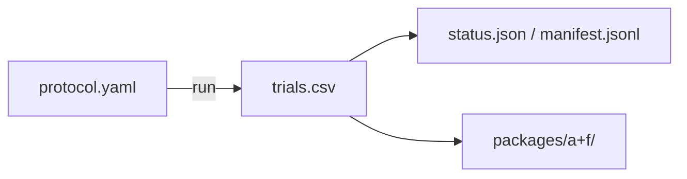

# phase4_fat_size_scout

## Purpose

SCOUT FAT compact size map. Used to plan claim windows. Not claim-grade by itself.

## Setup

- Protocol: `scaling_v2` (`phase4_fat_size_scout`)
- Depends on: none for running. Starts the FAT size chain. Writes `trials.csv`.
- Method: `fat`
- Layout: compact
- N: {5, 10, 25, 50, 75, 100, 150, 200, 300, 400}
- D: {1, 2, 3, 4, 6, 10, 15, 20, 25, 35}
- Seeds: 30
- Package export: A, F
- Command: `make -C scaling scaling-transfer-size-scout TRANSFER_METHOD=fat WORKERS=16`

## Completeness

3,000 / 3,000 trials (`status.json` complete).

## Runtime

Started:  2 Oct 2026, 05:19 UTC
Finished: 3 Oct 2026, 20:25 UTC
Total:    1d 15h 6m

## Results

Scout size map on compact FAT. Claim-grade frontiers live in the claim folder.

## Files in this folder

### Dependencies



```
.
|-- manifest.jsonl
|-- protocol.yaml
|-- status.json
|-- trials.csv
`-- packages/
    |-- a/
    `-- f/
```

**Config**
- `protocol.yaml`: Run settings (method, layouts, N/D grid, seeds, grade).

**Auto-generated (run)**
- `manifest.jsonl`: Per-cell progress log; enables resume without re-running ok cells.
- `status.json`: Planned vs done counts, complete flag, start/finish, elapsed.
- `trials.csv`: One row per seed (success, ticks, path/effort, layout, N, D, ...).

**Auto-generated (analysis packages)**
- `packages/a/`: Package A (size-map tables).
- `packages/f/`: Package F (scaling-fit tables).

Trajectory parquet written during the run is not retained here.

## Limits

SCOUT (30 seeds). Not for claims.
