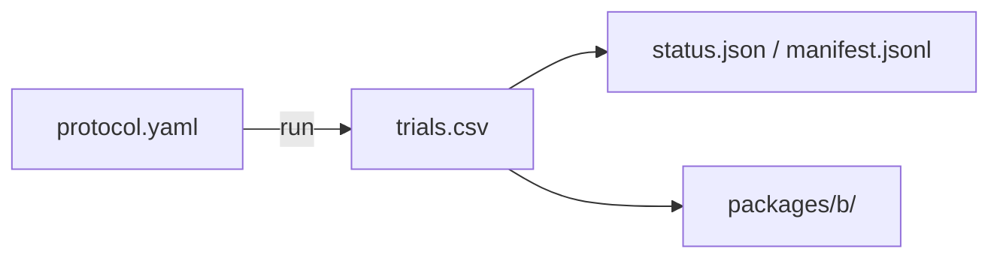

# phase4_fat_structure_scout

## Purpose

SCOUT FAT four-layout structure map. Used to plan claim windows. Not claim-grade by itself.

## Setup

- Protocol: `scaling_v2` (`phase4_fat_structure_scout`)
- Depends on: none for running. Starts the FAT structure chain. Writes `trials.csv`.
- Method: `fat`
- Layouts: compact, wide, split, outlier_rich
- N: {50, 100, 200}
- D: {1, 2, 3, 4, 6, 10, 15, 20, 25, 35}
- Seeds: 30
- Package export: B
- Command: `make -C scaling scaling-transfer-structure-scout TRANSFER_METHOD=fat WORKERS=16`

## Completeness

3,600 / 3,600 trials (`status.json` complete).

## Runtime

Started:  29 Sep 2026, 19:38 UTC
Finished: 1 Oct 2026, 05:38 UTC
Total:    1d 10h 0m

## Results

Scout structure map on FAT. Claim-grade frontiers live in the claim folder.

## Files in this folder

### Dependencies



```
.
|-- manifest.jsonl
|-- protocol.yaml
|-- status.json
|-- trials.csv
`-- packages/
    `-- b/
```

**Config**
- `protocol.yaml`: Run settings (method, layouts, N/D grid, seeds, grade).

**Auto-generated (run)**
- `manifest.jsonl`: Per-cell progress log; enables resume without re-running ok cells.
- `status.json`: Planned vs done counts, complete flag, start/finish, elapsed.
- `trials.csv`: One row per seed (success, ticks, path/effort, layout, N, D, ...).

**Auto-generated (analysis packages)**
- `packages/b/`: Package B (structure / layout tables).

Trajectory parquet written during the run is not retained here.

## Limits

SCOUT (30 seeds). Not for claims.
