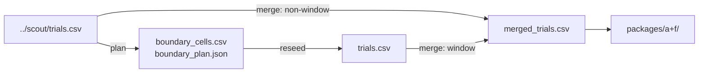

# phase4_kubo_size_claim

## Purpose

CLAIM reseed for the Kubo compact size map.

## Setup

- Protocol: `scaling_v2` (`phase4_kubo_size_claim`)
- Depends on: Kubo size scout (not blocked on RQ1/RQ2/RQ3).
  - Reads (plan): `../scout/trials.csv`
  - Writes: `boundary_cells.csv`, `boundary_plan.json`, then `trials.csv`
  - Merge: `merged_trials.csv` = claim `trials.csv` + non-window `../scout/trials.csv`
  - Later: `package_d/size/` also needs RQ2 and FAT claim merges
- Method: `kubo`
- Layout: compact
- N: {5, 10, 25, 50, 75, 100, 150, 200, 300, 400}
- D: claim reliability window (see `boundary_cells.csv`)
- Seeds: 100
- Package export: A, F
- Commands (run in this order):
  1. Plan: `make -C scaling scaling-transfer-size-claim-plan TRANSFER_METHOD=kubo`
     Must run after this method's scout. Chooses scout cells near the reliability edge and writes `boundary_cells.csv` / `boundary_plan.json` (no claim sims yet).
  2. Reseed: `make -C scaling scaling-transfer-size-claim-reseed TRANSFER_METHOD=kubo WORKERS=16`
     Runs the claim sims (100 seeds) on those planned cells.

## Completeness

2,100 / 2,100 trials (`status.json` complete). Merge has 4,470 rows.

## Runtime

Started:  25 Sep 2026, 21:45 UTC
Finished: 26 Sep 2026, 02:12 UTC
Total:    4h 27m

## Results

On compact starts, Kubo keeps a low D_min floor for larger flocks (D_min = 3 at N=5; D_min = 1 for N >= 10). No overcrowding.

## Files in this folder

### Dependencies



```
.
|-- boundary_cells.csv
|-- boundary_plan.json
|-- dmin_bootstrap.csv
|-- manifest.jsonl
|-- merged_dmin_bootstrap.csv
|-- merged_trials.csv
|-- protocol.yaml
|-- status.json
|-- trials.csv
`-- packages/
    |-- a/
    `-- f/
```

**Config**
- `protocol.yaml`: Run settings (method, layouts, N/D grid, seeds, grade).

**Planning (auto before claim / T1)**
- `boundary_cells.csv`: Cells chosen for 100-seed claim reseed (from scout).
- `boundary_plan.json`: Planner metadata for the claim window (theta, params).

**Auto-generated (run)**
- `manifest.jsonl`: Per-cell progress log; enables resume without re-running ok cells.
- `merged_trials.csv`: Claim-window 100-seed rows + non-window scout 30-seed rows.
- `status.json`: Planned vs done counts, complete flag, start/finish, elapsed.
- `trials.csv`: One row per seed (success, ticks, path/effort, layout, N, D, ...).

**Auto-generated (analysis)**
- `dmin_bootstrap.csv`: Bootstrap of D_min / CI from claim trials only.
- `merged_dmin_bootstrap.csv`: Same bootstrap schema on merged_trials.csv.

**Auto-generated (analysis packages)**
- `packages/a/`: Package A (size-map tables).
- `packages/f/`: Package F (scaling-fit tables).

Trajectory parquet written during the run is not retained here.

## Limits

CLAIM grade. Baseline transfer contrast for this method only.
