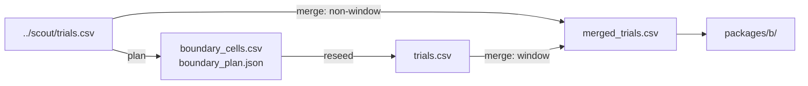

# phase4_kubo_structure_claim

## Purpose

CLAIM Kubo structure map across four layouts at N in {50, 100, 200}. Measures which layout cells transfer from the Strombom baseline and which shift or fail.

## Setup

- Protocol: `scaling_v2` (`phase4_kubo_structure_claim`)
- Depends on: Kubo structure scout (not blocked on RQ1/RQ2/RQ3).
  - Reads (plan): `../scout/trials.csv`
  - Writes: `boundary_cells.csv`, `boundary_plan.json`, then `trials.csv`
  - Merge: `merged_trials.csv` = claim `trials.csv` + non-window `../scout/trials.csv`
  - Later: `package_d/structure/` also needs RQ1 and FAT claim merges
- Method: `kubo`
- Layouts: compact, wide, split, outlier_rich
- N: {50, 100, 200}
- Seeds: 100 on standard claim windows; 200 on outlier_rich N=200 for D in {1, 2, 3, 4, 6, 10, 15, 20, 25}; D=35 stays at 30 (scout)
- Theta: 0.90
- T0: 10000
- obs_mode: global
- Package export: B
- Commands (run in this order):
  1. Plan: `make -C scaling scaling-transfer-structure-claim-plan TRANSFER_METHOD=kubo`
     Must run after this method's scout. Chooses scout cells near the reliability edge and writes `boundary_cells.csv` / `boundary_plan.json` (no claim sims yet).
  2. Reseed: `make -C scaling scaling-transfer-structure-claim-reseed TRANSFER_METHOD=kubo WORKERS=16`
     Runs the claim sims (100 seeds) on those planned cells.

## Completeness

| Field | Value |
|-------|------:|
| Claim trials (`trials.csv`) | 4,000 |
| Merged rows | 6,670 |
| `status.json` complete | yes |

`status.json` reports `n_planned` = 600 for the original window plan; the finished claim tree has 4,000 trial rows after the outlier_rich N=200 raise.

## Runtime

Started:  26 Sep 2026, 18:52 UTC
Finished: 6 Oct 2026, 10:54 UTC
Total:    9d 16h 1m

## Results

From `packages/b/frontier_by_layout.csv` and `merged_dmin_bootstrap.csv`:

| Layout | N | D_min | Notes |
|--------|--:|------:|-------|
| compact / split | 50, 100, 200 | 1 | shared with baseline |
| outlier_rich | 50, 100 | 1 | shared |
| outlier_rich | 200 | 20 | 200 seeds; R(20)=0.935, R(25)=0.910; CI [2, 20] |
| wide | 50, 100, 200 | none | hard failure (best R about 0.47 to 0.54) |

Outlier_rich N=200 rates (`outlier_rich_n200_window.json`): D1 0.745, D2 0.855, D3 0.835, D4 0.860, D6 0.890, D10 0.875, D15 0.855, D20 0.935, D25 0.910 (n=200); D35 0.967 (n=30).

## Claims update

| Claim | What it asks (supported when) | Verdict | Evidence |
|-------|-------------------------------|---------|----------|
| C4 | `D_min` or overcrowding is shared across the three required methods; structure row also needs all structure runs | SUPPORTED (partial) | This merge: shifted on outlier_rich N=200; absent on wide |

## Files in this folder

### Dependencies



```
.
|-- boundary_cells.csv
|-- boundary_plan.json
|-- dmin_bootstrap.csv
|-- manifest.jsonl
|-- merged_dmin_bootstrap.csv
|-- merged_trials.csv
|-- outlier_rich_n200_window.json
|-- protocol.yaml
|-- status.json
|-- trials.csv
`-- packages/
    `-- b/
```

**Config**
- `protocol.yaml`: Run settings (method, layouts, N/D grid, seeds, grade).

**Planning (auto before claim / T1)**
- `boundary_cells.csv`: Cells chosen for 100-seed claim reseed (from scout).
- `boundary_plan.json`: Planner metadata for the claim window (theta, params).

**Auto-generated (run)**
- `manifest.jsonl`: Per-cell progress log; enables resume without re-running ok cells.
- `merged_trials.csv`: Claim-window 100-seed rows + non-window scout 30-seed rows.
- `status.json`: Planned vs done counts, complete flag, start/finish, elapsed.
- `trials.csv`: One row per seed (success, ticks, path/effort, layout, N, D, ...).

**Auto-generated (analysis)**
- `dmin_bootstrap.csv`: Bootstrap of D_min / CI from claim trials only.
- `merged_dmin_bootstrap.csv`: Same bootstrap schema on merged_trials.csv.
- `outlier_rich_n200_window.json`: Snapshot of the Kubo outlier_rich N=200 claim window.

**Auto-generated (analysis packages)**
- `packages/b/`: Package B (structure / layout tables).

Trajectory parquet written during the run is not retained here.

## Limits

Scout Package B is not the claim answer for outlier_rich N=200. Bootstrap on that `D_min` stays wide because several D < 20 sit near theta.
