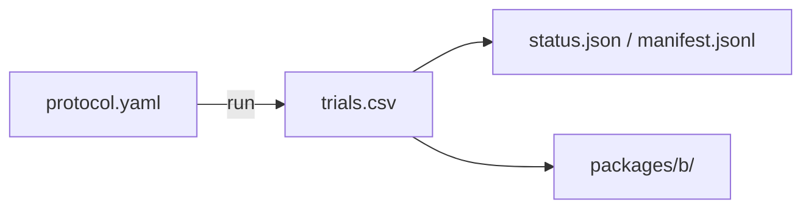

# phase4_kubo_structure_scout

## Purpose

SCOUT Kubo structure map across four layouts. Used to plan claim reseed windows. Not claim-grade by itself.

## Setup

- Protocol: `scaling_v2` (`phase4_kubo_structure_scout`)
- Depends on: none for running. Starts the Kubo structure chain. Writes `trials.csv`.
- Method: `kubo`
- Layouts: compact, wide, split, outlier_rich
- N: {50, 100, 200}
- D: {1, 2, 3, 4, 6, 10, 15, 20, 25, 35}
- Seeds: 30
- Theta: 0.90
- T0: 10000
- obs_mode: global
- Package export: B
- Command: `make -C scaling scaling-transfer-structure-scout TRANSFER_METHOD=kubo WORKERS=16`

## Completeness

3,600 / 3,600 trials (`status.json` complete).

## Runtime

Started:  26 Sep 2026, 02:13 UTC
Finished: 26 Sep 2026, 18:52 UTC
Total:    16h 39m

## Results

Scout Package B is a 30-seed sketch. Compact/split keep `D_min` = 1; wide is hard failure; outlier_rich N=200 looks soft on scout (`D_min` = 2 with overcrowding flags) and is superseded by the claim merge (`D_min` = 20 at 200 seeds).

## Files in this folder

### Dependencies



```
.
|-- manifest.jsonl
|-- protocol.yaml
|-- status.json
|-- trials.csv
`-- packages/
    `-- b/
```

**Config**
- `protocol.yaml`: Run settings (method, layouts, N/D grid, seeds, grade).

**Auto-generated (run)**
- `manifest.jsonl`: Per-cell progress log; enables resume without re-running ok cells.
- `status.json`: Planned vs done counts, complete flag, start/finish, elapsed.
- `trials.csv`: One row per seed (success, ticks, path/effort, layout, N, D, ...).

**Auto-generated (analysis packages)**
- `packages/b/`: Package B (structure / layout tables).

Trajectory parquet written during the run is not retained here.

## Limits

SCOUT (30 seeds). Not for claims. For outlier_rich N=200 use the claim merge.
