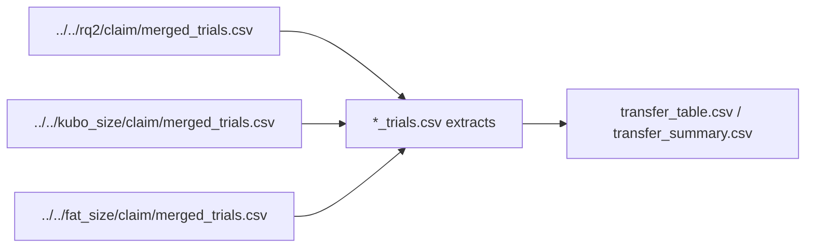

# Package D: size transfer

This folder is **auto-generated** by the analysis package export (Package D transfer tables compiled across methods). Do not edit these files by hand.

Side-by-side size frontiers for `strombom_multi`, `kubo`, and `fat` on compact starts: shared, shifted, or absent `D_min` / overcrowding cells.

## Depends on



- Baseline: `../../rq2/claim/merged_trials.csv` (`strombom_multi`)
- Kubo: `../../kubo_size/claim/merged_trials.csv`
- FAT: `../../fat_size/claim/merged_trials.csv`

## Artefacts

```
.
|-- artefacts.json
|-- fat_trials.csv
|-- kubo_trials.csv
|-- transfer_summary.csv
`-- transfer_table.csv
```

**Auto-generated (analysis)**
- `artefacts.json`: Index of paths written by the analysis package export.
- `fat_trials.csv`: Trial extract used for the FAT side of Package D.
- `kubo_trials.csv`: Trial extract used for the Kubo side of Package D.
- `transfer_summary.csv`: Counts of shared / shifted / absent transfer rows.
- `transfer_table.csv`: Per feature x N x method: baseline vs method value and transfer label (shared / shifted / absent).

## Numbers

44 compared rows: 8 shared, 7 shifted, 29 absent. Kubo shares `D_min` = 1 with baseline for N >= 25; small-N cells shift. FAT is mostly absent (hard failure for N >= 25).

Transfer labels (C4) in `transfer_table.csv` / `transfer_summary.csv`:

- `shared`: method matches the Strombom baseline value for that feature x N cell.
- `shifted`: both sides have a defined value, but they differ.
- `absent`: the method (or baseline) has no defined value for that cell (for example hard failure / no `D_min`).
