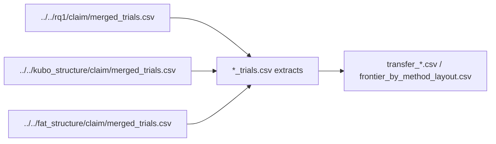

# Package D: structure transfer

This folder is **auto-generated** by the analysis package export (Package D transfer tables compiled across methods). Do not edit these files by hand.

Side-by-side structure frontiers for `strombom_multi`, `kubo`, and `fat` across the four layouts.

## Depends on



- Baseline: `../../rq1/claim/merged_trials.csv` (`strombom_multi`)
- Kubo: `../../kubo_structure/claim/merged_trials.csv`
- FAT: `../../fat_structure/claim/merged_trials.csv`

## Artefacts

```
.
|-- fat_trials.csv
|-- frontier_by_method_layout.csv
|-- kubo_trials.csv
|-- strombom_multi_trials.csv
|-- transfer_compact.csv
|-- transfer_outlier_rich.csv
|-- transfer_split.csv
`-- transfer_wide.csv
```

**Auto-generated (analysis)**
- `fat_trials.csv`: Trial extract used for the FAT side of Package D.
- `frontier_by_method_layout.csv`: Fewest dogs / B* / hard_failure and rates by method x layout x N.
- `kubo_trials.csv`: Trial extract used for the Kubo side of Package D.
- `strombom_multi_trials.csv`: Trial extract used for the baseline method side of Package D.
- `transfer_compact.csv`: Structure transfer labels for compact starts.
- `transfer_outlier_rich.csv`: Structure transfer labels for outlier_rich starts.
- `transfer_split.csv`: Structure transfer labels for split starts.
- `transfer_wide.csv`: Structure transfer labels for wide starts.

## Numbers

Kubo matches baseline `D_min` = 1 on compact and split. Outlier_rich N=200 is shifted (Kubo `D_min` = 20 vs baseline 1). Wide is hard failure for Kubo. FAT is hard failure on all four layouts at N in {50, 100, 200}.

Transfer labels (C4):

- `shared`: method matches the Strombom baseline `D_min` (or related feature) for that layout x N.
- `shifted`: both sides defined, but values differ.
- `absent`: method or baseline has no defined value (hard failure / missing frontier cell).
