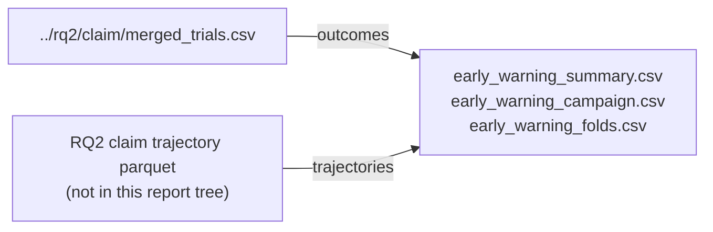

# RQ7: early warning

Can recent flock and dog state warn of a later failure better than knowing only N and D?

## Status

DONE as analysis only, but not answerable cleanly on this data. No new simulations. Package G used claim-grade trajectories from the RQ2 size map. Those trajectory parquet files are not included here; the summary tables below are.

## Dependencies



| Input | Role |
|-------|------|
| `../rq2/claim/merged_trials.csv` | Claim-grade outcomes and cell keys |
| RQ2 claim trajectory parquet (outside report) | Per-tick state for early-warning features |

No new sims. Re-running RQ7 needs the RQ2 claim merge plus trajectory stores from the claim run (`store_timeseries: true` on claim protocols).

## This folder

Analysis CSVs live at the top level and are mirrored under `packages/`.

```
.
|-- CLAIM_NOTE.md
|-- artefacts.json
|-- early_warning_campaign.csv
|-- early_warning_folds.csv
|-- early_warning_summary.csv
`-- packages/
    `-- g/
```

**Config**
- `CLAIM_NOTE.md`: Claim note (C7a / C7b verdicts and limits).

**Auto-generated (analysis)**
- `artefacts.json`: Index of paths written by the analysis package export.
- `early_warning_campaign.csv`: Campaign settings and AUROC vs (N, D) baseline.
- `early_warning_folds.csv`: Per-fold AUROC detail (may be empty).
- `early_warning_summary.csv`: Lead-time and coverage summary across failure trials.

**Auto-generated (analysis packages)**
- `packages/g/`: Package G (early-warning tables; mirrors the CSVs above).

## Takeaway

By the first check at tick 1,000, almost every successful RQ2 size-map run has already finished, so there is no late window left to warn.

## Claims

| Claim | What it asks (supported when) | Verdict |
|-------|-------------------------------|---------|
| C7a | Held-out state AUROC exceeds the held-out `(N, D)` baseline | INCONCLUSIVE |
| C7b | At least 30 percent of failure trials have lead time of at least 500 ticks | REJECTED (`frac_lead_ge_500` ≈ 0.083) |
