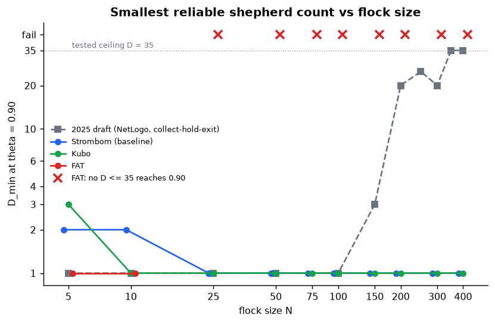

# HerdSim scaling study: short report

## What this is about

When a few dogs guide a larger flock, how much control do you actually need as the flock gets bigger, or starts more spread out?

That is the question this study tries to answer carefully. We do not assume there is one universal scaling law. We ask questions we can run in simulation, fix the rules so comparisons stay fair, and only claim what the runs support.

**HerdSim** is the platform we used. A few dogs guide sheep to a goal under settings we can lock and repeat. For this study it is a model system for measuring *control demand* (how many dogs, or how much dog work, is enough), not a copy of a real farm.

Control here is indirect: we cannot steer every sheep by hand. The dogs only push through local reactions. So "how much control" is something we can measure as size and starting shape change.

This package is meant to be readable on its own. The short report tells the story. Folders under `rq1/` through `rq7/` and `protocol/` hold the setup files, trial tables, and notes if you want to check a number.

---

## What we asked

After the core runs, we wanted concrete answers about:

- whether start shape matters beyond size,
- how dog need changes as the group grows,
- which processes seem to drive the pattern,
- what looks shared across herding methods versus method-specific.

### Core questions

**RQ1 (structure).** At the same flock size, does start shape (spread, split, outliers) change how many dogs are needed? Run on the baseline method only.

**RQ2 (size and regimes).** As flock size grows, how does the useful dog range change: the minimum for reliable herding, and whether adding more still helps, mostly wastes walking, or starts to hurt?

**RQ3 (mechanism).** Why does the pattern appear (for example dog interference, flock splitting, coverage limits)? Analysis only, when we have matched efficient and overcrowding cells at the same size.

**RQ4 (generality).** If we switch herding method, which parts of the pattern stay the same? Repeat size and structure maps for Kubo and FAT beside the baseline.

### Follow-on questions

**RQ5 (information).** Can better sensing or communication reduce the dog count at the same reliability?

**RQ6 (scaling fits).** Once we have minimum dog counts vs flock size, which simple curve best predicts a held-out size, and is one power law enough?

**RQ7 (early warning).** Can recent flock state warn of failure better than knowing only N and D?

We are not trying to pick the "best" herding algorithm, copy every detail of real livestock, or ship a farm product. Only claim what the evidence supports.

---

## How we studied it

### Shared rules

Every scientific run uses the same frozen protocol (`scaling_v2`):

| Piece | Setting |
|-------|---------|
| Task | Drive every sheep into a goal disk before the deadline (`drive_to_goal`) |
| Field | 500 by 500; flock centre (250, 250); goal (370, 250); drive length 120 |
| Goal radius | `15 * sqrt(N/50)` so area per sheep stays roughly constant |
| Reliability bar | succeed in at least 90% of repeats (`theta = 0.90`); we also report 0.50 and 0.70, but they do not define the minimum |
| Flock sizes `N` | `{5, 10, 25, 50, 75, 100, 150, 200, 300, 400}` |
| Dog counts `D` | `{1, 2, 3, 4, 6, 10, 15, 20, 25, 35}` |
| Start layouts | compact, wide, split, outlier_rich |
| Main deadline | T0 = 10,000 ticks; a longer T1 = 20,000 only if overcrowding cells appear |
| Seeds | smoke 5; scout 30; claim 100 (200 on soft edges); master seed 2026 |

`D_min` means the smallest tested dog count that clears the 90% bar. It is not a property of sheep in nature; it depends on this task and these locks.

Machine-readable defaults sit in [`protocol/canonical_grid.yaml`](protocol/canonical_grid.yaml). Campaign YAML subsets sit in [`protocol/protocols/`](protocol/protocols/).

### Why three methods

We need different *kinds* of dog rules on the same task, not three tiny variants of the same idea:

| Method | Role | Plain description |
|--------|------|-------------------|
| `strombom_multi` | Baseline | Dogs gather stragglers (Collect), then push the flock to the goal (Drive) |
| `kubo` | Transfer | Continuous force rules; each dog pushes the sensed sheep farthest from the goal |
| `fat` | Transfer | Each dog chases the sheep farthest from itself; dogs do not space themselves apart |

If all three show the same pattern, that pattern is more likely about the task. If Kubo or FAT breaks it, we learn how far we can generalise. That is what RQ4 is for. It does not mean these three cover every herding idea in the world.

### Why smoke, scout, then claim

We need accurate success rates near the important edges (where the minimum sits, and where overcrowding might start). Running every cell at 100 seeds would waste budget on cells that always succeed or always fail.

So each simulation campaign stages the work:

1. **Smoke (5 seeds):** pipeline check on a small grid.
2. **Scout (30 seeds):** cheap map of the full scientific grid so we can see where reliability lives.
3. **Claim (100 seeds, or 200 on soft edges):** reseed only the window cells that matter.

Scout covers the whole map; claim covers a small window. Claims use claim-grade merges, not scout alone.

### How many trials we ran

| RQ | What | SMOKE | SCOUT | CLAIM | Total | Status |
|----|------|------:|------:|------:|------:|--------|
| RQ1 | Structure map (baseline, 4 layouts) | 600 | 3,600 | 2,400 | 6,600 | DONE |
| RQ2 | Size map (baseline, compact) | 150 | 3,000 | 2,200 | 5,350 | DONE |
| RQ3 | Mechanism contrast | 0 | 0 | 0 | 0 | SKIPPED |
| RQ4 | Kubo then FAT size + structure | 0 | 13,200 | 10,500 | 23,700 | DONE |
| RQ5 | Observation, range, communication ladders | 0 | 0 | 0 | 0 | NOT RUN YET |
| RQ6 | Curve fits on claim frontiers | 0 | 0 | 0 | 0 | DONE (analyse) |
| RQ7 | Early warning on claim trajectories | 0 | 0 | 0 | 0 | DONE (analyse) |
| **All** | | **750** | **19,800** | **15,100** | **35,650** | |

RQ2's longer-deadline T1 was also planned and skipped (0 overcrowding cells). RQ5 is not run yet (prior Phase 5 trees removed after obs/comm bugs). Claim merges hold 30,670 rows (fewer than total sims because a reseeded cell drops its scout rows from the merge). Integrity checks are in [`TRUST_AUDIT.md`](TRUST_AUDIT.md).

Commands used (from the HerdSim repo root; re-running needs that codebase, not only this folder):

```bash
# RQ2 size map
make -C scaling scaling-pilot WORKERS=16
make -C scaling scaling-scout WORKERS=16
make -C scaling scaling-claim-reseed WORKERS=16

# RQ1 structure map
make -C scaling scaling-phase2-scout WORKERS=16
make -C scaling scaling-phase2-claim-reseed WORKERS=16

# RQ4 transfer (kubo, then fat)
make -C scaling scaling-transfer-size-scout TRANSFER_METHOD=kubo WORKERS=16
make -C scaling scaling-transfer-size-claim-reseed TRANSFER_METHOD=kubo WORKERS=16
make -C scaling scaling-transfer-structure-scout TRANSFER_METHOD=kubo WORKERS=16
make -C scaling scaling-transfer-structure-claim-reseed TRANSFER_METHOD=kubo WORKERS=16
# repeat with TRANSFER_METHOD=fat

# RQ5 ladders (not run yet; planned)
# WORKERS=18 bash scaling/results/phase5/run_all_ladders.sh
```

Exact grids, seeds, and run notes for each campaign sit under the matching `rq*/` folder.

---

## What we found

### RQ1: does start shape change dog need?

**Status:** Answered on the baseline (`strombom_multi`). Kubo and FAT structure maps are under RQ4.

At N = 50, 100, and 200, all four start layouts have `D_min = 1`. Start shape does not change how many dogs you need for the 90% bar on the baseline.

It does change cost. Wide and large outlier-rich starts take much longer and more walking than compact. Split looks a lot like compact. Because `D_min` never moved across layouts, we could not test whether early flock-state measures predict difficulty better than knowing only N and D.

One-dog cost by layout (median over successful trials; success rate 1.00 at D = 1 for every cell):

| Layout | N | Median ticks | Median path |
|--------|---:|---:|---:|
| compact | 50 | 195 | 158 |
| compact | 100 | 204 | 161 |
| compact | 200 | 191 | 144 |
| split | 50 | 195 | 158 |
| split | 100 | 205 | 162 |
| split | 200 | 193 | 144 |
| outlier_rich | 50 | 224 | 209 |
| outlier_rich | 100 | 501 | 554 |
| outlier_rich | 200 | 1,228 | 1,647 |
| wide | 50 | 2,139 | 2,925 |
| wide | 100 | 3,074 | 4,319 |
| wide | 200 | 3,870 | 5,213 |

Wide versus compact at one dog: about 11x to 20x more time and about 19x to 36x more path. On wide starts, the cheapest reliable choice is two dogs (`B* = 2`): the second dog cuts path while staying reliable.


*Wide and large outlier-rich starts cost much more time and path at one dog; D_min stays 1.*

More detail: [`rq1/`](rq1/).

### RQ2: how does dog need change with flock size?

**Status:** Answered on the baseline (`strombom_multi`, compact) inside the tested dog list through D = 35.

The useful lower end is small and almost flat. At one dog, N = 5 and 10 fail the 90% bar (success about 0.07 and 0.24). From N = 25 upward, one dog is enough. Adding dogs past the minimum does not break success on that map; it mostly adds walking (88 of 100 cells labeled wasteful; 0 overcrowding).

Baseline compact frontier at the 90% bar:

| N | D_min | D_max | Maximum SR |
|---:|---:|---|---:|
| 5 | 2 | not reach | 100% |
| 10 | 2 | not reach | 100% |
| 25 | 1 | not reach | 100% |
| 50 | 1 | not reach | 100% |
| 75 | 1 | not reach | 100% |
| 100 | 1 | not reach | 100% |
| 150 | 1 | not reach | 100% |
| 200 | 1 | not reach | 100% |
| 300 | 1 | not reach | 100% |
| 400 | 1 | not reach | 100% |

Here "not reach" means no overcrowding appeared before D = 35, so `D_max` is only the top of our tested list, not a measured collapse. Bootstrap width on every `D_min` above is zero.


*Success-rate surfaces. Baseline and Kubo show a reliable band on compact starts; FAT does not for larger N.*


*Extra dogs mainly raise path after the minimum; success stays high (waste, not overcrowding).*

More detail: [`rq2/`](rq2/).

### RQ3: what mechanism drives the pattern?

**Status:** Not answerable yet. SKIPPED as a contrast.

The plan was to compare efficient cells with overcrowding cells at the same N. We never saw overcrowding on the baseline size map inside D <= 35, so that contrast does not exist. Correlation candidates (interference, splitting, and related logs) were not tested against a real upper failure band.

Unlocking RQ3 needs either a measured collapse (for example D > 35, or a harder draft-style task) or another protocol where overcrowding appears. See [What we plan next](#what-we-plan-next). Note: [`rq3/`](rq3/).

### RQ4: do the patterns transfer across methods?

**Status:** Partial.

On tight (compact) starts, Strombom and Kubo share a low `D_min` floor for larger flocks. FAT does not copy that story.

Compact `D_min` at the 90% bar:

| N | Baseline (`strombom_multi`) | Kubo | FAT |
|---:|---:|---:|---|
| 5 | 2 | 3 | 1 |
| 10 | 2 | 1 | 1 |
| 25 | 1 | 1 | not reach |
| 50 | 1 | 1 | not reach |
| 100 | 1 | 1 | not reach |
| 150 | 1 | 1 | not reach |
| 200 | 1 | 1 | not reach |
| 300 | 1 | 1 | not reach |
| 400 | 1 | 1 | not reach |

Structure breaks transfer further. Shared compact floors do not imply shared structure behavior.

Structure-map `D_min` at the 90% bar (N in `{50, 100, 200}`):

| Layout | N | Baseline | Kubo | FAT |
|--------|---:|---:|---:|---|
| compact | 50 | 1 | 1 | not reach |
| compact | 100 | 1 | 1 | not reach |
| compact | 200 | 1 | 1 | not reach |
| split | 50 | 1 | 1 | not reach |
| split | 100 | 1 | 1 | not reach |
| split | 200 | 1 | 1 | not reach |
| outlier_rich | 50 | 1 | 1 | not reach |
| outlier_rich | 100 | 1 | 1 | not reach |
| outlier_rich | 200 | 1 | 20 | not reach |
| wide | 50 | 1 | not reach | not reach |
| wide | 100 | 1 | not reach | not reach |
| wide | 200 | 1 | not reach | not reach |

On Kubo wide, best success is about 0.47 to 0.54. FAT clears no structure cell at these sizes. Kubo `outlier_rich` at N = 200 is a point estimate `D_min = 20` with a wide bootstrap interval `[2, 20]`.



*Baseline and Kubo stay near one dog for large compact flocks. FAT has no D_min for N >= 25. A 2025 NetLogo draft on a harder collect-hold-gate task rose sharply; that draft was not rerun here.*


*At N = 200, compact and split look shared for Strombom and Kubo; wide and large outlier-rich do not.*


*Soft edge: point D_min = 20 after 200 seeds; bootstrap still wide.*

That is enough to reject "the same story everywhere," but not enough to say which patterns are shared across a broader method set. More detail: [`rq4/`](rq4/).

### RQ5: can better information replace dogs?

**Status:** Not run yet.

No claim-grade observation, range, or communication ladder results are published. Prior Phase 5 trees were removed after shared sim bugs (bearing-only freeze, range under global observation, communication list stacking). Protocols remain for a clean rerun.

More detail: [`rq5/`](rq5/).

### RQ6: which curve fits D_min vs N?

**Status:** Weak, but the planned fit package ran.

On the baseline compact map, `D_min` is almost only two values: 2 for N = 5 and 10, and 1 for everything larger. Leave-one-N-out RMSE (lower is better):

| Model | RMSE |
|-------|-----:|
| Constant | 0.44 |
| Linear | 0.44 |
| Power law | 0.25 |
| Piecewise | 0.13 |

Piecewise wins because it matches that step, not because we measured a rich growth law. These fits are not a universal scaling law.


More detail: [`rq6/`](rq6/).

### RQ7: can state warn of failure early?

**Status:** Not answerable on this data.

By the first check at tick 1,000, almost every successful RQ2 size-map run has already finished (median success about 183 ticks). Failures are almost all tiny flocks with one dog that run to the deadline. There is no late window left to warn before success or failure settles. Held-out AUROC folds were empty. Only 14 of 169 failures had a measured lead time of at least 500 ticks (about 8.3%; the bar was 30%).


*Successful runs finish early; the shaded warning checks start after most successes are already done.*

More detail: [`rq7/`](rq7/).

### Claims scorecard

Verdicts use claim-grade evidence only.

| Claim | RQ | Verdict | Meaning in plain words |
|-------|----|---------|------------------------|
| C1a | RQ1 | REJECTED | Layout did not move `D_min` on the baseline |
| C1b | RQ1 | INCONCLUSIVE | No `D_min` shift, so state-vs-(N, D) predictor test could not run |
| C2a | RQ2 | REJECTED | No overcrowding on the baseline size map |
| C2b | RQ2 | SKIPPED | No overcrowding cell to extend to T = 20,000 |
| C3 | RQ3 | INCONCLUSIVE | Mechanism contrast undefined without overcrowding |
| C4 | RQ4 | SUPPORTED (partial) | Compact size shared for Strombom/Kubo (N >= 25); FAT and several structure cases break transfer |
| C5a | RQ5 | NOT RUN | Information ladders not rerun yet |
| C5b | RQ5 | NOT RUN | Information ladders not rerun yet |
| C6a | RQ6 | SUPPORTED | Power law worse than piecewise on leave-one-N RMSE |
| C6b | RQ6 | SUPPORTED | Flat `D_min = 1` on compact N in {25..400}, so log-log slope 0 |
| C7a | RQ7 | INCONCLUSIVE | Held-out AUROC could not be computed |
| C7b | RQ7 | REJECTED | Too few failures with lead time >= 500 ticks |

These checks only support statements inside the tested protocol. They do not support a universal law, an untested task, or real-farm performance.

---

## What we did not settle / limits

- **One task.** Results are for `drive_to_goal` under this frozen protocol only.
- **Grid ceiling.** `D_max = 35` means "still OK at the largest D we tried," not "collapse begins at 35."
- **No overcrowding on the baseline size map.** That is why RQ3 did not run and T1 was skipped.
- **Transfer is only partial.** Compact size floors for Strombom and Kubo do not extend to FAT, Kubo-wide, or large Kubo outlier-rich.
- **Easy compact map.** Many baseline cells succeed at D = 1 with success near 1.00, so rising dog-count laws, information savings, and early-warning overlap are hard to see.
- **RQ5 not run yet.** Prior Phase 5 trees were removed after obs/comm bugs; no claim-grade RQ5 evidence is published.
- **RQ7 timing.** Warning checks start after almost every success has finished.
- **Simulated controllers.** No farm or biology validity claim.
- **Discrete dog list.** We cannot resolve effects finer than one step on that list.
- **Time across methods.** Do not treat Kubo ticks as the same physical time as Strombom-family ticks.

A 2025 NetLogo draft on a collect-hold-gate task needed many dogs for large flocks. We did not rerun that draft. On *this* compact `drive_to_goal` map, the draft's "large N needs many dogs" story does not appear for the baseline or Kubo.

---

## What we plan next

None of the items below have been run as claim-grade work in this package. They are intentions.

### Measure an upper collapse (or a harder task)

We still do not know whether success eventually falls for D > 35, or whether path waste keeps rising without collapse. That matters because it turns the current list ceiling into a measured upper story, and it is what unlocks RQ3 (efficient vs overcrowding at the same N).

| Question | Why it matters | How we would run it |
|----------|----------------|---------------------|
| After a good band, does success fall for some D > 35? | Measured collapse instead of a ceiling | Extend the dog-count list past 35 on selected N |
| If success stays high, does path waste keep rising? | Waste-only upper band | Same extended sweep; report path and regimes |
| Does a longer deadline rescue high-D failures at T0? | Separates "too slow" from true overcrowding | T1 only on candidate overcrowding cells |
| Do efficient and overcrowding cells differ in interference or splitting? | Unlocks RQ3 | Matched tests at the same N |
| Does that upper story transfer across methods? | RQ4 on the upper band | Repeat under Kubo / FAT (later `communication_free`) |

Another path without raising the dog cap: port the draft-style collect-hold-gate task into HerdSim and see whether overcrowding appears inside D <= 35. Not scheduled yet.

### Finish RQ4 more cleanly

1. Run the planned next transfer method, `communication_free`, on the same size and structure maps.
2. Tighten or clearly mark soft edges (especially Kubo `outlier_rich` at N = 200, bootstrap `[2, 20]`).
3. Ask why FAT and Kubo-wide fail under this protocol, then retry a fairer FAT setup if needed (for example local sensing as the method intends), still on the frozen grids.
4. Once an upper collapse exists, repeat the size/structure transfer check on that upper band.

### Fairer follow-ups for RQ5 and RQ7

- RQ5: rerun the three ladders after the shared obs/comm fixes (`local_positions` for range and communication; bearing proxies beyond the stop radius; sheep-index union for sharing). Prefer a layout or method where more than one dog is needed.
- RQ7: need failures and successes overlapping in time (harder layout or method, or earlier check times).

---

## Evidence in this package

After this short report, you can dig into:

| Path | What it holds |
|------|----------------|
| [`protocol/`](protocol/) | Frozen `canonical_grid.yaml` and campaign YAML subsets |
| [`rq1/`](rq1/) | Structure campaign (setup, trials, Package B) |
| [`rq2/`](rq2/) | Size campaign (setup, trials, Package A); T1 note |
| [`rq3/`](rq3/) | SKIPPED note only |
| [`rq4/`](rq4/) | Kubo/FAT size and structure maps; Package D |
| [`rq5/`](rq5/) | NOT RUN YET note only (no trials) |
| [`rq6/`](rq6/) | Scaling-fit tables (Package F) |
| [`rq7/`](rq7/) | Early-warning summary tables (Package G) |
| [`TRUST_AUDIT.md`](TRUST_AUDIT.md) | Count and protocol-hash integrity checks |
| [`figures/`](figures/) | Plots used in this report |

Each `rq*/` folder has a README that explains what the files mean. Trajectory parquet files are not included (they are large; RQ7 keeps summary tables only).
