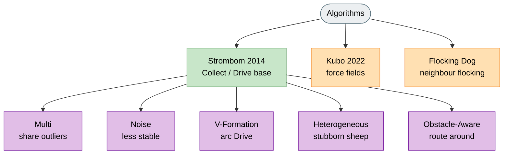

# Algorithms

HerdSim implements algorithms from the published literature and a small set of HerdSim variants. Every algorithm runs under the same scenarios and the same metrics, so comparisons stay direct.

## Family map



Legend: grey = index, green = Strombom base, purple = Strombom variants, orange = other algorithms.

## Chooser

| Algorithm | What it is | Why it is in HerdSim | Goal |
|-----------|------------|----------------------|------|
| **Strombom 2014** | Single-shepherd Collect / Drive base | Paper-faithful herding heuristic | Gather outliers, then drive a cohesive flock into the goal |
| **Strombom Multi-Dog** | Coordinated multi-dog Collect / Drive | Avoid dogs stacking on one point | Spaced Collect / Drive coverage as a multi-dog baseline |
| **Strombom Noise** | Same rules, noisier defaults | Stress-test robustness | Show sensitivity of Collect / Drive under jitter |
| **V-Formation** | Multi-dog V-arc Drive | Compare Drive geometry | Even pressure across the flock back during Drive |
| **Heterogeneous** | Stubborn sub-population of sheep | Model mixed flock response | Quantify harder herding when some sheep resist |
| **Obstacle-Aware** | Drive deflection around obstacles / gates | Constrained scenarios | Reach the goal without locking onto a blocked line |
| **Kubo 2022** | Continuous force-based multi-dog | Different dynamics family | Fan dogs behind the flock and advance without Collect / Drive modes |
| **Flocking Dog** | Topological sheep flocking + Collect / Drive dog | Empirical neighbour-based sheep model | Small-flock herding with local attraction / alignment |

## Algorithm groups

### Strombom family (Collect / Drive)

These algorithms share Strombom 2014 sheep dynamics and the Collect / Drive shepherd switch based on the cohesion threshold

```
f(N) = r_a * N^(2/3)
```

### Other algorithms

| Algorithm | Family | Basis |
|-----------|--------|-------|
| **Kubo 2022** | Continuous force-based, multi-shepherd | Kubo et al., Artif. Life Robotics, 2022 |
| **Flocking Dog 2024** | Topological flocking + Collect / Drive shepherding | Jadhav et al., Commun. Biol., 2024 |

Flocking Dog uses a Collect / Drive-style shepherd, but its sheep model is not Strombom: sheep use topological attraction and alignment subsets rather than the Strombom heading sum. Kubo is a separate force-based family with no discrete Collect / Drive modes.

## Two dynamics styles

**Collect / Drive.** The shepherd recovers outliers (Collect) or pushes a cohesive flock toward the goal (Drive). Mode switching depends on whether any sheep lies outside the cohesion threshold around the flock centre of mass.

**Continuous force-based.** Sheep and shepherds respond to weighted force fields at every integration step. Dogs spread through dog-dog repulsion and target the sheep farthest from the goal within sensing range. There is no explicit Collect / Drive switch.

## Comparing algorithms

Use **Arena** for side-by-side runs under a shared seed and scenario. Use **Analytics** for multi-seed trials or parameter sweeps, then export CSV or JSON.

Path length and speed are not directly comparable between Strombom-family algorithms (fixed displacement per tick) and Kubo (continuous integration with `dt`). Analytics exports document this caveat.
