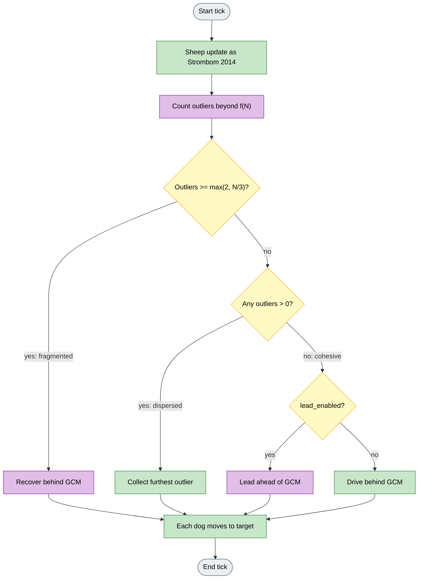
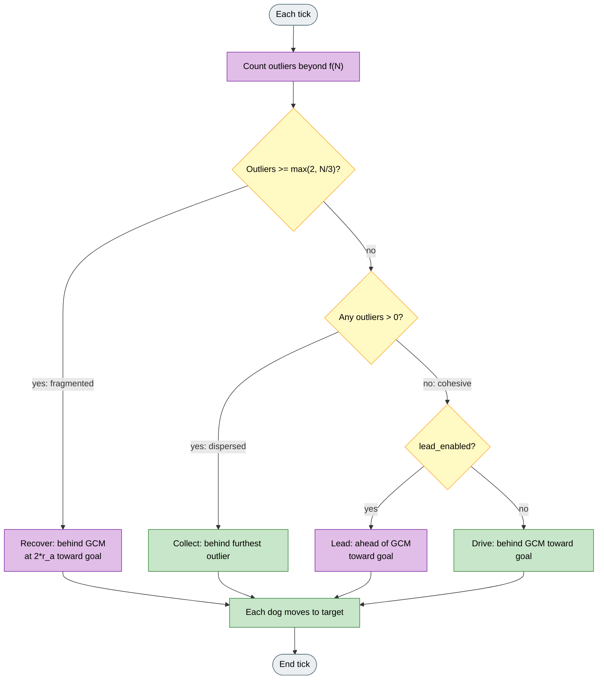

# Adaptive

## What it is

Instrument preset: `adaptive`
(`sheep_model=strombom`, `dog_controller=adaptive`).

Classifies the flock as dispersed, cohesive, or fragmented, then selects collect, drive, recover, or lead for all dogs on that tick. This is a HerdSim mode switcher for fixed-vs-adaptive comparisons. It borrows ideas from context-aware control and lead/herd papers, but it is not a port of any one of them.

**Fidelity:** Collect and drive use Strombom helpers. The outlier-count classifier and recover behaviour are HerdSim additions. Lead moves the dog ahead of the flock when cohesive, but does not implement Strombom et al. (2026) sheep attraction or their full protocol.

## Why

Fixed Collect / Drive can work well on open-field runs and then struggle when the flock splits, re-forms, or needs a different spatial strategy. Recent work argues transporters should switch behaviour with context (for example lead when the flock is tight, herd when it is not).

Adaptive makes that switch explicit in run metadata (`flock_state`, `herding_mode`), so you can compare a fixed policy with a context-dependent one on the same metrics and seeds, without adding a new sheep model.

## Goal

Compare Adaptive with fixed Strombom Collect / Drive on harder held-out settings (noise, obstacles, heterogeneous sheep). Watch `flock_state` and `herding_mode` over time. A good result means the switch picks useful modes more often than a fixed policy under the same metrics. It does not mean HerdSim reproduces a specific 2024 or 2026 paper result.

## What changes

| Aspect | Strombom 2014 | Adaptive |
|--------|---------------|----------|
| Sheep | Graze / flee / flock | Unchanged (still flee; no follow mode) |
| Mode set | Collect or Drive | Collect, Drive, Recover, or Lead |
| Switch | f(N) cohesive vs not | Outlier-count classifier: fragmented / dispersed / cohesive |
| Collect | Behind furthest outlier | Same (when dispersed) |
| Drive | Behind GCM toward goal | Same (when cohesive and lead off) |
| Recover | -- | Stand-off `2 * r_a` behind GCM toward goal (when fragmented) |
| Lead | -- | Point ahead of GCM toward goal (when cohesive and `lead_enabled`) |
| Default M | 1 | 2 |

## Key differences from Collect / Drive and Communication-Free

| Instrument | Who decides | Behaviours |
|------------|-------------|------------|
| Strombom 2014 | One Collect / Drive rule | collect, drive |
| Communication-Free | Per-dog Collect / Drive on local view | collect, drive |
| Adaptive | Shared flock-state classifier for all dogs | collect, drive, recover, lead |

Adaptive uses one classification (from the first observation view) for every dog that tick. It does not decentralise like Communication-Free.

## How (idea)

Each tick: classify flock state from outlier count, pick one behaviour for the team, then move each dog to the matching target.



Legend: grey = start/end, yellow = decision, green = Strombom-style targets, purple = Adaptive-only states and lead/recover.

## How (rules)

### Sheep dynamics

Unchanged Strombom 2014. Read **Strombom 2014** for the heading sum and graze rules. Sheep still flee the dog; there is **no sheep follow / attraction-to-leader mode**.

### Flock classification

Using the flock view from the first observation (shared decision for all dogs):

```
threshold = f(N) * collect_threshold_scale
outliers = count of sheep with distance to GCM > threshold
```

| Condition | State |
|-----------|-------|
| `outliers >= max(2, N/3)` | fragmented |
| `outliers > 0` | dispersed |
| otherwise | cohesive |

```
f(N) = r_a * N^(2/3)
```

### Behaviour selection

| State | Behaviour | Target |
|-------|-----------|--------|
| dispersed | collect | Strombom Collect: behind furthest outlier relative to GCM at stand-off `r_a` |
| fragmented | recover | `position_behind_target(GCM, goal, 2 * r_a)` (press from further back to re-form) |
| cohesive + `lead_enabled` | lead | Point ahead of GCM toward goal: `GCM + 0.35 * (goal - GCM)` |
| cohesive (lead off) | drive | Strombom Drive: behind GCM toward goal at `r_a * sqrt(N)` |

### Dog step

- **Collect, recover, drive:** `shepherd_step_toward` with the Strombom stop rule (`shepherd_stop_multiple * r_a`) plus angular noise.
- **Lead:** `move_toward` at full `shepherd_speed` **without** the stop rule (dog may pass closer to sheep while ahead of the flock).



Legend: grey = start/end, yellow = decision, green = shared Strombom targets, purple = Adaptive recover / lead.

### Run metadata

- `flock_state`: `fragmented`, `dispersed`, or `cohesive`.
- `herding_mode`: `collect`, `recover`, `lead`, or `drive`.
- Canvas **assignment lines** show each dog's target and behaviour label.

## Knobs

### HerdSim preset agents

| Agent | Default |
|-------|---------|
| Sheep (N) | 50 |
| Dogs (M) | 2 |

### Parameters

Strombom 2014 parameters apply. Adaptive-specific and shared switch knobs:

| Parameter | Default | Meaning |
|-----------|---------|---------|
| `lead_enabled` | true | When cohesive, move ahead of the flock toward the goal instead of driving from behind. |
| `collect_threshold_scale` | 1.0 | Scales f(N) for the outlier classifier (and thus state transitions). |
| `r_a` | 2.0 | Entered into Collect/Drive/recover stand-offs and stop radius. |
| `shepherd_speed` | 1.5 | Displacement per tick for all behaviours. |
| `shepherd_stop_multiple` | 3.0 | Stop rule for collect / recover / drive (not lead). |
| `noise_strength` | 0.3 | Angular noise on shepherd_step_toward behaviours. |

### Experimental factors (recommended pairings)

| Factor | Typical use with Adaptive |
|--------|---------------------------|
| Scenario shift | Obstacles, noise preset, heterogeneous sheep |
| `lead_enabled` | On vs off to isolate lead vs drive when cohesive |
| `stubborn_fraction` | Fixed Collect / Drive vs Adaptive under hard sheep |
| Held-out seeds | Generalization: train/compare ranking under distribution shift |

## How to read a run

- Plot or inspect `flock_state` vs time: expect Collect when dispersed, Recover when many outliers, Lead/Drive when cohesive.
- Compare against Strombom 2014 on the same seed: Adaptive should spend fewer ticks stuck in the wrong mode on split or re-forming flocks.
- With `lead_enabled` false, Adaptive reduces to Collect / Drive / Recover only.
- Lead can look aggressive near sheep (no stop rule); interpret carefully on dense flocks.

## Limits

- Sheep still use Strombom flee dynamics. There is **no follow mode** as in lead/herd papers.
- Recover and the three-state classifier are HerdSim heuristics (`max(2, N/3)` is not from a single paper).
- Lead is a simplified stand-in (dog moves toward a point ahead of the GCM), not a full bi-modal sheep interaction model.
- Classification uses the first observation view for all dogs; it is not a per-dog decentralised policy.
- No claim to reproduce Swarm Intelligence (2024) or Strombom et al. (2026) experimental protocols.

## Fidelity status

**From context-aware / adaptive literature:** idea of selecting behaviour from flock context.

**From lead/herd literature (Strombom et al. 2026):** idea of leading when cohesive and herding otherwise, without their sheep attraction switch.

**From Strombom 2014:** sheep dynamics; Collect and Drive targets; stop rule for non-lead behaviours.

**HerdSim-only:** outlier-count classifier; recover stand-off `2 * r_a`; lead point at `0.35` of the GCM-to-goal vector; shared team decision from first observation.

**Not implemented:** sheep follow/attraction modes; full 2024 context-aware agent stack; 2026 experimental lead/herd protocol.

## Reference

**Background (context-aware / adaptive control):**

"Contextually aware intelligent control agents for heterogeneous swarms."
Swarm Intelligence, 2024.
DOI: 10.1007/s11721-024-00235-w

**Background (lead vs herd switching):**

D. Strombom, C. Hoitt, M. Cloud, et al.
"Re-Solving the Shepherding Problem: Lead When Possible, Herd When Necessary."
arXiv:2602.16750, 2026.

**Collect / Drive base:**

D. Strombom, et al.
"Solving the shepherding problem: heuristics for herding autonomous, interacting agents."
Journal of The Royal Society Interface, 11(100):20140719, 2014.
DOI: 10.1098/rsif.2014.0719
