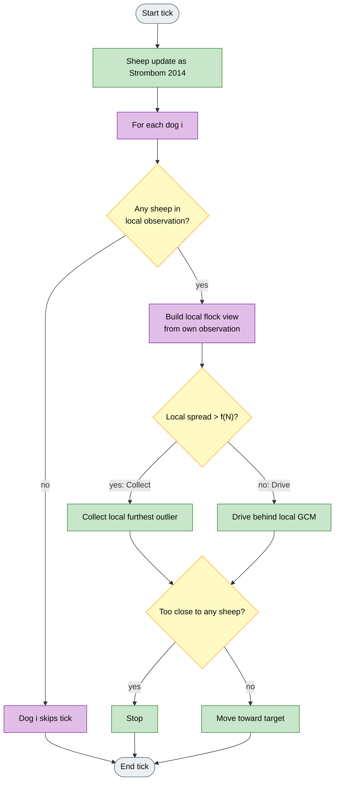
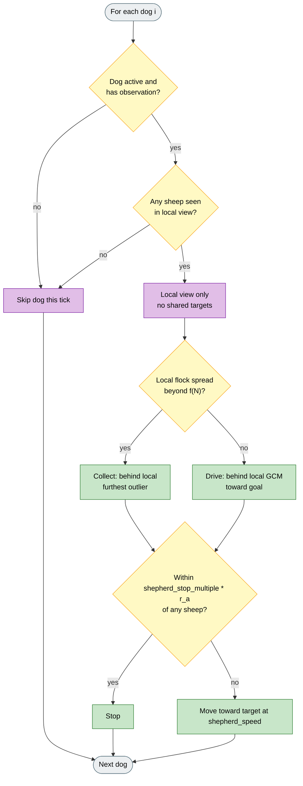

# Communication-Free

## What it is

Instrument preset: `communication_free`
(`sheep_model=strombom`, `dog_controller=communication_free`).

Each dog runs Collect / Drive from its own observation only: no shared targets, no inter-dog messages, no coordinated assignment. Use it with `communication=none` and local observation modes. The research question follows Li et al. (2023); HerdSim does not reproduce their full navigation law.

**Fidelity:** Applies standard Strombom Collect / Drive independently to each dog's local observation. Li et al.'s steering-agent dynamics and experimental layout are not reproduced.

## Why

Coordinated multi-dog Strombom (and Strombom Multi-Dog) assume dogs share one flock picture or one set of targets. Distributed shepherding work asks how well teams do when each agent decides locally, without broadcasting positions or modes.

Communication-Free makes that assumption explicit. With observation and communication factors, you can see when decentralised Collect / Drive still works, and when sharing (or a simpler rule like FAT) is needed.

## Goal

Compare decentralised Collect / Drive with coordinated Strombom Multi-Dog and with FAT on the same scenario and seeds. Watch for dogs entering different modes, duplicated work on the same outlier, or gaps where no dog sees a straggler. The point is information-sharing tradeoffs, not Li et al.'s exact performance.

## What changes

| Aspect | Strombom Multi-Dog | Communication-Free |
|--------|--------------------|--------------------|
| Sheep | Strombom 2014 | Unchanged |
| Flock view | Shared / global flock for all dogs | Per-dog local observation only |
| Mode switch | One Collect / Drive decision for the team | Independent Collect / Drive per dog on its local view |
| Collect | Assigned distinct outliers + tangential spread | Each dog Collects its own local furthest outlier (no assignment) |
| Drive | Shared Drive point + circle spacing | Each dog Drives from its local GCM (no shared arc) |
| Communication | Implicit shared state | None between dogs |
| Default M | 3 | 3 |

## Key differences from FAT and Multi-Dog

| Instrument | Local view? | Dog rule |
|------------|-------------|----------|
| Strombom Multi-Dog | Usually global | Coordinated Collect / Drive |
| Communication-Free | Yes | Local Collect / Drive (Strombom formulas on partial flock) |
| FAT | Yes | Always chase farthest visible sheep (no mode switch) |

Communication-Free keeps the Strombom cohesion test; FAT does not. Multi-Dog shares targets; Communication-Free does not.

## How (idea)

Each tick: Strombom sheep update; then each dog independently builds a local flock from its observation and runs Collect or Drive on that partial set.



Legend: grey = start/end, yellow = decision, green = Strombom step on local data, purple = per-dog isolation.

## How (rules)

### Sheep dynamics

Unchanged Strombom 2014. Read **Strombom 2014** for graze vs respond, LCM, repulsion, and heading update. Each sheep responds to dogs within `r_s` as usual.

### Dog algorithm (per dog)

For each dog `k` with a valid observation:

**1. Local view.** Build a flock view from dog `k`'s observation only (after `obs_mode`, range, bearing, and noise). If no sheep are seen, the dog does not move. No positions or modes are shared with other dogs.

**2. Local cohesion test.** On the visible sheep set of size `n_k`:

```
f(n_k) = r_a * n_k^(2/3) * collect_threshold_scale
```

If any visible sheep exceeds this distance from the **local** GCM, dog `k` enters Collect; otherwise Drive.

**3. Collect (local).** Target behind the furthest visible outlier relative to the local GCM, at stand-off `r_a` (same formula as Strombom 2014, but on the partial flock):

```
P_c = p_farthest  +  r_a * (p_farthest - GCM_local) / ||p_farthest - GCM_local||
```

There is no multi-dog outlier assignment and no tangential spacing between dogs.

**4. Drive (local).** Target behind the local GCM toward the goal (Strombom Drive formula on the visible set):

```
P_d = GCM_local  +  r_a * sqrt(n_k) * (GCM_local - goal) / ||GCM_local - goal||
```

**5. Shepherd step.** Move toward the chosen target with the Strombom stop rule (`shepherd_stop_multiple * r_a`) and angular noise `noise_strength`.



Legend: grey = start/end, yellow = decision, green = Collect/Drive step, purple = local-only wiring.

Dogs may disagree on mode when their views differ under limited sensing.

### Run metadata

- `herding_mode` is the first active dog's mode (`collect` or `drive`); individual dogs may differ.
- Canvas **assignment lines** show each dog's Collect sheep or Drive GCM target and per-dog mode.

## Knobs

### HerdSim preset agents

| Agent | Default |
|-------|---------|
| Sheep (N) | 50 |
| Dogs (M) | 3 |

### Parameters

All Strombom 2014 parameters apply with the same meanings. Communication-Free uses at least:

| Parameter | Default | Meaning |
|-----------|---------|---------|
| `r_a` | 2.0 | Entered into local f(N) and Collect/Drive stand-offs. |
| `shepherd_speed` | 1.5 | Dog displacement per tick. |
| `shepherd_stop_multiple` | 3.0 | Stop distance as a multiple of `r_a`. |
| `noise_strength` | 0.3 | Angular noise on the dog step. |
| `collect_threshold_scale` | 1.0 | Multiplier on local f(N). |

### Experimental factors (recommended pairings)

| Factor | Typical use with Communication-Free |
|--------|-------------------------------------|
| `obs_mode` | `local_positions`, `bearing_only`, vs `global` |
| `communication` | `none` (default for this instrument) vs shared/broadcast for contrast |
| `sensing_range` | How much of the flock each dog sees |
| `n_shepherds` | Herdability under decentralised Collect / Drive |

## How to read a run

- **Mode disagreement:** under local sensing, some dogs may Collect while others Drive on the same tick.
- **Duplicated Collect:** without assignment, several dogs may chase the same visible outlier.
- **Blind dogs:** empty local view means no motion for that dog that tick.
- **Fair compare:** same scenario, seed, N, M, and `obs_mode` against Strombom Multi-Dog (coordination on) and FAT (no mode switch).
- **Vs FAT:** both are local; Communication-Free still uses Collect / Drive geometry on the partial flock.

## Limits

- Not Li et al.'s steering-agent dynamics, consensus terms, or proof setup.
- No multi-dog spacing or outlier assignment (unlike Strombom Multi-Dog).
- Local GCM can be a biased subset of the true flock, so Collect / Drive can fire on the wrong scale.
- Wall reflection and scenario goals are HerdSim environment features.

## Fidelity status

**From Li et al. (2023):** research question of multiple dogs with no communication between steering agents.

**From Strombom 2014:** sheep dynamics; Collect / Drive formulas; stop distance; applied independently per local view via `compute_shepherd_velocity` / `should_collect`.

**HerdSim-only:** local observation pipeline as the only information channel; no Li-style interaction forces.

**Not implemented:** Li et al.'s specific navigation law, experimental layout, or analytic guarantees.

## Reference

**Source (communication-free multi-agent shepherding):**

Z. Li, et al.
"Communication-free shepherding navigation with multiple steering agents."
Frontiers in Control Engineering, 4, 2023.
DOI: 10.3389/fcteg.2023.989232

**Collect / Drive base:**

D. Strombom, et al.
"Solving the shepherding problem: heuristics for herding autonomous, interacting agents."
Journal of The Royal Society Interface, 11(100):20140719, 2014.
DOI: 10.1098/rsif.2014.0719
