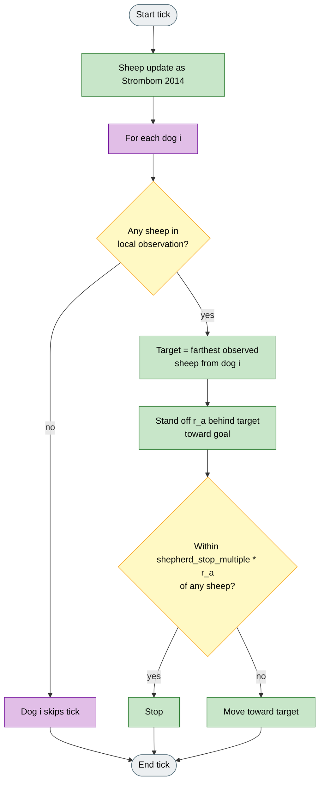
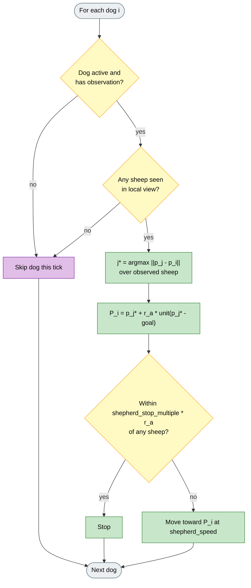

# FAT (Farthest-Agent Targeting)

## What it is

Instrument preset: `fat` (`sheep_model=strombom`, `dog_controller=fat`).

Under local observations, each dog picks the farthest sheep it can see, moves to a stand-off point behind that sheep toward the goal, and applies the Strombom stop rule. There is no Collect / Drive mode switch, no flock cohesion test, and no shared target between dogs.

The idea comes from Tsunoda et al. (2018) on local-camera shepherding. HerdSim runs a minimal version of that rule on Strombom sheep; it is not a full implementation of their paper.

**Fidelity:** Implements farthest-agent selection in the local view, using Strombom sheep, `position_behind_target`, and `shepherd_step_toward`. Tsunoda's camera model, positional-error handling, and sheep dynamics are not ported.

## Why

Global Collect / Drive assumes the herder can see enough of the flock to compute a GCM and choose Collect vs Drive. Real dogs and field robots often have limited range or bearing-only sensing.

FAT asks whether a simple rule (always press the farthest visible straggler) can still move the flock under observation-mode factors such as `local_positions` or `bearing_only`. It is a clear local baseline against global Collect / Drive and against local Communication-Free Collect / Drive.

## Goal

On Drive to Goal (or any shared scenario), compare FAT with Strombom 2014 and Communication-Free under the same seeds and metrics. A useful run shows dogs pursuing different visible sheep when views differ, making progress without a global flock picture, and failing clearly when dogs see nothing or chase the wrong visible outlier. Use it for information-limit experiments, not to claim Tsunoda's exact navigation performance.

## What changes

| Aspect | Strombom 2014 | FAT |
|--------|---------------|-----|
| Sheep | Strombom graze / flee / flock | Unchanged |
| Flock view | Global (full flock in view) | Per-dog local observation only |
| Dog decision | Collect / Drive via f(N) | Always FAT: farthest **observed** sheep |
| Target geometry | Behind outlier (Collect) or behind GCM (Drive) | Behind chosen sheep toward **goal** at stand-off `r_a` |
| Multi-dog | Independent Collect / Drive on same global flock | Independent FAT; no coordination |
| Default M | 1 | 2 |

## Key difference from Kubo

Kubo dogs also pick a "farthest" sheep, but **farthest from the goal** among sheep in range. FAT picks the sheep **farthest from the dog** among observed sheep. Under local sensing the two rules diverge: Kubo pulls the back of the flock toward the goal; FAT chases the edge of the dog's visible set.

## How (idea)

Each tick: Strombom sheep update first; then each dog independently runs FAT on its own observation.



Legend: grey = start/end, yellow = decision, green = motion step, purple = per-dog local loop.

## How (rules)

### Sheep dynamics

Unchanged Strombom 2014. Read **Strombom 2014** for graze vs respond, LCM, repulsion, and heading update.

### Dog algorithm (FAT)

For each dog `k` with a valid observation on the current tick:

**1. Visible set.** Let `S_k` be the sheep positions reported in dog `k`'s observation (after `obs_mode`, range, bearing, and noise filters). If `S_k` is empty, the dog does not move.

**2. Farthest-agent selection (Tsunoda-style local rule).** Choose the observed sheep farthest from the dog:

```
j* = argmax over j in S_k of  || p_j - p_k ||
```

where `p_k` is the dog position.

**3. Stand-off target.** Place the dog behind sheep `j*` along the goal-to-sheep ray at distance `r_a`:

```
P_k = p_j*  +  r_a * (p_j* - goal) / || p_j* - goal ||
```

This matches `position_behind_target(sheep, goal, r_a)` in code: push from behind the straggler toward the scenario goal.

**4. Shepherd step (Strombom stop + noise).** Move toward `P_k` at speed `shepherd_speed` with angular noise `noise_strength`, unless any sheep is within `shepherd_stop_multiple * r_a`, in which case the dog stops for that tick (same rule as Strombom 2014).



Legend: grey = start/end, yellow = decision, green = dog update, purple = skip when blind.

### Run metadata

- `herding_mode` is always `"fat"`.
- Canvas **assignment lines** link each dog to its chosen sheep (`mode: fat`).

## Knobs

### HerdSim preset agents

| Agent | Default |
|-------|---------|
| Sheep (N) | 50 |
| Dogs (M) | 2 |

The `fat` preset sets M = 2 so local multi-dog FAT is testable out of the box. N follows Strombom defaults.

### Parameters (from Strombom defaults used by FAT)

| Parameter | Default | Meaning |
|-----------|---------|---------|
| `r_a` | 2.0 | Stand-off behind the target sheep; also enters the stop radius. |
| `shepherd_speed` | 1.5 | Dog displacement per tick toward `P_k`. |
| `shepherd_stop_multiple` | 3.0 | Stop when within this multiple of `r_a` of any sheep. |
| `noise_strength` | 0.3 | Angular noise on the dog step (Strombom shepherd noise). |
| `r_s`, `rs_weight`, `c`, `inertia`, ... | Strombom 2014 | Sheep-side parameters; see **Strombom 2014**. |

FAT does **not** use `collect_threshold_scale`, Collect offset, or Drive offset. There is no mode switch.

### Experimental factors (recommended pairings)

| Factor | Typical use with FAT |
|--------|----------------------|
| `obs_mode` | `local_positions`, `bearing_only`, or degraded global view |
| `communication` | `none` (default for decentralised FAT) |
| `sensing_range` | Limit how many sheep each dog sees |
| `n_shepherds` | Sweep M for herdability under local FAT |

## How to read a run

- **Assignment lines:** each dog should point at its farthest visible sheep, not at the GCM.
- **Blind dogs:** under tight range or occlusion, expect ticks where a dog sees zero sheep and does not move.
- **Compare fairly:** same scenario, seed, N, M, and `obs_mode` against Strombom 2014, Communication-Free, or Kubo; interpret path length and success, not tick-for-tick timing vs Kubo (different integration).
- **Vs Communication-Free:** both use local views; Communication-Free still runs Collect / Drive on partial flocks, FAT always chases one visible straggler.

## Limits

- No Collect / Drive switch: a spread flock may leave unobserved outliers unaddressed if no dog sees them.
- No dog-dog repulsion or spacing (unlike Kubo `K_f4` or Strombom Multi-Dog arc).
- Target uses scenario **goal**, not Tsunoda's fixed experimental layout.
- Does not model camera occlusion geometry, positional error, or lost-track recovery from Tsunoda et al.
- Wall reflection is a HerdSim arena feature, not part of the FAT paper setup.

## Fidelity status

**From Tsunoda et al. (2018):** farthest-agent selection in a **local** visible set; operation without global flock coordinates.

**From Strombom 2014:** sheep dynamics; stand-off geometry; stop distance; shepherd speed and noise.

**HerdSim-only:** goal-relative stand-off at fixed `r_a` (not Tsunoda's full navigation law); Strombom sheep instead of their experimental agents; multi-dog as independent FAT loops.

**Not implemented:** Tsunoda camera model, their stability analysis under observation error, and their specific simulation calibration.

## Reference

**Source (FAT / local sensing idea):**

Y. Tsunoda, et al.
"Analysis of local-camera-based shepherding navigation."
Advanced Robotics, 32(23), 2018.
DOI: 10.1080/01691864.2018.1539410

**Sheep and stop rule base:**

D. Strombom, et al.
"Solving the shepherding problem: heuristics for herding autonomous, interacting agents."
Journal of The Royal Society Interface, 11(100):20140719, 2014.
DOI: 10.1098/rsif.2014.0719
