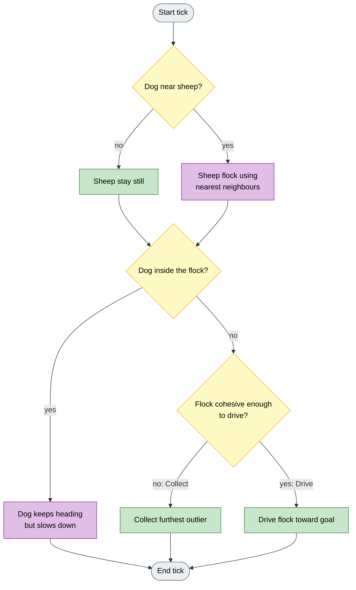

# Flocking Dog (Jadhav et al. 2024)

## Reference

V. Jadhav, et al.
"Collective responses of flocking sheep (Ovis aries) to a herding dog (border collie)."
Communications Biology, 2024.
DOI: 10.1038/s42003-024-07245-8

## Problem

Real sheep under dog pressure do not use a simple global flock model. They attend to a limited set of neighbours, and a dog that presses too hard inside the flock can scatter them instead of driving them.

## Solution

Model sheep with topological flocking: each sheep looks at its nearest neighbours and samples subsets for attraction and alignment. The dog still Collects and Drives like Strombom, but slows when it is already inside the flock. Default flocks are small (N = 14), matching the empirical setting.

## Goal

A successful run on a small flock shows neighbour-based flocking under dog pressure, Collect when the group splits, and Drive when it is tight, without the dog charging through the flock at full speed. Compared with Strombom 2014, trails look more local and variable because attraction and alignment use random neighbour subsets.

## Architecture



Legend: grey = start/end, yellow = decision, green = Collect/Drive shepherding, purple = flocking / close-dog behaviour.

## Sheep dynamics

Each sheep `i` operates in two states depending on whether the dog is within detection distance `r_s`.

**Grazing.** If the dog distance exceeds `r_s`, the sheep is stationary.

**Responding.** The sheep perceives its `k_neighbors` nearest neighbours. From that neighbourhood, `n_attraction` sheep are drawn at random for the attraction force, and `n_alignment` sheep are drawn at random for the alignment force. This random topological sub-sampling reflects the paper's empirical model of attention under stress.

**Neighbour repulsion** `Rep` -- for all neighbours `j` within `r_a`:

```
Rep = sum_j  (p_i - p_j) / ||p_i - p_j||
```

**Attraction** `Att` -- unit vector from `p_i` toward the mean position of the `n_attraction` sampled neighbours.

**Alignment** `Ali` -- mean unit velocity of the `n_alignment` sampled neighbours.

**Dog repulsion** `Dog` -- unit vector from the dog toward `p_i`.

**Heading update:**

```
H' = inertia * H
   + sheep_repulsion_weight * Rep
   + dog_repulsion_weight * Dog
   + attraction_weight * Att
   + alignment_weight * Ali
   + noise_strength * epsilon
```

where `epsilon` is a unit vector in a uniformly random direction. `H'` is normalised and the sheep steps by `sheep_speed` in that direction.

## Dog algorithm

### Cohesion threshold

The same threshold as Strombom 2014:

```
f(N) = r_a * N^(2/3)
```

### Collect mode

If the furthest sheep exceeds `f(N)` from the GCM, the dog moves to the point behind that sheep relative to the GCM at stand-off distance `r_a`:

```
P_c = p_farthest  +  r_a * (p_farthest - GCM) / ||p_farthest - GCM||
```

### Drive mode

The dog positions behind the GCM toward the goal at stand-off `r_a * sqrt(N)`:

```
P_d = GCM  +  r_a * sqrt(N) * (GCM - goal) / ||GCM - goal||
```

### Close-dog behaviour

When the dog is within `r_a` of any sheep, it continues on its current heading at a reduced absolute speed `dog_close_speed`. This prevents scattering when the dog is already inside the flock boundary, and matches the author's MATLAB implementation.

## Agents

| Agent | Default |
|-------|---------|
| Sheep (N) | 14 |
| Dog (M) | 1 |

The paper studies small empirical flocks. Running with larger N is valid but changes the f(N) threshold substantially.

## Parameters

| Parameter | Default | Meaning |
|-----------|---------|---------|
| `r_a` | 2 | Sheep-sheep repulsion distance; also enters f(N) and the close-dog test. |
| `r_s` | 12 | Dog detection radius. Sheep outside this range graze. Substantially smaller than Strombom 2014's default. |
| `k_neighbors` | 10 | Total topological neighbourhood size. |
| `n_attraction` | 5 | Random subset of neighbours used for the attraction force. |
| `n_alignment` | 1 | Random subset of neighbours used for alignment. |
| `inertia` | 0.5 | Previous-heading weight. |
| `sheep_repulsion_weight` | 2.0 | Weight on neighbour repulsion. |
| `dog_repulsion_weight` | 1.0 | Weight on dog repulsion. |
| `attraction_weight` | 1.5 | Weight on attraction toward sampled neighbours. |
| `alignment_weight` | 1.3 | Weight on velocity matching. |
| `noise_strength` | 0.5 | Angular noise magnitude. |
| `sheep_speed` | 1.0 | Sheep displacement per tick. |
| `dog_speed` | 1.5 | Dog displacement per tick (paper `vDog` / `vD`). |
| `dog_close_speed` | 0.05 | Absolute dog speed when within `r_a` of any sheep (paper close-range slowdown). |

## Fidelity notes

The HerdSim implementation follows the author MATLAB model for sheep heading and dog close-speed. The Drive target uses the scenario goal rather than the MATLAB reference origin. Wall reflection is applied at arena boundaries. The random topological sub-sampling (`n_attraction`, `n_alignment`) means runs at the same seed can exhibit more variability than the Strombom family, particularly at small N.
