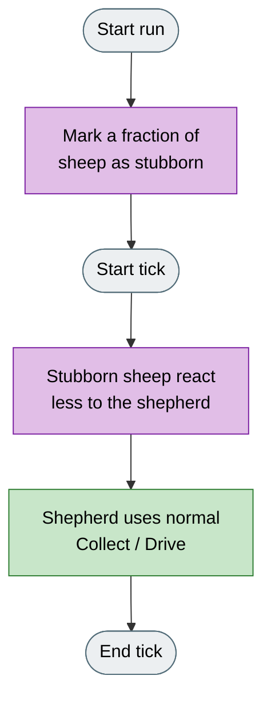
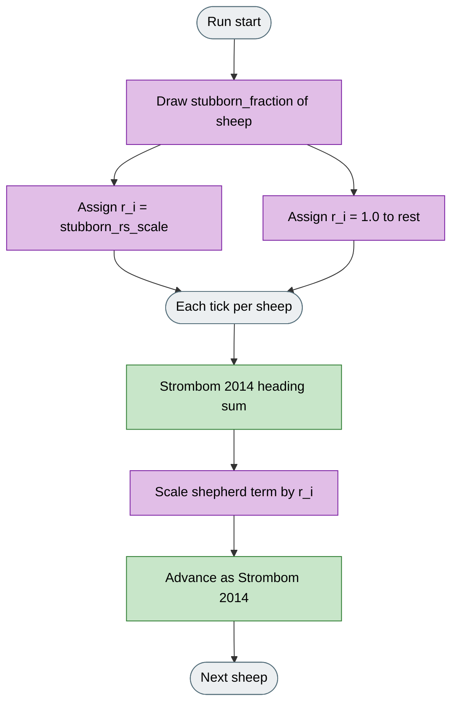

# Heterogeneous Sheep

## What it is

Variant of **Strombom 2014**. Collect / Drive is unchanged; a fraction of sheep have weaker shepherd repulsion for the whole run. The idea comes from heterogeneous-responsivity work such as Himo et al.; this is not a full port of that paper.

**Fidelity:** Only the shepherd repulsion term is scaled per sheep (`stubborn_rs_scale` on a random fraction). Himo et al.'s iterative identification and control loop are not implemented. Shepherd Collect / Drive stays standard Strombom 2014.

## Why

Strombom 2014 assumes every sheep responds the same way to the shepherd. Real flocks are mixed: some animals are easy to push, others resist, so residual outliers can remain even when Collect looks correct.

The `stubborn_fraction` factor lets you measure that difficulty on the same scenarios and metrics as the homogeneous case.

## Goal

Compared with homogeneous Strombom 2014, expect slower aggregation, more residual outliers, and lower success under the same tick budget as `stubborn_fraction` rises or `stubborn_rs_scale` falls. The point of a run is to quantify that difficulty, not to guarantee a cleaner herding path.

## What changes

| Aspect | Strombom 2014 | Heterogeneous |
|--------|---------------|---------------|
| Shepherd | Collect / Drive | Unchanged; shepherd does not know who is stubborn |
| Sheep response | Same `rs_weight` for all | Fraction `stubborn_fraction` use `stubborn_rs_scale` on shepherd repulsion |
| Extra params | -- | `stubborn_fraction`, `stubborn_rs_scale` |

At `stubborn_fraction` = 0 the algorithm is equivalent to Strombom 2014.

## How (idea)



Legend: grey = start/end, green = shared Strombom shepherding, purple = heterogeneous sheep.

## How (rules)

Shepherd algorithm is standard Strombom 2014 Collect / Drive. Read **Strombom 2014** for that part.



Legend: green = unchanged Strombom terms, purple = per-sheep response factor r_i.

The heading update follows Strombom 2014 with one modification: each sheep has an individual response factor `r_i` assigned at initialisation.

**Response assignment.** At the start of each run, a fraction `stubborn_fraction` of sheep are drawn uniformly at random and assigned the response factor `stubborn_rs_scale`. All other sheep receive a response factor of `1.0`.

**Individual heading update:**

```
H'_i = inertia * H_i
     + c * C_i
     + r_a * R_a_i
     + (rs_weight * r_i) * R_s_i
     + noise_strength * epsilon_i
```

The shepherd repulsion weight for sheep `i` is scaled by `r_i`. A stubborn sheep with `stubborn_rs_scale` = 0.25 feels only 25% of the shepherd repulsion that a normal sheep would, making it significantly harder to move.

All other terms (LCM attraction, neighbour repulsion, `inertia`, and `noise_strength`) are unchanged.

## Knobs

### HerdSim preset agents

| Agent | Default |
|-------|---------|
| Sheep (N) | 50 |
| Shepherd (M) | 1 |

All Strombom 2014 parameters apply. Additional parameters:

| Parameter | Default | Meaning |
|-----------|---------|---------|
| `stubborn_fraction` | 0.2 | Fraction of sheep assigned reduced shepherd response. At 0.0 the algorithm is equivalent to Strombom 2014. |
| `stubborn_rs_scale` | 0.25 | Response multiplier for stubborn sheep. Lower values make those sheep harder to push; at 0.0 they ignore the shepherd entirely. |

### Experimental factors (recommended pairings)

| Factor | Typical use with Heterogeneous |
|--------|--------------------------------|
| `stubborn_fraction` | Sweep 0.0 to 0.5 under fixed tick budget |
| `stubborn_rs_scale` | Sweep toward 0.0 for harder residual outliers |
| Instrument compare | Same seed vs Strombom 2014 and Adaptive |

## How to read a run

- As `stubborn_fraction` increases, expect slower aggregation, more outlier ticks, and lower success under a fixed tick budget.
- Raising `stubborn_rs_scale` toward 1.0 weakens the effect; lowering it toward 0.0 approaches a permanent unresponsive sub-population.
- Stubborn assignment is fixed for the run and drawn from the simulation seed; the same seed always produces the same stubborn sub-population.

## Limits

Shepherd geometry matches Strombom 2014. Heterogeneous response is a HerdSim model of population variation, not a claim to reproduce one specific published flock.

## Fidelity status

**From Himo et al. (2022):** idea that some agents have reduced responsivity to the shepherd.

**From Strombom 2014:** sheep heading sum and Collect / Drive shepherd (unchanged).

**HerdSim-only:** random draw of a stubborn fraction; scalar `stubborn_rs_scale` on the shepherd repulsion term only.

**Not implemented:** Himo et al.'s iterative identification and control loop.

## Reference

**Collect / Drive base:**

D. Strombom, R. P. Mann, A. M. Wilson, S. Hailes, A. J. Morton, D. J. T. Sumpter, A. J. King.
"Solving the shepherding problem: heuristics for herding autonomous, interacting agents."
Journal of The Royal Society Interface, 11(100):20140719, 2014.
DOI: 10.1098/rsif.2014.0719

**Background (heterogeneous responsivity):**

T. Himo, et al.
"Iterative shepherding control for agents with heterogeneous responsivity."
Mathematical Biosciences and Engineering, 19(11), 2022.
DOI: 10.3934/mbe.2022162
