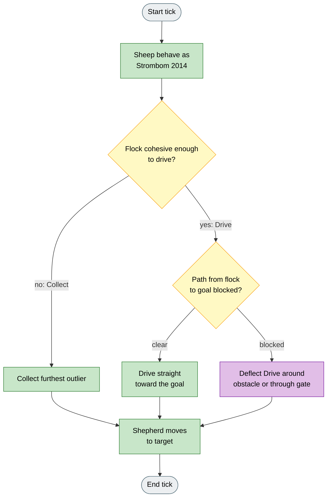
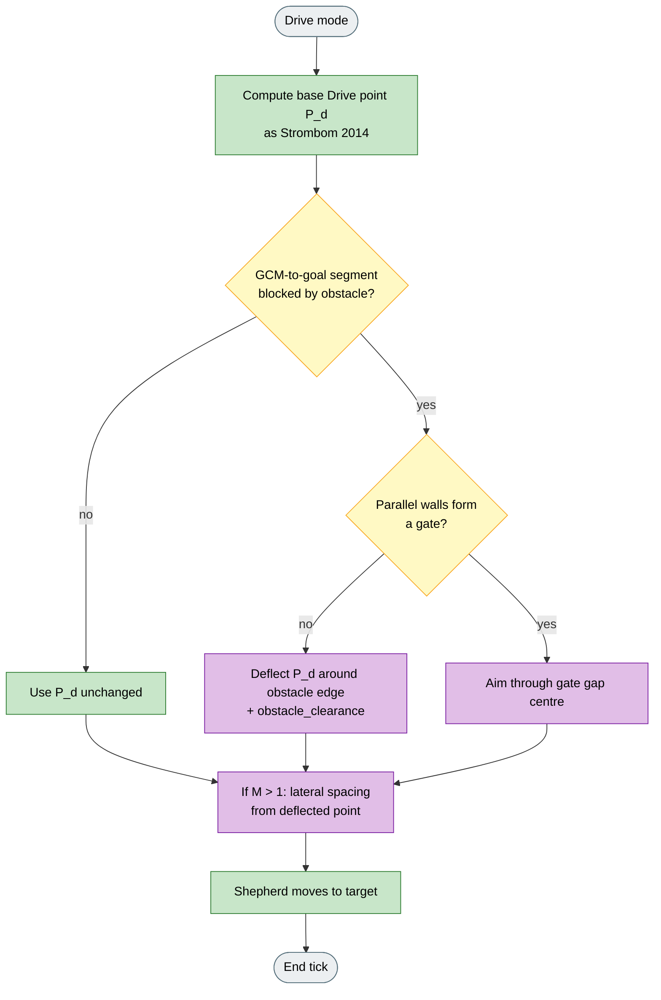

# Obstacle-Aware Collect / Drive

## What it is

Variant of **Strombom 2014**. Sheep and Collect stay the same; Drive deflects around obstacles or through a gate when the straight flock-to-goal line is blocked. Meant for Obstacle Course and Narrow Gate.

**Fidelity:** Collect and sheep dynamics match Strombom 2014. Drive adds a geometric deflection around obstacles and gate-centre aiming when the GCM-to-goal segment is blocked. This is a HerdSim heuristic, not a port of a published obstacle-aware shepherd.

## Why

Open-field Collect / Drive aims straight from flock to goal. With obstacles or a narrow gate, that line is blocked, so the shepherd can push sheep into walls or stall in front of a choke point.

This variant keeps those constrained scenarios usable without locking onto a blocked straight-line Drive target.

## Goal

On Obstacle Course or Narrow Gate, a successful run reaches the goal without the shepherd locking onto a blocked straight line. Versus plain Strombom on the same layout, expect fewer stalls against walls and more completions when the gate or obstacle corridor is the real path.

## What changes

| Aspect | Strombom 2014 | Obstacle-Aware |
|--------|---------------|----------------|
| Sheep | Collect / Drive sheep model | Unchanged |
| Collect | Furthest outlier | Unchanged |
| Drive | Straight behind-GCM target toward goal | Same base target, then deflect if the GCM-to-goal segment is blocked |
| Extra params | -- | `obstacle_clearance` |
| Multi-dog | Independent or Multi-Dog spacing | Lateral spacing from the deflected Drive point (Multi-Dog style) |

## How (idea)



Legend: grey = start/end, yellow = decision, green = shared Strombom step, purple = obstacle-aware Drive.

## How (rules)

Sheep dynamics and Collect are identical to Strombom 2014. Read **Strombom 2014** for those rules.



Legend: grey = start/end, yellow = decision, green = shared Strombom step, purple = obstacle-aware Drive routing.

The cohesion threshold is:

```
f(N) = r_a * N^(2/3)
```

### Drive mode (obstacle-aware)

When the flock is cohesive enough to drive, the shepherd computes the base Drive point `P_d` behind the GCM relative to the goal (Strombom 2014 formula). It then checks whether the straight line segment from the GCM to the goal intersects any obstacle.

**If the path is clear:** the shepherd moves toward `P_d` normally.

**If an obstacle blocks the path:** the shepherd deflects `P_d` around the nearer edge of the blocking obstacle, adding a clearance margin:

```
P_d_deflected = obstacle_edge  +  obstacle_clearance * outward_normal
```

The outward normal points away from the obstacle centre so the shepherd arcs around the obstruction rather than through it.

**If a gate is detected:** when two parallel wall segments form a choke point, the shepherd aims through the detected gate gap centre rather than around the wall pair.

When multiple dogs are present, each dog applies a lateral spacing offset from the deflected Drive point, using the same arc logic as Strombom Multi-Dog.

## Knobs

### HerdSim preset agents

| Agent | Default |
|-------|---------|
| Sheep (N) | 50 |
| Shepherd (M) | 1 |

Multi-dog configurations work with the spacing extension. All Strombom 2014 parameters apply. Additional parameter:

| Parameter | Default | Meaning |
|-----------|---------|---------|
| `obstacle_clearance` | 5.0 | Extra stand-off distance when routing around an obstacle edge. Larger values give a wider berth; too small may cause the shepherd to clip the obstacle corner and push sheep into it. |

### Experimental factors (recommended pairings)

| Factor | Typical use with Obstacle-Aware |
|--------|----------------------------------|
| Scenario | Obstacle Course, Narrow Gate |
| Instrument compare | Same seed vs Strombom 2014 on the same layout |
| `obstacle_clearance` | Sweep berth width vs clipping risk |

## How to read a run

- Prefer Obstacle Course or Narrow Gate scenarios.
- Compare with plain Strombom 2014 on the same layout: look for fewer wall stalls and more completed runs when the corridor or gate is the real path.
- Watch whether Drive targets bend around obstacles or aim through the gate gap instead of a blocked straight line.

## Limits

Obstacle deflection is a geometric heuristic. It does not guarantee optimal routing or collision-free paths under all configurations. The shepherd may oscillate near complex obstacle layouts or narrow gates if the deflected Drive point is unstable. No control barrier function safety certificates are applied. This algorithm is appropriate for exploratory comparison on constrained scenarios, not for guaranteed safety analysis.

## Fidelity status

**From Strombom 2014:** sheep dynamics, Collect, and base Drive point.

**HerdSim-only:** GCM-to-goal segment occlusion check; edge deflection with `obstacle_clearance`; gate-gap aiming; optional Multi-Dog-style lateral spacing from the deflected point.

**Not implemented:** published multi-robot obstacle-aware shepherds, CBF safety certificates, or optimal path planning.

## Reference

**Collect / Drive base:**

D. Strombom, R. P. Mann, A. M. Wilson, S. Hailes, A. J. Morton, D. J. T. Sumpter, A. J. King.
"Solving the shepherding problem: heuristics for herding autonomous, interacting agents."
Journal of The Royal Society Interface, 11(100):20140719, 2014.
DOI: 10.1098/rsif.2014.0719
