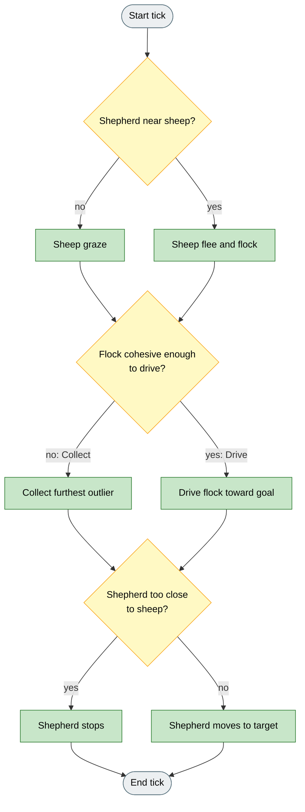

# Strombom et al. (2014)

## What it is

Single-shepherd **Collect / Drive** herding. Sheep graze or flee under shepherd pressure while staying near neighbours; the shepherd switches between recovering outliers (Collect) and pushing a tight flock to the goal (Drive). This is the base of the Strombom family in HerdSim. All other Strombom variants reuse these sheep rules and the same cohesion switch unless they say otherwise.

## Reference

D. Strombom, R. P. Mann, A. M. Wilson, S. Hailes, A. J. Morton, D. J. T. Sumpter, A. J. King.
"Solving the shepherding problem: heuristics for herding autonomous, interacting agents."
Journal of The Royal Society Interface, 11(100):20140719, 2014.
DOI: 10.1098/rsif.2014.0719

## Why

One shepherd must bring a flock of interacting sheep to a fixed goal. Sheep do not cooperate: they graze when the shepherd is far, and when threatened they flee the shepherd while staying near neighbours. A single Drive push fails when the flock is spread, because outliers are left behind.

## Goal

On Drive to Goal with the paper preset, a successful run gathers stragglers, then drives a cohesive flock into the goal. Live metrics show cohesion falling, outlier count rising only during Collect, and success rate rising as sheep enter the goal. The run report records whether the scenario criterion was met and how long the shepherd path was.

## How (idea)

Switch between two modes. **Collect** recovers the furthest outlier until the flock is tight enough. **Drive** then pushes the whole flock toward the goal from behind. The switch uses cohesion threshold f(N). The shepherd stops if it gets too close, so it does not scatter the sheep.



Legend: grey = start/end, yellow = decision, green = action.

## How (rules)

### Sheep dynamics

Each sheep `i` maintains a heading `H_i` and position `p_i`. On every tick, if the shepherd is farther than `r_s` away, the sheep grazes -- it either stays still or with probability `graze_move_prob` takes a random step of length `sheep_speed`. When the shepherd is within `r_s` the sheep responds:

**Local centre of mass (LCM).** The sheep computes the mean position of its `n_neighbors` nearest neighbours. The unit vector from `p_i` toward this centre is denoted `C`.

**Neighbour repulsion.** For every neighbour `j` within distance `r_a`:

```
R_a = sum_j  (p_i - p_j) / ||p_i - p_j||
```

`R_a` is then normalised to a unit vector.

**Shepherd repulsion.** The unit vector away from the shepherd is `R_s`.

**Heading update (paper Eq. 4.2):**

```
H' = inertia * H  +  c * C  +  r_a * R_a  +  rs_weight * R_s  +  noise_strength * epsilon
```

where `epsilon` is a unit vector in a uniformly random direction. `H'` is normalised and the sheep advances `sheep_speed` in that direction (paper Eq. 4.3):

```
p_i  <-  p_i  +  sheep_speed * (H' / ||H'||)
```

### Shepherd algorithm

#### Cohesion threshold

The shepherd computes the flock global centre of mass (GCM) and checks whether the flock is cohesive enough to drive. The threshold radius is:

```
f(N) = r_a * N^(2/3)
```

If the maximum distance from any sheep to the GCM exceeds `f(N)`, the flock is too spread to push and the shepherd enters Collect mode. Otherwise it enters Drive mode.

#### Collect mode

The shepherd identifies the outlier sheep -- the one farthest from the GCM -- and moves to a point directly behind it relative to the GCM at stand-off distance `r_a`. Once in position it pushes the outlier back toward the flock.

**Collect target:**

```
P_c = p_farthest  +  r_a * (p_farthest - GCM) / ||p_farthest - GCM||
```

#### Drive mode

The shepherd positions behind the GCM along the direction toward the goal and pushes the whole flock forward.

**Drive target:**

```
P_d = GCM  +  r_a * sqrt(N) * (GCM - goal) / ||GCM - goal||
```

The stand-off `r_a * sqrt(N)` keeps the shepherd far enough back to maintain pressure on the whole flock rather than just the nearest sheep.

#### Shepherd step

On each tick the shepherd moves toward its target at speed `shepherd_speed`, unless it is within `shepherd_stop_multiple * r_a` of any sheep, in which case it stops to avoid scattering the flock.

## Knobs

### Agents

| Agent | Paper default |
|-------|---------------|
| Sheep (N) | 50 |
| Shepherd (M) | 1 |

The **paper** preset loads these values. Running with M > 1 uses the base Strombom rules with each shepherd applying the same Collect / Drive logic independently. For coordinated multi-dog behaviour see Strombom Multi-Dog, Kubo 2022, or V-Formation.

### Parameters

| Parameter | Default | Meaning |
|-----------|---------|---------|
| `r_a` | 2.0 | Sheep-sheep repulsion distance. Also sets the cohesion threshold f(N) and the Collect/Drive stand-off distances. Larger values widen personal space and raise the threshold, so the shepherd collects more aggressively. |
| `r_s` | 65.0 | Shepherd detection distance. Sheep beyond `r_s` graze; sheep within `r_s` respond. A smaller value limits how early the shepherd exerts pressure. |
| `rs_weight` | 1.0 | Scalar weight on shepherd repulsion in the heading sum. Higher values make sheep flee faster; lower values make them harder to push. |
| `c` | 1.05 | LCM attraction weight. Higher values strengthen clustering within the neighbourhood. |
| `inertia` | 0.5 | Weight on the previous heading. Higher values smooth trajectories; lower values allow sharper turns. |
| `noise_strength` | 0.3 | Angular noise magnitude applied to both sheep and shepherd. Higher noise increases scatter and can cause Collect to fail under a fixed seed budget. |
| `n_neighbors` | -1 (all) | Neighbourhood size for the LCM. `-1` uses all other sheep (global). Smaller values give more local cohesion but raise split risk. |
| `sheep_speed` | 1.0 | Sheep displacement per tick. |
| `shepherd_speed` | 1.5 | Shepherd displacement per tick. |
| `graze_move_prob` | 0.05 | Probability of a random step while grazing. Higher values cause more drift when the shepherd is far away. |
| `shepherd_stop_multiple` | 3.0 | Stop distance as a multiple of `r_a`. The shepherd halts when within this radius of any sheep. |

## In HerdSim

| Parameter | Default | Purpose |
|-----------|---------|---------|
| `collect_threshold_scale` | 1.0 | Multiplier on f(N). Scenarios that start with a spread flock may raise this so the shepherd collects rather than attempting to drive prematurely. |
| `collect_offset` | derived | Override the Collect stand-off distance. Default is `r_a`. |
| `drive_offset` | derived | Override the Drive stand-off distance. Default is `r_a * sqrt(N)`. |

## Limits

The HerdSim implementation matches the paper Collect / Drive switch condition, the sheep heading composition, and the shepherd stop distance `shepherd_stop_multiple * r_a` (default 3 * `r_a`). The goal is the scenario goal zone rather than a fixed origin. Wall reflection is applied at arena boundaries (the paper uses an open field). The `collect_threshold_scale` parameter is a HerdSim addition with no paper equivalent.

## Fidelity status

**Matches paper:** Collect/Drive switch via f(N), sheep heading composition, shepherd stop distance, paper-preset agent dynamics defaults.

**Differs by design:** scenario-owned goal/world layout and wall reflection; optional `collect_threshold_scale`. Analytics now reports trajectory aggregates (auc cohesion, fragmentation) in addition to task success -- interpret Collect spikes via outlier_count and fragmentation over time, not final-tick cohesion alone.
