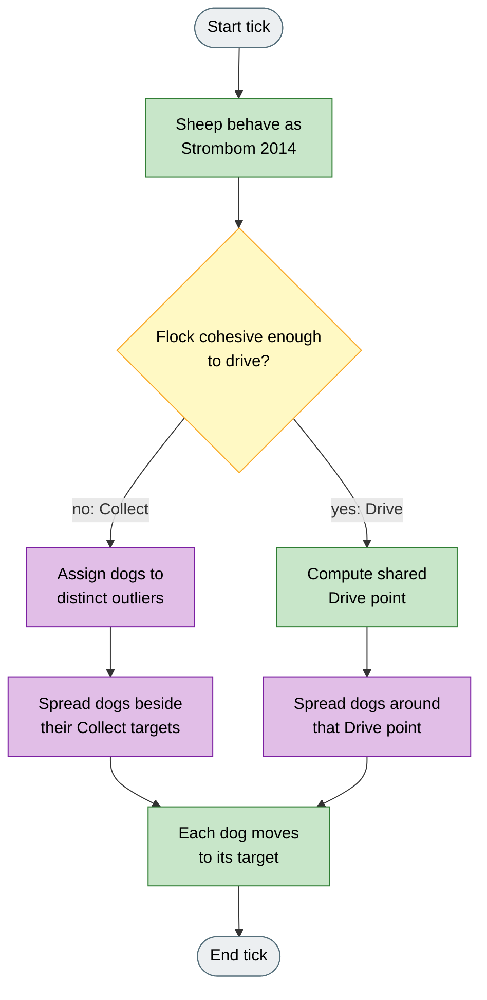
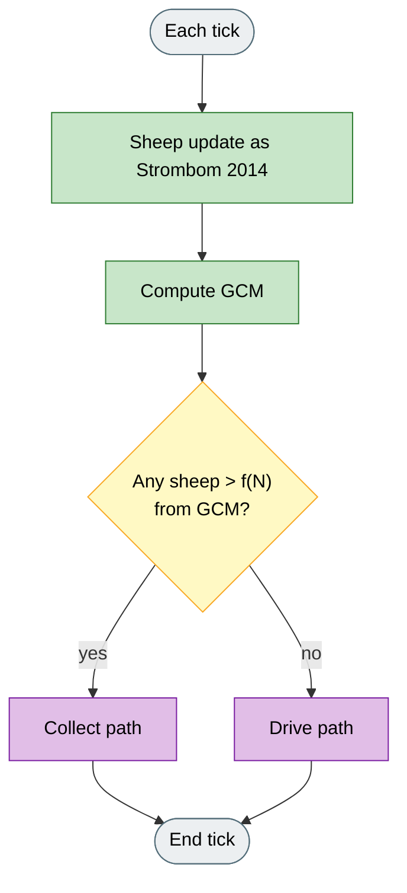
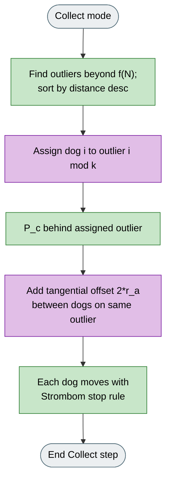
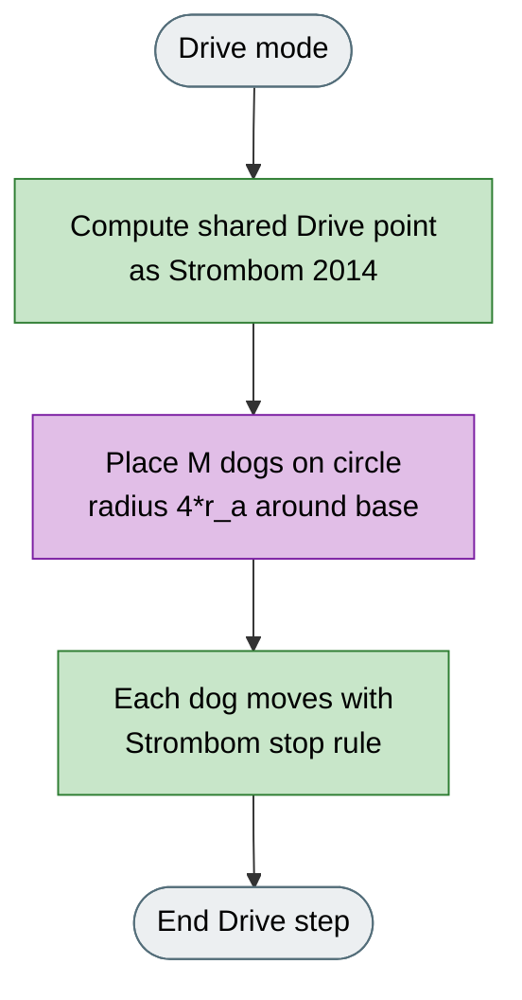

# Strombom Multi-Dog

## What it is

Multi-dog variant of **Strombom 2014**. Sheep and the Collect / Drive switch stay the same; dogs are coordinated so they do not all stack on one Collect or Drive point. The multi-dog spacing rules are a HerdSim design, not a published twin of the 2014 paper.

In the app the herders are labeled **Dog** (unlike Strombom 2014, which uses Shepherd).

**Fidelity:** Sheep rules and the shared f(N) Collect / Drive switch match Strombom 2014. Outlier assignment, tangential Collect spacing, and the Drive circle of radius `4 * r_a` are HerdSim additions. This is not a port of Lien et al. (2005) or any other specific multi-shepherd paper.

## Why

Strombom 2014 is built for one shepherd. With several dogs and no coordination, they stack on the same Collect or Drive point and waste coverage on one side of the flock.

This variant is the coordinated multi-dog Collect / Drive baseline for fair comparison with V-Formation, Kubo, and the decentralised controllers.

## Goal

Use several dogs that work together instead of all chasing the same spot.

In a successful run you should see:
- during Collect, different dogs go after different outliers (assignment lines on the canvas)
- during Drive, dogs stand spaced behind the flock, not stacked on one point

Compared with Strombom 2014 run with several dogs but no coordination, this should recover a split flock faster and push the flock more evenly. Use it as the multi-dog baseline when comparing with V-Formation or Kubo.

## What changes

| Aspect | Strombom 2014 | Strombom Multi-Dog |
|--------|---------------|--------------------|
| Herder label | Shepherd | Dog |
| Sheep | Collect / Drive sheep model | Unchanged |
| Mode switch | f(N) cohesion threshold | Same rule for all dogs together |
| Collect | One shepherd, furthest outlier | Dogs assigned to distinct outliers, with tangential spread |
| Drive | One shepherd behind GCM | Shared Drive point; dogs spaced on a circle of radius `4 * r_a` |
| Default M | 1 | 3 |

## How (idea)

Purple steps are the multi-dog changes.



Legend: grey = start/end, yellow = decision, green = shared Strombom step, purple = multi-dog change.

## How (rules)

Sheep dynamics are identical to Strombom 2014. Each sheep responds to the nearest dog within `r_s`. Read **Strombom 2014** for the heading sum and graze rules.



Legend: grey = start/end, yellow = decision, green = shared Strombom step, purple = multi-dog branches below.

### Mode switching

```
f(N) = r_a * N^(2/3) * collect_threshold_scale
```

If any sheep exceeds this distance from the GCM, all dogs enter Collect mode. Otherwise all dogs enter Drive mode.

### Collect mode (multi-dog)



Legend: green = shared Strombom target logic, purple = multi-dog assignment and spacing.

1. Identify all outlier sheep (those whose distance to the GCM exceeds `f(N)`) and sort them by distance descending.
2. Assign dog `i` to outlier `(i mod k)`, where `k` is the number of outliers. If there are more dogs than outliers, dogs cycle through the list and share outliers.
3. Each dog's target is the point behind its assigned outlier relative to the GCM:

```
P_c(i) = p_outlier(i)  +  r_a * (p_outlier(i) - GCM) / ||p_outlier(i) - GCM||
```

A tangential offset is added so that dogs approaching the same outlier spread apart rather than stacking on a single line. Dogs that share an outlier receive a tangential step of `2 * r_a` between slots.

### Drive mode (multi-dog)



Legend: green = shared Strombom Drive point, purple = multi-dog arc spacing.

The base Drive point is computed as in Strombom 2014: behind the GCM along the GCM-to-goal axis. The `M` dogs are then distributed on a circle around that base, spaced at equal angles. The circle radius is `4 * r_a`:

```
spacing = 4 * r_a
angle(i) = 2*pi * i / M
P_d(i) = base  +  spacing * (cos(angle(i)), sin(angle(i)))
```

HerdSim chooses `4 * r_a` so Drive lateral spread scales with sheep personal space. It is larger than the stop radius (`shepherd_stop_multiple * r_a`, default `3 * r_a`), so dogs stay clear of each other when pressing the flock, while remaining tight enough to keep collective drive pressure focused.

### Dog step

Each dog applies the Strombom stop condition: it halts if it is within `shepherd_stop_multiple * r_a` of any sheep. All dogs move at speed `shepherd_speed` with angular noise `noise_strength`.

## Knobs

| Agent | Default |
|-------|---------|
| Sheep (N) | 50 |
| Dogs (M) | 3 |

All Strombom 2014 parameters apply with the same meanings. Multi-dog spacing is derived from `r_a` (`4 * r_a` in Drive, `2 * r_a` per Collect slot); there is no separate spacing parameter.

## How to read a run

- Canvas **assignment lines** show which dog is assigned to which outlier during Collect.
- Compare against uncoordinated multi-dog Strombom 2014 or against V-Formation / Kubo on the same seed and scenario.
- Expect less stacking and more even Drive pressure than independent dogs on one target.

## Limits

The sheep model and the Collect / Drive threshold are faithful to Strombom 2014. The assignment and Drive arc geometry are HerdSim designs intended to provide a coherent multi-dog baseline; they are not claimed to reproduce any specific published multi-dog algorithm.

## Fidelity status

**From Strombom 2014:** sheep dynamics; shared f(N) Collect / Drive switch; stop rule.

**HerdSim-only:** outlier assignment (`i mod k`), tangential Collect spacing (`2 * r_a`), Drive circle radius `4 * r_a`.

**Background (multi-shepherd without stacking):** Lien et al. (2005) studied cooperative multi-shepherd behaviours; HerdSim does not port Lien's specific rules.

**Not implemented:** Lien et al. assignment geometry; any other published multi-dog Collect/Drive twin.

## Reference

**Collect / Drive base:**

D. Strombom, R. P. Mann, A. M. Wilson, S. Hailes, A. J. Morton, D. J. T. Sumpter, A. J. King.
"Solving the shepherding problem: heuristics for herding autonomous, interacting agents."
Journal of The Royal Society Interface, 11(100):20140719, 2014.
DOI: 10.1098/rsif.2014.0719

**Background (multi-shepherd cooperation):**

J.-M. Lien, et al.
"Shepherding behaviors with multiple shepherds."
Proceedings of the IEEE International Conference on Robotics and Automation (ICRA), 2005.
