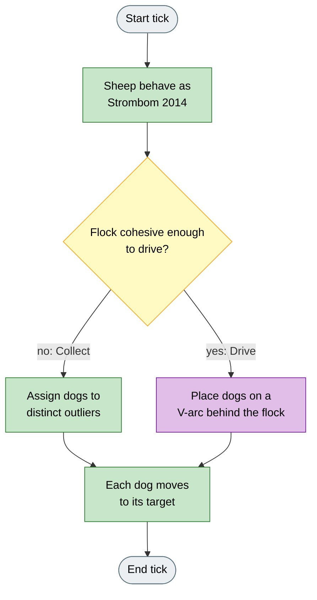
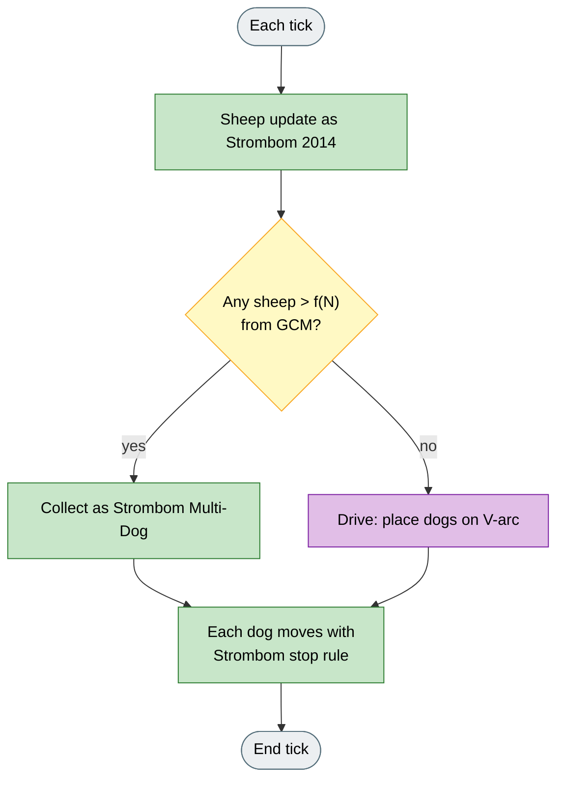
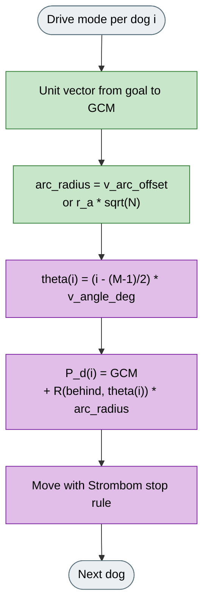

# V-Formation

## What it is

Multi-dog variant of **Strombom 2014**. Sheep and Collect match Strombom Multi-Dog; Drive places dogs on a V-shaped arc behind the flock, following the Fujioka-style formation idea. Not a full copy of Fujioka's experiment settings.

In the app the herders are labeled **Dog**, as with Strombom Multi-Dog.

**Fidelity:** Collect comes from Strombom Multi-Dog. The V-arc placement (`v_angle_deg`, `v_arc_offset`) is a HerdSim take on the Fujioka formation idea, not a line-by-line replica of that paper.

## Why

In multi-dog Drive, stacking dogs on one point or spreading them on a full circle can leave uneven pressure across the back of the flock.

V-Formation lets you compare Drive geometry alone against Strombom Multi-Dog (circle spacing vs V-arc) while holding sheep and Collect assignment fixed.

## Goal

A successful Drive phase shows dogs on a clear V or fan behind the flock rather than a single stacked point. Versus Strombom Multi-Dog on the same scenario, compare how evenly the flock advances and how path length and time to goal change when Drive geometry alone differs.

## What changes

| Aspect | Strombom Multi-Dog | V-Formation |
|--------|--------------------|-------------|
| Sheep | Strombom 2014 | Unchanged |
| Collect | Outlier assignment + tangential spread | Same as Strombom Multi-Dog |
| Drive | Dogs on a full circle around the shared Drive point | Dogs on a V-arc behind the flock |
| Extra params | (none for spacing) | `v_angle_deg`, `v_arc_offset` |
| Default M | 3 | 2 |

## How (idea)

Purple marks the V-arc Drive.



Legend: grey = start/end, yellow = decision, green = shared step, purple = V-formation Drive.

## How (rules)

Sheep dynamics are identical to Strombom 2014. Collect and the cohesion threshold match Strombom Multi-Dog. Read those pages for the shared parts.



Legend: grey = start/end, yellow = decision, green = shared step, purple = V-arc Drive.

### Drive mode (V-arc)



Legend: green = shared geometry inputs, purple = V-arc placement per dog.

The controller uses the unit direction from the goal to the GCM as the direction behind the flock. The arc radius is `v_arc_offset` when supplied, or `r_a * sqrt(N)` otherwise. The angular offset for dog `i` is:

```
theta(i) = (i - (M - 1) / 2) * v_angle_deg  (converted to radians)
```

This centres the arc symmetrically. Dog `0` sits to one side; the middle dog (if `M` is odd) sits directly behind the GCM.

Each dog's target is a point on the arc centred on the GCM:

```
P_d(i) = GCM  +  R(behind_direction, theta(i)) * arc_radius
```

where `R(...)` denotes a 2D rotation of the behind-GCM unit vector by angle `theta(i)`.

The result is a fan of dogs spread across the back of the flock at equal angular intervals, forming a V or arc shape.

### Dog step

Each dog applies the Strombom stop condition (halt within `shepherd_stop_multiple * r_a` of any sheep) and moves at speed `shepherd_speed` with angular noise `noise_strength`.

## Knobs

| Agent | Default |
|-------|---------|
| Sheep (N) | 50 |
| Dogs (M) | 2 |

All Strombom 2014 parameters apply. V-Formation-specific additions:

| Parameter | Default | Meaning |
|-----------|---------|---------|
| `v_angle_deg` | 35 | Angular spacing between adjacent dogs in the arc, in degrees. Larger values widen the V. |
| `v_arc_offset` | `r_a * sqrt(N)` | Radius of the target arc around the GCM. Larger values place dogs farther from the flock. |

## How to read a run

- Watch Drive geometry: dogs should form a V / fan, not a stacked point or full circle.
- Canvas **assignment lines** show Collect outlier assignment.
- Best comparison pair: V-Formation vs Strombom Multi-Dog on the same seed (Drive geometry only differs).

## Limits

The sheep model is faithful to Strombom 2014. The V-arc Drive geometry is a HerdSim design implementing the formation idea; it is not a line-by-line reproduction of any specific Fujioka experiment configuration. Scenario goal and wall reflection apply as with all HerdSim algorithms.

## Fidelity status

**From Fujioka / Hayashi (2018):** V-formation (fan) Drive idea behind the flock.

**From Strombom Multi-Dog / Strombom 2014:** sheep dynamics; Collect outlier assignment; stop rule.

**HerdSim-only:** `v_angle_deg` / `v_arc_offset` placement; default M = 2.

**Not implemented:** Fujioka experiment settings, environment, or full parameter sweep as published.

## Reference

**V-formation Drive idea:**

K. Fujioka, S. Hayashi.
"Effective Herding in Shepherding Problem in V-formation Control."
Transactions of the Institute of Systems, Control and Information Engineers, 2018.
DOI: 10.5687/iscie.31.21

**Sheep / Collect base:**

D. Strombom et al.
"Solving the shepherding problem: heuristics for herding autonomous, interacting agents."
Journal of The Royal Society Interface, 11(100):20140719, 2014.
DOI: 10.1098/rsif.2014.0719
