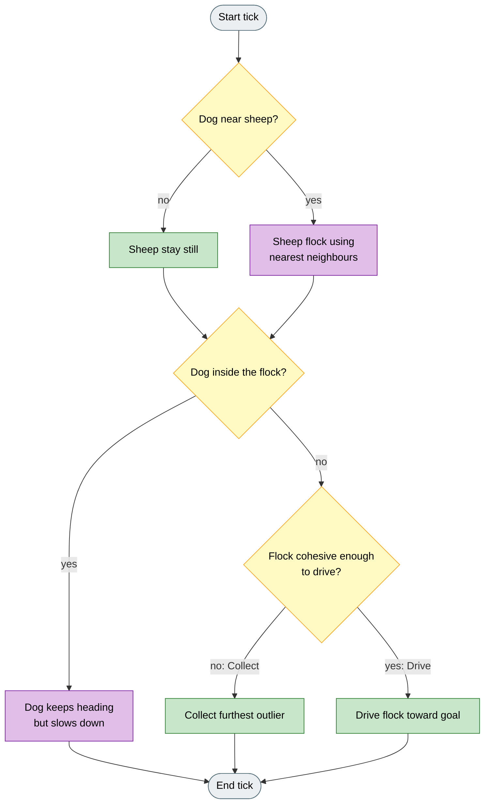
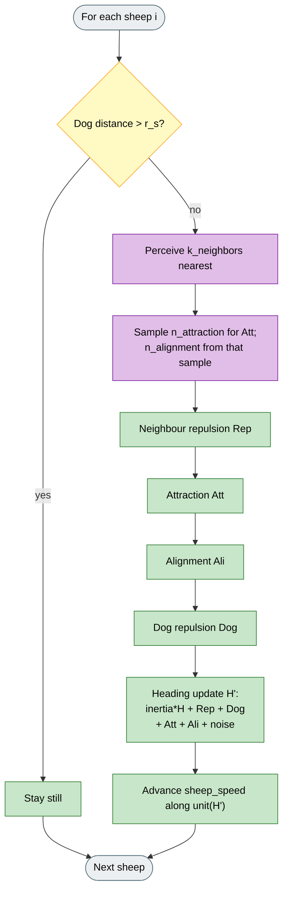
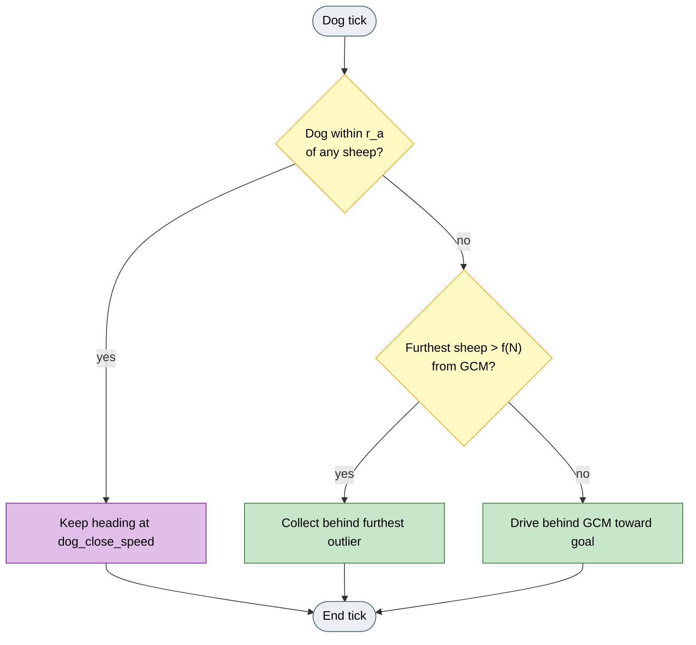

# Flocking Dog (Jadhav et al. 2024)

## What it is

Sheep flocking based on field observations of dogs and sheep, paired with a Collect / Drive-style dog that slows when already inside the flock. Default flocks are small (N = 14), matching the paper setting. Method: `flocking_dog` (`sheep_model=jadhav`, `dog_controller=collect_drive`).

**Fidelity:** Sheep rules follow Jadhav on topological neighbourhoods, random attraction/alignment subsets, small N, and dog close-speed inside `r_a`. The dog Collect / Drive geometry is Strombom-style for shared-scenario comparison; that is not a claim that Jadhav's field trials used that exact controller. HerdSim also uses a scenario goal and arena wall reflection instead of the MATLAB origin setup.

## Why

Strombom sheep use a large neighbourhood heading model that is convenient but not field-calibrated. Real sheep under a herding dog attend to a limited neighbour set, and a dog that presses too hard inside the group can scatter them.

Flocking Dog brings that sheep behaviour into HerdSim while keeping a readable Collect / Drive dog, so you can compare sheep realism against Strombom and Kubo on the same scenarios and metrics.

## Goal

A successful run on a small flock shows neighbour-based flocking under dog pressure, Collect when the group splits, and Drive when it is tight, without the dog charging through the flock at full speed. Compared with Strombom 2014, trails look more local and variable because attraction and alignment use random neighbour subsets.

## How (idea)



Legend: grey = start/end, yellow = decision, green = Collect/Drive shepherding, purple = flocking / close-dog behaviour.

## How (rules)

### Sheep dynamics



Legend: grey = start/end, yellow = decision, green = motion terms, purple = topological neighbour sampling.

Each sheep `i` operates in two states depending on whether the dog is within detection distance `r_s`.

**Grazing.** If the dog distance exceeds `r_s`, the sheep is stationary.

**Responding.** The sheep perceives its `k_neighbors` nearest neighbours. It draws `n_attraction` sheep at random for the attraction force, then draws `n_alignment` sheep at random from that attraction sample for alignment. This random topological sub-sampling reflects the paper's empirical model of attention under stress.

**Neighbour repulsion** `Rep`: for all neighbours `j` within `r_a`:

```
Rep = sum_j  (p_i - p_j) / ||p_i - p_j||
```

**Attraction** `Att`: unit vector from `p_i` toward the mean position of the `n_attraction` sampled neighbours.

**Alignment** `Ali`: mean unit velocity of `n_alignment` neighbours sampled from the attraction sample.

**Dog repulsion** `Dog`: unit vector from the dog toward `p_i`.

**Heading update:**

```
H' = inertia * H
   + sheep_repulsion_weight * Rep
   + dog_repulsion_weight * Dog
   + attraction_weight * Att
   + alignment_weight * Ali
   + noise_strength * epsilon
```

where `epsilon` is a unit vector in a uniformly random direction. `H'` is normalised and the sheep steps by `sheep_speed` in that direction.

### Dog algorithm



Legend: grey = start/end, yellow = decision, green = Collect/Drive, purple = close-range slowdown.

### Cohesion threshold

The same threshold as Strombom 2014:

```
f(N) = r_a * N^(2/3)
```

### Collect mode

If the furthest sheep exceeds `f(N)` from the GCM, the dog moves to the point behind that sheep relative to the GCM at stand-off distance `r_a`:

```
P_c = p_farthest  +  r_a * (p_farthest - GCM) / ||p_farthest - GCM||
```

### Drive mode

The dog positions behind the GCM toward the goal at stand-off `r_a * sqrt(N)`:

```
P_d = GCM  +  r_a * sqrt(N) * (GCM - goal) / ||GCM - goal||
```

### Close-dog behaviour

When the dog is within `r_a` of any sheep, it continues on its current heading at a reduced absolute speed `dog_close_speed`. This prevents scattering when the dog is already inside the flock boundary, and matches the author's MATLAB implementation.

## HerdSim preset agents

| Agent | Default |
|-------|---------|
| Sheep (N) | 14 |
| Dog (M) | 1 |

The paper reports a 14-sheep empirical flock. HerdSim uses the same count in
its `flocking_dog` preset. Running with larger N changes the f(N) threshold
substantially.

## Parameters

| Parameter | Default | Meaning |
|-----------|---------|---------|
| `r_a` | 2 | Sheep-sheep repulsion distance; also enters f(N) and the close-dog test. |
| `r_s` | 12 | Dog detection radius. Sheep outside this range graze. Substantially smaller than Strombom 2014's default. |
| `k_neighbors` | 10 | Total topological neighbourhood size. |
| `n_attraction` | 5 | Random subset of neighbours used for the attraction force. |
| `n_alignment` | 1 | Random subset of neighbours used for alignment. |
| `inertia` | 0.5 | Previous-heading weight. |
| `sheep_repulsion_weight` | 2.0 | Weight on neighbour repulsion. |
| `dog_repulsion_weight` | 1.0 | Weight on dog repulsion. |
| `attraction_weight` | 1.5 | Weight on attraction toward sampled neighbours. |
| `alignment_weight` | 1.3 | Weight on velocity matching. |
| `noise_strength` | 0.5 | Angular noise magnitude. |
| `sheep_speed` | 1.0 | Sheep displacement per tick. |
| `dog_speed` | 1.5 | Dog displacement per tick (paper `vDog` / `vD`). |
| `dog_close_speed` | 0.05 | Absolute dog speed when within `r_a` of any sheep (paper close-range slowdown). |

## Fidelity status

**Paper-informed elements:** topological sheep neighbour rules, dog close-speed inside `r_a`, and the small-flock setting (N=14). HerdSim combines these sheep rules with a Collect/Drive-style dog controller.

**HerdSim differences:** scenario goal instead of MATLAB origin; arena wall reflection. Role in HerdSim: a third sheep model alongside Strombom and Kubo for shared-scenario comparison.

## Fidelity notes

The Drive target uses the scenario goal rather than the paper's experimental target setup, and wall reflection is applied at arena boundaries. The random topological sub-sampling (`n_attraction`, `n_alignment`) means runs at the same seed can exhibit more variability than the Strombom family, particularly at small N.

## Reference

V. Jadhav, et al.
"Collective responses of flocking sheep (Ovis aries) to a herding dog (border collie)."
Communications Biology, 2024.
DOI: 10.1038/s42003-024-07245-8
