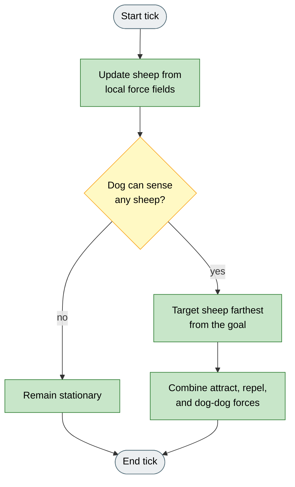
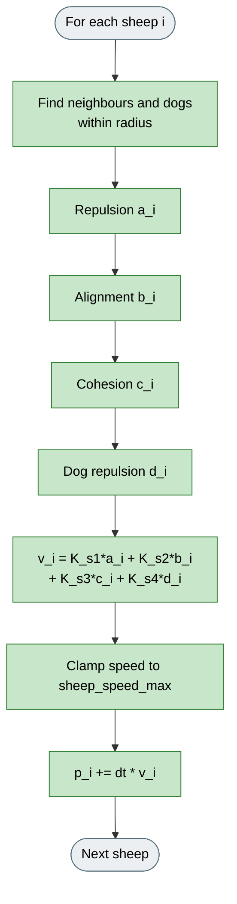
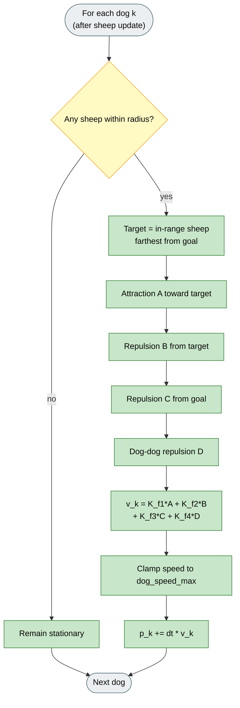

# Kubo et al. (2022)

## What it is

Force-based multi-dog herding without an explicit Collect / Drive switch. Sheep and dogs update from continuous force sums inside a sensing radius. Each dog targets the in-range sheep farthest from the goal; dog-dog repulsion spreads dogs into an arc. HerdSim implements the documented force decomposition from Kubo et al. (2022), with scenario-owned layout and wall reflection.

**Fidelity:** Matches the paper force model (sheep K_s1..K_s4, dog K_f1..K_f4), sensing `radius`, `dt` integration, speed clamps, and dog-after-sheep update order. HerdSim differences: scenario spawn/goal layout, arena wall reflection, and preset counts of 40 sheep / 4 dogs for shared-scenario experiments (not a claim of the paper's exact trial sizes). Advanced vision occlusion exists but is off by default.

## Why

Collect / Drive is one shepherding style. Force models ask whether aggregation and driving can emerge together from local interactions when several dogs press the flock, without discrete mode labels.

Kubo is the main non-Strombom method in HerdSim, so you can compare force-based herding with Collect / Drive on the same scenarios, seeds, and metrics.

## Goal

A successful multi-dog run shows dogs fanned behind the flock rather than stacked, with the flock advancing toward the goal without an explicit Collect / Drive label. Compared with Strombom on the same scenario, expect different trail shapes and tick counts because motion uses `dt` integration. Use Arena or Analytics to compare outcomes, not raw path length tick-for-tick.

## How (idea)



Legend: grey = start/end, yellow = decision, green = force-based step. No Collect / Drive modes.

## Key difference from Strombom and FAT

| Method | Integration | "Farthest" meaning |
|------------|-------------|--------------------|
| Strombom family | Fixed displacement per tick | Outlier farthest from GCM (Collect) |
| FAT | Fixed displacement per tick | Sheep farthest from the **dog** (local view) |
| Kubo | `p <- p + dt * v` | Sheep farthest from the **goal** (in range) |

Path length and tick counts are not directly comparable across families. Analytics exports note this caveat.

## How (rules)

### Sheep dynamics



Legend: green = force integration step. No Collect / Drive modes.

For each sheep `i`, forces are computed from all neighbours and all dogs within `radius`.

**Neighbour repulsion** `a_i`: the mean of repulsion vectors from nearby sheep, scaled by inverse squared distance:

```
a_i = mean over j in neighbourhood of  (p_i - p_j) / ||p_i - p_j||^2
```

**Alignment** `b_i`: the mean unit velocity of moving neighbours:

```
b_i = mean over j of  v_j / ||v_j||
```

**Cohesion** `c_i`: the mean of attraction vectors toward nearby sheep:

```
c_i = -mean over j of  (p_i - p_j) / ||p_i - p_j||
```

**Dog repulsion** `d_i`: repulsion from each dog `k` scaled by inverse cubed distance:

```
d_i = mean over k of  (p_i - p_k) / ||p_i - p_k||^3
```

**Velocity update:**

```
v_i  =  K_s1 * a_i  +  K_s2 * b_i  +  K_s3 * c_i  +  K_s4 * d_i
```

The velocity magnitude is clamped to `sheep_speed_max`. Position advances by:

```
p_i  <-  p_i  +  dt * v_i
```

### Dog dynamics



Legend: grey = start/end, yellow = decision, green = force-based dog step.

Dogs update after the sheep positions have been computed for the current tick (matching the MATLAB reference order).

For each dog `k`:

1. Find all observed sheep within `radius`.
2. If no sheep are observed, leave the dog stationary for that tick.
3. Otherwise, the **target sheep** is the in-range sheep farthest from the goal.

**Attraction to target** `A`: unit vector from dog toward the target sheep.

**Repulsion from target** `B`: inverse-cube repulsion that prevents the dog from colliding with its target:

```
B = (p_k - p_target) / ||p_k - p_target||^3
```

**Repulsion from goal** `C`: unit vector away from the goal centre. This keeps dogs from passing through the goal and losing their driving position.

**Dog-dog repulsion** `D`: mean inverse-cube repulsion from all other dogs:

```
D = mean over l != k of  (p_k - p_l) / ||p_k - p_l||^3
```

**Dog velocity update:**

```
v_k  =  K_f1 * A  +  K_f2 * B  +  K_f3 * C  +  K_f4 * D
```

The velocity magnitude is clamped to `dog_speed_max`. Position advances by:

```
p_k  <-  p_k  +  dt * v_k
```

## HerdSim preset agents

| Agent | Default |
|-------|---------|
| Sheep (N) | 40 |
| Dogs (M) | 4 |

These are the HerdSim `kubo` preset defaults for shared-scenario experiments.
They are not presented as the paper's experimental agent counts.

## Parameters

| Parameter | Default | Meaning |
|-----------|---------|---------|
| `radius` | 60 | Sensing radius for both sheep and dogs. Larger values bring more agents into the force sums. |
| `K_s1` | 10 | Sheep-sheep repulsion gain. Higher values increase personal space within the flock. |
| `K_s2` | 0.5 | Alignment gain. Higher values increase velocity matching among neighbours. |
| `K_s3` | 2.0 | Cohesion gain. Higher values strengthen attraction toward the local group centre. |
| `K_s4` | 5000 | Dog repulsion gain for sheep. High by design: sheep must flee dogs strongly. |
| `K_f1` | 10 | Dog attraction to target sheep. Higher values make dogs close in on their target faster. |
| `K_f2` | 200 | Dog repulsion from target sheep. Prevents dogs from colliding with or overshooting the target. |
| `K_f3` | 8 | Dog repulsion from goal. Keeps dogs positioned behind the flock rather than inside the goal. |
| `K_f4` | 3000 | Dog-dog repulsion. Spreads dogs into an arc around the flock. Too low causes stacking. |
| `dt` | 0.05 | Integration time step. Smaller values increase simulation accuracy; larger values speed up motion. |
| `sheep_speed_max` | 5 | Maximum sheep speed. Velocity is clamped to this before integration. |
| `dog_speed_max` | 10 | Maximum dog speed. |

## Fidelity status

**Implemented model:** force decomposition (sheep K_s1..K_s4, dog K_f1..K_f4), sensing `radius`, `dt` integration, speed clamps, and dog update after sheep for the tick. The HerdSim preset uses 40 sheep and 4 dogs; use custom counts for a controlled cross-method comparison.

**Environment (not part of the force model):** HerdSim scenarios such as Drive to Goal use a bounded arena with wall reflection and a standardized spawn/goal layout. The original MATLAB demo uses an open-field-style initialization. Fair cross-model comparison should lock shared N/M on the same scenario rather than retuning Kubo gains.

There is a single `kubo` algorithm plugin. Agent counts for fair comparison are experiment overrides; they do not change the force equations.

## Fidelity notes

HerdSim represents agents as `(N, 2)` arrays and evaluates the documented force components in that layout. Advanced vision occlusion is available but off by default. Arena wall reflection is a HerdSim environment addition; the paper's examples use their own initialization and target-region setup.

## Note on time comparison

Because Kubo integrates `p <- p + dt * v` with a continuous `dt`, while Strombom-family algorithms advance position by a fixed displacement `sheep_speed` per tick, the number of ticks to complete a run is not physically comparable across families. Analytics exports document this caveat and list the integration convention for each algorithm.

## Reference

M. Kubo, M. Tashiro, H. Sato, et al.
"Herd guidance by multiple sheepdog agents with repulsive force."
Artificial Life and Robotics, 27, 416-427, 2022.
DOI: 10.1007/s10015-021-00726-7
