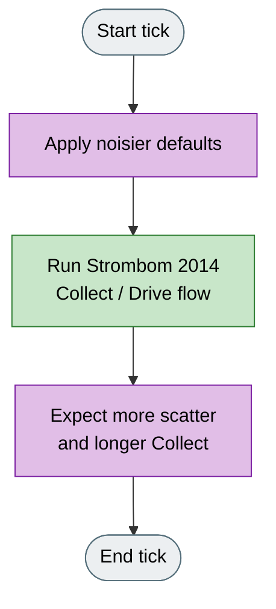
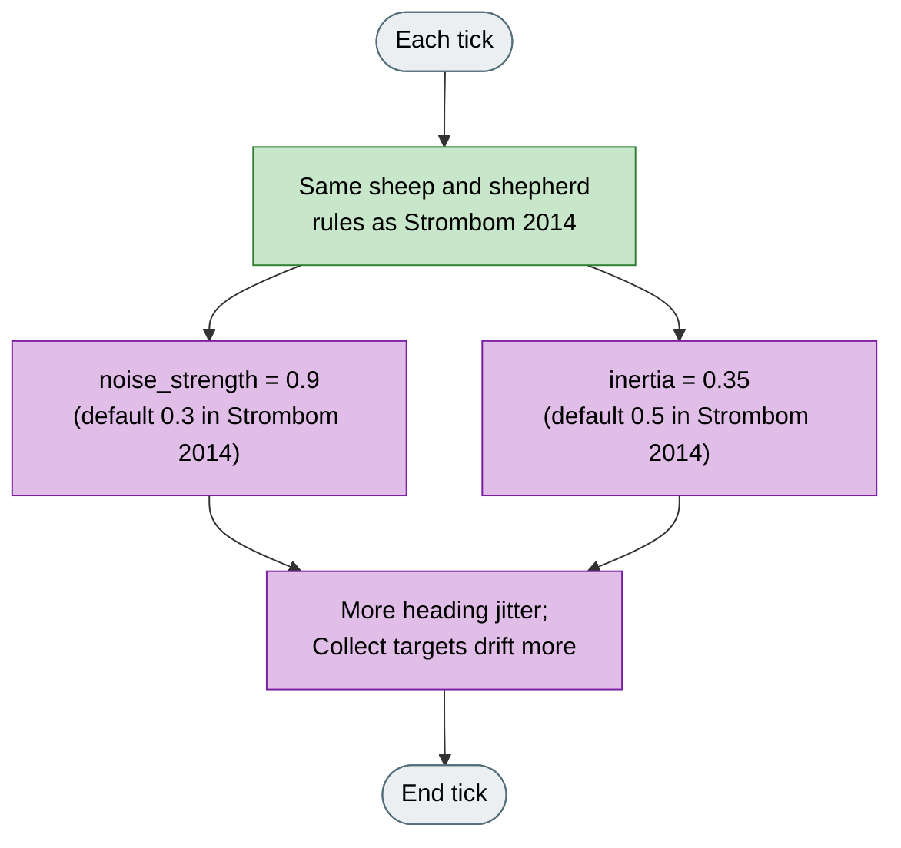

# Strombom Noise

## What it is

A stress preset on **Strombom 2014**: same Collect / Drive rules, noisier defaults. Not a separate paper or control law.

**Fidelity:** Same Collect / Drive rules as Strombom 2014. Only the default `noise_strength` and `inertia` values change.

## Why

The Strombom 2014 defaults are fairly smooth. That can hide how brittle Collect / Drive becomes when headings jitter and the flock will not stay tidy.

This preset keeps the same geometry so you can compare success rate and Collect duration under a fixed seed budget, and see how sensitive a run is to perturbation.

## Goal

The goal is comparative, not a smoother herding demo. On the same seed and scenario as Strombom 2014, expect more scatter, longer Collect, more timeouts, and lower success under a fixed tick budget. If Noise still succeeds, Collect / Drive is relatively stable under noise. If it fails often, that sensitivity is what the variant is meant to show.

## What changes

| Parameter | Strombom 2014 | Strombom Noise | Why this change |
|-----------|---------------|-----------------|-----------------|
| `noise_strength` | 0.3 | 0.9 | Triple angular noise so paths jitter and Collect targets keep moving. |
| `inertia` | 0.5 | 0.35 | Reduce heading memory so agents cannot smooth the noise away as easily. |

Raising noise alone still leaves strong inertia; lowering inertia alone still leaves mild noise. Together they create a real stress regime inside the same model.

Sheep rules, cohesion threshold, Collect / Drive targets, and shepherd stop distance are unchanged.

## How (idea)

Legend: grey = start/end, green = shared Strombom flow, purple = noise-variant change.

## How (rules)

Identical to Strombom 2014. Read **Strombom 2014** for sheep and shepherd rules. Only the two default parameter values above differ.

Legend: green = unchanged Strombom 2014 control law, purple = noisier default parameters only.

## Knobs

### HerdSim preset agents

| Agent | Default |
|-------|---------|
| Sheep (N) | 50 |
| Shepherd (M) | 1 |

All other Strombom parameters keep the same meanings; only `noise_strength` and `inertia` defaults differ as in **What changes**.

### Experimental factors (recommended pairings)

| Factor | Typical use with Strombom Noise |
|--------|----------------------------------|
| Method compare | Same seed vs Strombom 2014 |
| Tick budget | Fixed budget to expose timeouts |
| Scenario | Drive to Goal for brittle Collect under jitter |

## How to read a run

- Arena or Analytics: Strombom 2014 vs Strombom Noise on the same scenario and seeds.
- Checking whether a scenario result is brittle to perturbation.
- Demonstrating Collect / Drive failure modes without changing the algorithm geometry.

## Limits

Same fidelity as Strombom 2014. This page only changes defaults; it does not add a new control law.

## Fidelity status

**From Strombom 2014:** full Collect / Drive control law and sheep dynamics.

**HerdSim-only:** noisier default pair (`noise_strength` = 0.9, `inertia` = 0.35).

**Not a separate publication.**

## Reference

**Algorithm base (unchanged rules):**

D. Strombom, R. P. Mann, A. M. Wilson, S. Hailes, A. J. Morton, D. J. T. Sumpter, A. J. King.
"Solving the shepherding problem: heuristics for herding autonomous, interacting agents."
Journal of The Royal Society Interface, 11(100):20140719, 2014.
DOI: 10.1098/rsif.2014.0719
