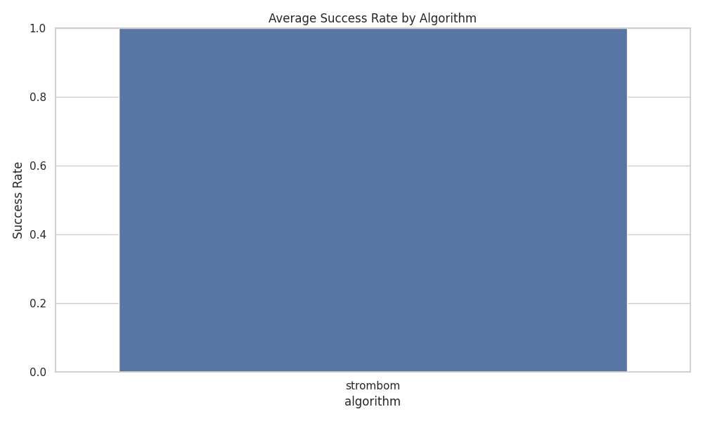
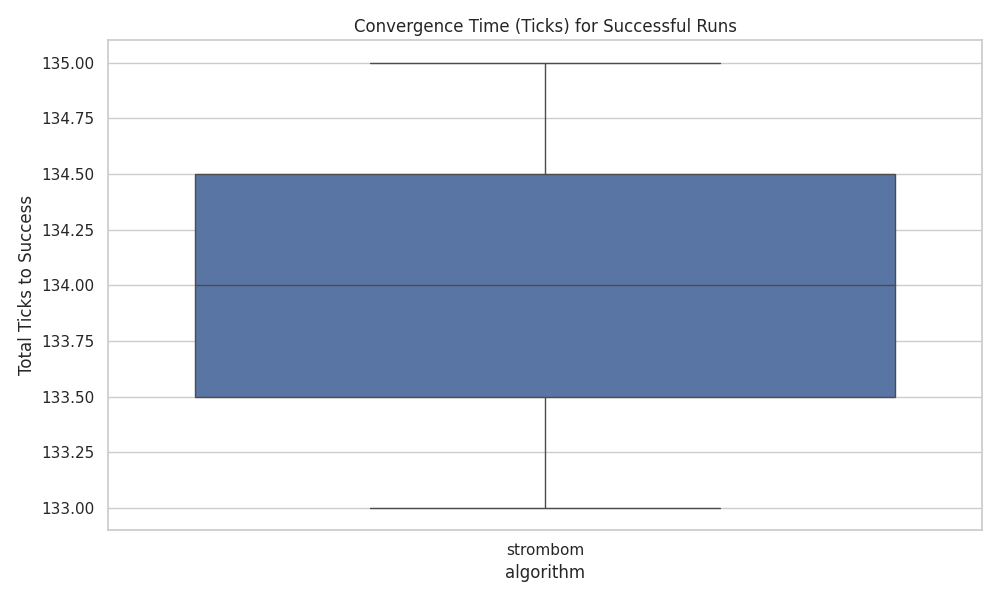

# HerdSim Batch Report

- rows: 2
- algorithms: strombom
- scenarios: drive_to_goal

## Summary by Algorithm

- strombom: success_rate=1.00

## Scientific Analysis




## Raw Table

```
algorithm      scenario preset  seed  n_sheep  n_shepherds  success  total_ticks  cohesion  time_to_goal  shepherd_path  success_rate  sheep_in_goal  polarization  outlier_count  min_separation
 strombom drive_to_goal  paper     1       50            1     True          135  4.812094         135.0     146.260540           1.0           50.0      0.530710            0.0        0.313282
 strombom drive_to_goal  paper     2       50            1     True          133  4.834175         133.0     152.941089           1.0           50.0      0.633741            0.0        0.259297
```
