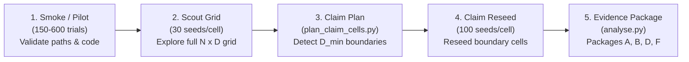

# HerdSim Scaling Protocols & Experiment Framework

This directory houses the protocol runner, experiment configurations, analysis pipelines, and results for the **Collective Herdability Under Shepherding** scaling research program.

Science rationale and formal research questions: [docs/main_scaling_plan.md](docs/main_scaling_plan.md)  
Campaign progress checklist: [docs/progress_tracker.md](docs/progress_tracker.md)  
Staged execution narrative: [docs/experiment_run_strategy.md](docs/experiment_run_strategy.md)  
Discussion notes: [docs/discuss/phase1.md](docs/discuss/phase1.md)

---

## 1. Directory Structure

```text
scaling/
├── Makefile                       # Operator entry point for running and analysing protocols
├── README.md                      # This document (subsystem map & operator guide)
│
├── configs/                       # Protocol specifications (frozen defaults & run subsets)
│   ├── canonical_grid.yaml        # Section 8 frozen defaults (arena, goal, N, D, T0, theta)
│   └── protocols/                 # Per-phase YAML configurations (phase1_*, phase2_*, etc.)
│       └── README.md              # Protocol authoring & inheritance guidelines
│
├── docs/                          # Scientific protocol documentation & tracker
│   ├── main_scaling_plan.md       # Primary specification of RQs, claims, metrics, and freeze
│   ├── progress_tracker.md        # Living run checklist, worker configurations, claim statuses
│   ├── experiment_run_strategy.md # Operator guide: pilot -> scout -> claim-plan -> reseed
│   ├── REPORT_TEMPLATE.md         # Markdown protocol report template
│   ├── REPORT_TEMPLATE.html       # Standalone interactive HTML report template
│   └── discuss/                   # High-level executive summaries for meetings/email
│
├── results/                       # Completed experiment outputs (trials, packages, guides)
│   ├── README.md                  # Results layout & data conventions
│   ├── phase1/                    # RQ2: Flock Size Scaling (pilot, scout, claim, t1, guides)
│   ├── phase2/                    # RQ1: Spatial Structure (pilot_state, scout, claim, guides)
│   └── phase4/                    # RQ4: Algorithm Generality (kubo, fat, package_d, guides)
│
├── scripts/                       # CLI commands wrapping services and analysis
│   ├── campaign.py                # Top-level CLI dispatcher (run, claim-plan, claim-reseed)
│   ├── run_grid.py                # Parallel worker pool executor with manifest resume
│   ├── plan_claim_cells.py        # Identifies boundary and overcrowding cells for reseeding
│   ├── plan_t1_cells.py           # T1 long-budget planner for overcrowding cells
│   ├── run_factor_sweep.py        # Factor sweep runner for Phase 5
│   └── analyse.py                 # Evidence package compiler (Packages A through G)
│
└── services/scaling/              # Core execution engine
    ├── runner.py                  # Simulation worker pool, parquet recorder, manifest ledger
    ├── layout.py                  # Standard path schemas and cell key generators
    └── campaign.py                # Command orchestration logic
```

---

## 2. Staged Protocol Lifecycle

Every scaling campaign proceeds through reproducible, gated stages:



1. **Pilot (Smoke)**: Fast run to verify parameters, metrics logging, and parquet storage.
2. **Scout**: Full factorial grid run at 30 seeds per cell to establish the rough reliability landscape.
3. **Claim Plan**: Automated detection of boundary cells around $D_{\min}$ (plus overcrowding cells if present).
4. **Claim Reseed**: High-depth reseed (100 seeds/cell) focused on critical boundaries, merged with scout interior.
5. **Auto-Analysis**: Evidence packages (A, B, D, F) outputting CSV summary tables, frontiers, and figures.
6. **Reporting**: Standalone interactive HTML dossiers in `results/phase{k}/guides/` for sharing and publication.

---

## 3. Operator Commands

Run commands from the repository root using `make -C scaling <target>` or directly within `scaling/`:

```bash
# Run unit & regression tests
make -C scaling scaling-test

# List all available scaling targets
make -C scaling help

# Phase 1: Size scaling
make -C scaling scaling-pilot WORKERS=16
make -C scaling scaling-scout WORKERS=16
make -C scaling scaling-claim-plan
make -C scaling scaling-claim-reseed WORKERS=16
make -C scaling scaling-analyse PACKAGE=A TRIALS=results/phase1/claim/merged_trials.csv

# Phase 2: Structure scaling
make -C scaling scaling-phase2-scout WORKERS=16
make -C scaling scaling-phase2-claim-reseed WORKERS=16

# Phase 4: Transfer across methods (kubo, fat)
make -C scaling scaling-transfer-size-scout TRANSFER_METHOD=kubo WORKERS=16
make -C scaling scaling-transfer-structure-scout TRANSFER_METHOD=kubo WORKERS=16
```

---

## 4. Resume & Fault Tolerance

- **Manifest Ledger**: Every protocol run maintains an append-only `manifest.jsonl`.
- **Interruption Recovery**: If a run is interrupted by power loss or timeout, simply rerun the exact same command. Completed cells marked `status=ok` in `manifest.jsonl` are automatically detected and skipped.
- **Do Not Delete**: Never delete `manifest.jsonl` in an active protocol folder unless performing a deliberate `--no-resume` clean run.

---

## 5. Data & Storage Conventions

- **Git-Tracked Artifacts**: Protocol parameters (`protocol.yaml`), provenance (`provenance.json`), status ledgers (`status.json`), trial metrics (`trials.csv`, `merged_trials.csv`), analysis evidence (`packages/`), and HTML report guides (`guides/`) are tracked in Git.
- **Local Timeseries Parquet Files**: High-frequency trajectory files in `timeseries/*.parquet` are excluded from Git via `.gitignore` to prevent repository bloat (5.4 GB total across 21,250 files). They remain locally accessible on disk for mechanism and early-warning analyses.
