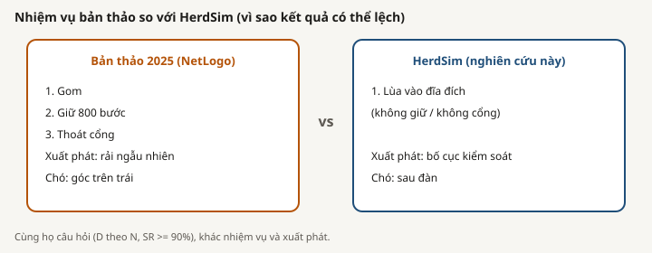

# Do tin cay va doi chieu

Thu muc nay tach bon doi tuong khong duoc xem la tuong duong:

1. **Ban thao 2025** la mot nghien cuu NetLogo dang ban thao, voi nhiem vu gom, giu, va dua dan qua cong.
2. **NetLogo** la mot nen tang mo phong dua tren tac tu chung.
3. Cac **twin NetLogo** di kem la mo hinh desktop doi ung cho mot so phuong phap HerdSim.
4. **Chong ket luan HerdSim** gom giao thuc `scaling_v2` dong bang, cac tang chay, bootstrap, va du lieu xuat dung cho ket luan hien tai.

Mo hinh cua ban thao khong phai twin. No khong duoc chay lai trong kho nay. Mot muc twin chi cho biet co mo hinh doi ung co the mo. No khong chung minh parity dinh luong voi HerdSim.

## Tai lieu

- [Doi chieu ban thao](draft_comparison_vi.md): doi chieu giao thuc va ket qua giua ban thao 2025 va HerdSim.
- [Xac thuc, NetLogo, va ranh gioi ket luan](validation_and_netlogo_vi.md): muc do bang chung, pham vi twin, kiem thu, va parity con thieu.
- [Ban tieng Anh](README.md)

## Muc do bang chung

| Muc | Bang chung hien co | Cach doc cho phep |
|---|---|---|
| Muc ket luan | Giao thuc dong bang, seed tang claim, CSV hop nhat, bootstrap, va provenance | Ho tro ket qua HerdSim da neu trong nhiem vu va luoi da thu |
| Bang chung trien khai | Kiem thu tinh xac dinh, cong thuc, cau hinh, API, duong dan, va launcher | Ho tro hanh vi ma nguon va cong cu |
| Kiem tra hanh vi | Co the cau hinh va quan sat mot twin NetLogo | Chi ho tro doi chieu dinh tinh |
| Ket qua ben ngoai duoc bao cao | PDF ban thao va ghi chu trong kho tom tat nghien cuu khac | Co the trich la ket qua ban thao, khong phai bang chung chay lai |
| Con thieu | Bang thu nghiem ghep cap hai dong co va tieu chi parity dinh luong | Khong co ket luan parity so hoc NetLogo voi HerdSim |

## Ranh gioi ngan

HerdSim co the ket luan ve ket qua mo phong lap lai duoc theo giao thuc dong bang va mo ta y tuong bo dieu khien dua tren bai bao. HerdSim khong the ket luan tuong duong NetLogo theo tung tick, parity twin dinh luong da cong bo, twin NetLogo cho `fat`, hoac ban thao 2025 da duoc chay lai.

## Nguon

- [Bao cao ket qua tieng Anh](../../results/summary/SUMMARY_REPORT.md), cho so sanh thuc nghiem
- [Bao cao ket qua tieng Viet](../../results/summary/SUMMARY_REPORT_vi.md), cho so sanh thuc nghiem
- [Ghi chu ban thao 2025](../notes/sheep-scaling_paper2025.md)
- [Ghi chu nghien cuu lien quan](../notes/related_work.md)
- [Danh ba twin NetLogo](../../../integrations/netlogo/twins.json)
- [Huong dan NetLogo](../../../platform/docs/guide/netlogo.md)
- [Huong dan Compare](../../../platform/docs/guide/compare.md)
- [Huong dan Experiments](../../../platform/docs/guide/experiments.md)
- [Kiem thu API NetLogo](../../../tests/backend/api/test_netlogo_api.py)
- [Kiem thu cau noi NetLogo](../../../tests/backend/test_netlogo.py)
