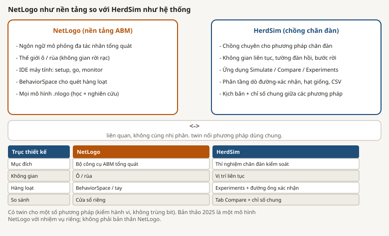
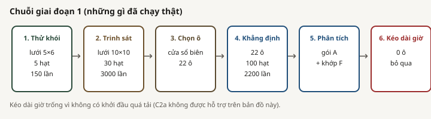
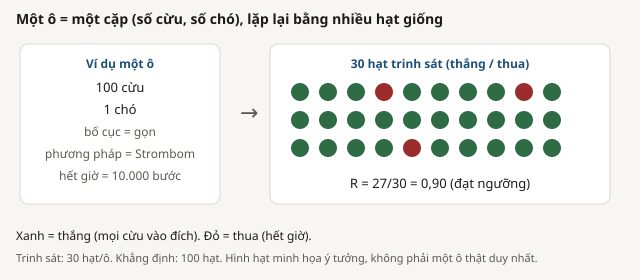
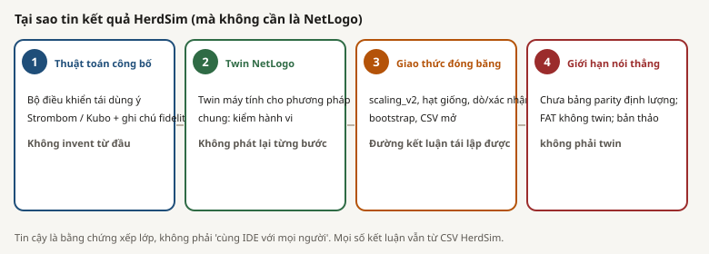

# Xac thuc, NetLogo, va ranh gioi ket luan

## Tach cac lop

**Nen tang NetLogo.** NetLogo la moi truong mo phong dua tren tac tu chung. Viec dung NetLogo khong tu dong xac thuc mot mo hinh cu the hoac ket qua HerdSim.

**Twin di kem.** `integrations/netlogo/twins.json` dang ky cac mo hinh `.nlogo` desktop doi ung cho mot so phuong phap. Giao dien HerdSim co the liet ke va mo chung. Chung phuc vu quan sat hanh vi voi cau hinh gan nhau.

**Ban thao 2025.** Ban thao dung NetLogo, nhung mo hinh gom, giu, va qua cong khong phai twin di kem. No khong duoc chay lai.

**Chong ket luan HerdSim.** Ket luan scaling hien tai den tu giao thuc Python `scaling_v2`, luoi dong bang, cac tang seed, hop nhat claim, bootstrap, provenance, va CSV xuat. Chung khong den tu twin NetLogo.

## Danh ba twin va cach dung cho ket luan

Danh ba hien co nam mo hinh doi ung:

| Phuong phap HerdSim | Mo hinh trong danh ba | Muc claim trong bao cao scaling | Ranh gioi |
|---|---|---|---|
| `strombom` | `strombom.nlogo` | Khong co goi claim scaling truc tiep | Co mo hinh doi ung; khong co diem parity |
| `strombom_noise` | `strombom_noise.nlogo` | Khong | Co mo hinh doi ung; khong co diem parity |
| `strombom_multi` | `strombom_multi.nlogo` | Co, Giai doan HerdSim 1 va 2 | Bang chung claim la du lieu Python, khong phai twin |
| `kubo` | `kubo.nlogo` | Co, Giai doan HerdSim 4 | Bang chung claim la du lieu Python; quy uoc thoi gian khac giua cac ho |
| `flocking_dog` | `flocking_dog.nlogo` | Khong co goi claim scaling hien tai | Co mo hinh doi ung; khong co diem parity |
| `fat` | khong co | Co, Giai doan HerdSim 4 | Chi HerdSim trong doi chieu nay |

Mo hinh ban thao 2025 khong co trong danh ba.

## Twin ho tro dieu gi

Huong dan NetLogo mo ta cac mo hinh doi ung voi hanh vi chan dat gan nhau cho Drive to Goal, cac thiet lap co the ghep bang tay, chi so truc tiep, va quan sat. Dieu nay ho tro kiem tra dinh tinh nhu phuong phap co gom, lua, dan cho ra, dung, hoac lam dan tach theo cach rong tuong tu hay khong.

Quang duong va tick hoan thanh chinh xac khong du kien khop vi Python va NetLogo dung bo sinh ngau nhien khac va co the cap nhat tac tu theo thu tu khac. Kubo dac biet nhay voi khac biet tich phan roi rac. Cung gia tri seed khong tao cung chuoi ngau nhien.

Vi vay, twin ho tro kiem tra hanh vi. Su ton tai cua twin khong tu dong ho tro tuong duong so hoc.

## Kiem thu chung minh dieu gi

| Khu vuc kiem thu | Dieu duoc kiem | Dieu khong duoc kiem |
|---|---|---|
| API twin | Nam phuong phap va ten tep mo hinh du kien duoc tra ve | Hanh vi mo hinh hoac parity hai dong co |
| API thu vien mo hinh | Co the liet ke mo hinh di kem; upload bi gioi han | Gia tri khoa hoc |
| API mo desktop | Launcher NetLogo nhan duong dan mo hinh | Mot lan chay khoa hoc thanh cong |
| Ho tro duong dan | Duong dan mo hinh duoc giai; co the phat hien NetLogo cuc bo | Quy dao khop |
| Tinh xac dinh HerdSim | Lap lai cau hinh va seed HerdSim co the khop | Ngau nhien NetLogo khop |
| Kiem thu bo dieu khien va chi so | Mot so cong thuc, cau hinh, va bat bien chay nhu ma | Dong y voi trien khai ngoai tren mot luoi nghien cuu |
| Kiem thu scaling | Truong giao thuc va ham phan tich theo quy tac du kien | Ket qua ban thao ben ngoai dung |

Tep lien quan:

- [Danh ba twin](../../../integrations/netlogo/twins.json)
- [Kiem thu API NetLogo](../../../tests/backend/api/test_netlogo_api.py)
- [Kiem thu cau noi NetLogo](../../../tests/backend/test_netlogo.py)
- [Kiem thu dung dan HerdSim](../../../tests/backend/correctness/)
- [Kiem thu good path HerdSim](../../../tests/backend/goodpath/)

## Bang chung ket luan HerdSim

Bang chung manh nhat hien tai la kha nang lap lai noi bo theo giao thuc dong bang:

1. `scaling_v2` khoa nhiem vu, the gioi, luoi N va D, bo cuc, theta, han, phuong phap, va seed goc.
2. Scout lap ban do luoi voi 30 seed moi o va chi dung de lap ke hoach.
3. Claim gieo lai cac cua so bien da chon, thuong voi 100 seed.
4. Phan tich dung hang claim noi co, va hang scout o noi khac.
5. Bat dinh D_min duoc uoc luong voi 1,000 bootstrap seed.
6. CSV, tep trang thai, anh chup giao thuc, va provenance van co the kiem tra.

Day la bang chung muc claim cho nhiem vu HerdSim mo phong va pham vi da thu. No khong phai xac thuc ngoai thuc dia, tai lap ben ngoai, hoac xac thuc hai dong co.

## Bang ket luan va khong ket luan

| Phat bieu duoc ho tro | Phat bieu manh hon khong duoc ho tro |
|---|---|
| HerdSim tai su dung y tuong bo dieu khien dua tren bai bao | HerdSim tai hien moi giao thuc bai bao da trich |
| Mot so phuong phap co mo hinh NetLogo doi ung | Moi phuong phap HerdSim co twin NetLogo |
| Twin cho phep kiem tra truc quan va theo chi so | Twin tuong duong dinh luong voi HerdSim |
| Lan chay HerdSim dong bang ho tro ket qua scaling hien tai | NetLogo da tai lap doc lap ket qua do |
| Ket qua hien tai bao phu mot nhiem vu mo phong, luoi da thu, va theta = 0.90 | Ket qua lap mot quy luat scaling nong trai hoac sinh hoc pho quat |
| D_max = 35 la tran luoi khi chua thay sup | 35 la gioi han vat ly phia tren da do |
| FAT khong dat theta trong cac o HerdSim da neu | FAT khong the chan dan lon noi chung |
| Ket qua ban thao khac ket qua HerdSim | Ban thao da bi bac bo |

## Bang chung parity con thieu

Chua co hien vat nao trong kho cung cap day du:

- Giao thuc Python va NetLogo ghep cap, dong bang cho moi twin
- Anh xa tai lieu hoa cho moi tham so, quy tac khoi tao, thu tu cap nhat, va quy tac bien
- Lan chay hai dong co tren cung luoi dieu kien
- Chien luoc seed xu ly hai bo sinh ngau nhien khac nhau
- Chi so parity va dung sai duoc khai bao truoc
- Doi chieu phan phoi voi bat dinh tren nhieu lan chay
- Bang ket qua parity co phien ban va provenance
- Quyet dinh dat hoac khong dat cho moi twin

Khi thieu cac muc nay, khong nen bao cao diem parity dinh luong. Mot nghien cuu parity tuong lai nen doi chieu phan phoi thay vi quy dao tung tick, voi cac ket qua nhu xac suat thanh cong, phan phoi thoi gian hoan thanh theo don vi thoi gian tuong thich, khoang cach dich cuoi, cohesion, fragmentation, va bat bien dinh tinh theo bo dieu khien.

## Huong dan doi chieu

Compare truc tiep la bang chung tham do cho mot cap HerdSim ghep dieu kien. Experiments cung cap bang chung HerdSim nhieu seed va tep xuat. NetLogo chay trong ung dung desktop rieng. Khong nen tron ba quy trinh ma khong co giao thuc khai bao truoc.

Khi doi chieu phuong phap HerdSim, khoa scenario, so cuu, so cho, quy tac thanh cong, ngan sach thoi gian, va danh sach seed. Paper preset tra loi cau hoi khac vi phuong phap co the co so tac tu mac dinh khac. Shepherd path va so tick cung can than trong giua Kubo va ho Strombom vi quy uoc tich phan khac.

## Trich dan

- D. Strombom et al. "Solving the shepherding problem: heuristics for herding autonomous, interacting agents." *Journal of the Royal Society Interface* 11(100):20140719, 2014. DOI: `10.1098/rsif.2014.0719`.
- M. Kubo et al. "Herd guidance by multiple sheepdog agents with repulsive force." *Artificial Life and Robotics* 27:416-427, 2022. DOI: `10.1007/s10015-021-00726-7`.
- V. Jadhav et al. "Collective responses of flocking sheep (Ovis aries) to a herding dog (border collie)." *Communications Biology*, 2024. DOI: `10.1038/s42003-024-07245-8`.
- Z. Li et al. "Communication-free shepherding navigation with multiple steering agents." *Frontiers in Control Engineering* 4, 2023. DOI: `10.3389/fcteg.2023.989232`.
- Ban thao 2025: [PDF trong kho](../../../docs/papers/sheep-scaling_paper2025.pdf). Khi trich dan phai giu trang thai ban thao va dong tac gia tam.

Nguon them: [nghien cuu lien quan](../notes/related_work.md), [huong dan NetLogo](../../../platform/docs/guide/netlogo.md), [huong dan Compare](../../../platform/docs/guide/compare.md), [huong dan Experiments](../../../platform/docs/guide/experiments.md), va [doi chieu ban thao](draft_comparison_vi.md).
