# Scaling Report

## Contents

- [How to read this report](#how-to-read-this-report)
- [1. HerdSim overview](#1-herdsim-overview)
  - [Why these three methods](#why-these-three-methods)
  - [Method tracks: transfer vs draft](#method-tracks-transfer-vs-draft)
  - [Does this answer the central question?](#does-this-answer-the-central-question)
- [2. Prior draft paper](#2-prior-draft-paper)
  - [Result of the paper](#result-of-the-paper)
  - [If we rerun a draft-style method](#if-we-rerun-a-draft-style-method)
- [3. Research questions](#3-research-questions)
  - [What we want from the program](#what-we-want-from-the-program)
  - [Core questions](#core-questions)
  - [Follow-on questions](#follow-on-questions)
  - [Scope](#scope)
- [4. Answers from the runs](#4-answers-from-the-runs)
  - [RQ1: structure](#rq1-structure)
  - [RQ2 / RQ6: size and regimes](#rq2--rq6-size-and-regimes)
  - [RQ3: mechanism](#rq3-mechanism)
  - [RQ4: generality across methods](#rq4-generality-across-methods)
  - [RQ5 and RQ7: follow-ons](#rq5-and-rq7-follow-ons)
  - [Status table](#status-table)
- [Detail sections: protocol, runs, and evidence](#detail-sections-protocol-runs-and-evidence)
- [5. Shared protocol](#5-shared-protocol)
  - [Core protocol](#core-protocol)
  - [Initial layouts](#initial-layouts)
  - [Frontier, regimes, and failure labels](#frontier-regimes-and-failure-labels)
- [6. Campaign design](#6-campaign-design)
  - [Design overview](#design-overview)
  - [Why we run it this way](#why-we-run-it-this-way)
  - [Grades](#grades)
  - [Shared pipeline (worked example: RQ2)](#shared-pipeline-worked-example-rq2)
  - [How each RQ uses the pipeline](#how-each-rq-uses-the-pipeline)
  - [Trial counts by run](#trial-counts-by-run)
- [7. Methods and results](#7-methods-and-results)
  - [`strombom_multi`](#strombom_multi)
  - [`kubo`](#kubo)
  - [`fat`](#fat)
- [8. Findings synthesis](#8-findings-synthesis)
  - [At a glance](#at-a-glance)
  - [Contrast with the 2025 draft](#contrast-with-the-2025-draft)
  - [Baseline cost and regimes](#baseline-cost-and-regimes)
  - [Upper frontier status](#upper-frontier-status)
  - [Future work: measuring collapse beyond D = 35](#future-work-measuring-collapse-beyond-d--35)
- [9. Cross-method transfer](#9-cross-method-transfer)
- [10. Scaling fits](#10-scaling-fits)
- [11. Claims](#11-claims)
- [12. Limits and threats](#12-limits-and-threats)
- [13. Information ladders](#13-information-ladders)
- [14. Outcomes and state metrics](#14-outcomes-and-state-metrics)
- [15. Prediction and early warning](#15-prediction-and-early-warning)
- [16. Commands run](#16-commands-run)

---

## How to read this report

This report has two layers. You do not need every section on the first pass.

| If you want... | Read... |
|----------------|---------|
| The problem and what we asked | [1. HerdSim overview](#1-herdsim-overview), [2. Prior draft paper](#2-prior-draft-paper), [3. Research questions](#3-research-questions) |
| What the runs answered (short) | [4. Answers from the runs](#4-answers-from-the-runs) |
| How we ran it (protocol, grids, seeds, campaign) | [5. Shared protocol](#5-shared-protocol) and [6. Campaign design](#6-campaign-design) |
| Per-method plots and package detail | [7. Methods and results](#7-methods-and-results) |
| Cross-cutting synthesis, claims, and limits | [8. Findings synthesis](#8-findings-synthesis) through [12. Limits and threats](#12-limits-and-threats) |
| Follow-on ladders, metrics, early warning, commands | [13](#13-information-ladders) to [16](#16-commands-run) |

Sections 1 to 4 state the question and the run-based answers. From [section 5](#5-shared-protocol) onward, the report is the configuration, campaign, and evidence detail that backs those answers.

---

## 1. HerdSim overview

> When a few shepherds guide a larger flock, how much control do we actually need as the flock gets bigger or more spread out?

If the flock gets bigger, or starts more spread out, do you need more dogs?

That is the same basic problem as an earlier 2025 draft paper on sheep scaling. This report keeps that problem, but tries to be more careful:

- say clearly what "how much control" means,
- separate flock *size* from flock *shape* at the start,
- ask *why* a pattern shows up, not only that it does,
- check whether the pattern still appears under a different herding method.

We are not assuming there is one universal scaling law. We start from questions we can actually run in simulation.

**HerdSim** is the platform we use for that. A few dogs guide a larger flock to a goal under settings we can fix and repeat. For this study it is a model system for measuring *control demand* (how many dogs / how much dog work is enough), not a full farm copy. 

Herding fits because control is *indirect*: we cannot steer by remote-controlling every sheep; the dogs only push through local reactions, so that demand is something we can measure as size and starting shape change. 

The same engine also supports fair comparison: we pick a method (how sheep move and how dogs decide), put it in a scenario, fix a seed, and score runs with the same metrics, so we can see when herding works, when it fails, and how methods compare when size and other settings are held equal.

HerdSim has two roles on one engine:

a. **Simulation + frontend**: interactive UI (Simulate, Compare, Experiments, NetLogo, Guide).

b. **Scaling**: command-line protocols that answer the control-demand research questions.

### Methods

A **method** is a ready-made package: a sheep model plus a dog controller that we implement from the published paper.

Methods currently in the platform:

| Method | Name | Default sheep | Default dogs | Notes |
|--------|------|---------------|--------------|-------|
| `strombom` | Strombom 2014 | 50 | 1 | |
| `strombom_multi` | Strombom Multi-Dog | 50 | 3 | |
| `strombom_noise` | Strombom Noise | 50 | 1 | noisier motion |
| `heterogeneous` | Heterogeneous Sheep | 50 | 1 | |
| `v_formation` | V-Formation | 50 | 2 | Strombom sheep model |
| `obstacle_aware` | Obstacle-Aware | 50 | 1 | |
| `fat` | FAT | 50 | 2 | Strombom sheep model |
| `communication_free` | Communication-Free | 50 | 3 | Strombom sheep model |
| `adaptive` | Adaptive | 50 | 2 | Strombom sheep model |
| `kubo` | Kubo 2022 | 40 | 4 | |
| `flocking_dog` | Flocking Dog 2024 | 14 | 1 | |

This study focuses on three of them: `strombom_multi` (our baseline), `kubo`, and `fat`.

#### Why these three methods

The plan freezes one baseline and two other methods so we can ask: "If we change only the dog rules, does the size/structure story stay the same?" That is research question RQ4.

| Method | Role | Description |
|--------|------|-------------------|
| `strombom_multi` | Baseline | Dogs gather stragglers (Collect), then push the flock toward the goal (Drive) |
| `kubo` | Required comparison | Continuous "force" rules; no Collect/Drive switch; each dog pushes the sheep farthest from the goal (among those it senses) |
| `fat` | Required comparison | Each dog chases the sheep farthest from *itself*; no Collect/Drive switch; dogs do not space themselves apart |

We need different *kinds* of controllers on the **same** task (`drive_to_goal`), not three tiny variants of Collect/Drive. Those three are the locked minimum set for claims. `communication_free` is recommended next, but outside that minimum. Other presets exist in the UI; they are not part of the current claim set unless we add them later.

If all three methods show the same pattern (for example the same smallest reliable dog count), that pattern is more likely a real feature of the task, not a quirk of one controller. If Kubo or FAT breaks the pattern, we learn how far we can generalise. That is what RQ4 is for. It does *not* mean these three methods cover every herding idea in the world.

---

## 2. Prior draft paper

The 2025 draft is titled "Collective Nudging that Scales". It asked a simple question: how many dogs do I need to herd sheep?

It was run in **NetLogo** (not HerdSim). The important differences from our main study:

- **Task**: gather the flock, hold it for 800 ticks, then push it out through a gate (not our `drive_to_goal`).
- **Success**: every sheep through the gate by 10,000 ticks.
- **Arena**: patch grid 101 x 71, with a central hold zone and a gate on the right wall.
- **Starts**: sheep scattered at random; dogs start in a top-left grid.
- **Controller**: one NetLogo collect / drive / patrol family.
- **Same idea of reliability**: succeed in at least 90% of runs; `D_min` is the smallest dog count that hits that bar.
- **Grids**: dog counts up to 35; flock sizes up to 400 (details in the list below).

Full setup notes:

- NetLogo: 7.0.3 on a patch grid.
- Containment radius: `rc = clamp (2.5 * sqrt (N), 23, 27)`.
- D grid: `{1, 2, 3, 4, 6, 10, 15, 20, 25, 35}`.
- N grid: `{5, 10, 25, 50, 100, 150, 200, 250, 300, 350, 400}`.
- Sampling: 100 runs in every cell (11,000 total).
- Seed: master seed not stated in the note.
- `D_overcrowd`: smallest dog count above `D_min` where success rate starts decreasing.
- `D_max`: smallest dog count above `D_min` with success rate below 90%; if none is observed, the grid ceiling (35).
- Structure: emergent spread summarized by `S_bar`.
- Metrics: success, ticks, phase, spread, path, lost sheep.

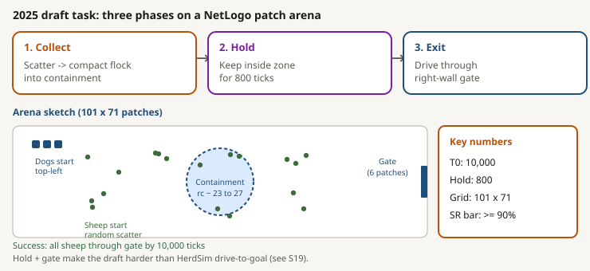

*Draft task: collect, hold, then exit through a gate (NetLogo patch arena).*

### Result of the paper

For small flocks one dog often worked; for large flocks the draft needed many more dogs (tens of dogs at N around 200 to 400).

At success rate (SR) >= 90%, draft Table A3 reports:

| N   | D_min | D_max     | Maximum SR |
|-----|-------|-----------|------------|
| 5   | 1     | not reach | 100%       |
| 10  | 1     | 15        | 100%       |
| 25  | 1     | 25        | 100%       |
| 50  | 1     | 25        | 100%       |
| 100 | 1     | not reach | 100%       |
| 150 | 3     | not reach | 99%        |
| 200 | 20    | 35        | 94%        |
| 250 | 25    | not reach | 93%        |
| 300 | 20    | not reach | 93%        |
| 350 | 35    | not reach | 91%        |
| 400 | 35    | not reach | 91%        |

Here "not reach" means they never found an upper failure point before D = 35.

The draft also found that more spread tended to go with worse success (Spearman `rho = -0.701` for mean spread `S_bar` vs SR, and `rho = -0.828` for `S_bar * N` vs SR, over 110 condition aggregates).

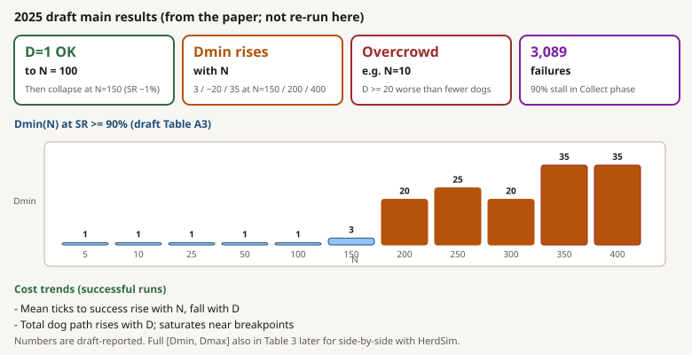

*Draft Table A3 pattern: D_min stays low at small N, then rises sharply for large flocks.*

### If we rerun a draft-style method

We did **not** rerun the draft yet. The plan is to port that collect / hold / gate task (and its controller family) into **HerdSim**, not to rerun NetLogo.

The aim is to ask the same research questions on that collect-hold-gate task, alongside the questions already asked on `drive_to_goal`. It is not equivalent to adding one more dog rule on the current task.

---

## 3. Research questions

### What we want from the program

After the core runs, we should be able to say something concrete about:

- whether start shape matters beyond size,
- how dog need changes as the group grows,
- which processes seem to drive the pattern,
- what looks shared across methods versus method-specific.

### Core questions

#### Structure (RQ1)

**Question:** At the same flock size, does start shape (spread, split, outliers) change how many dogs are needed?

**Methods:** RQ1 runs on the baseline only: `strombom_multi`.

#### Size and operating regimes (RQ2, with curve fits in RQ6)

**Question:** As flock size grows, how does the useful dog range change: the minimum needed for reliable herding, and whether adding more still helps, mostly wastes path, or starts to hurt?

RQ6 is the follow-on modeling step: once we have those minimums (`D_min` vs N), which simple curve best predicts a held-out flock size, and is one power law enough?

**Methods:** RQ2 runs on the baseline only: `strombom_multi`, compact starts. RQ6 is analyse-only on that baseline frontier (`D_min` vs N).

#### Mechanism (RQ3)

**Question:** Why does the pattern appear (for example dog interference, flock splitting, coverage limits)?

**Methods:** Analyse-only. Planned on baseline (`strombom_multi`) results from RQ1 and RQ2 when matched efficient vs overcrowding pairs exist.

#### Generality across methods (RQ4)

**Question:** If we switch herding method, which parts of the pattern stay the same?

**Methods:** All three locked methods: baseline `strombom_multi` as the reference pattern, then `kubo` and `fat` each rerun the core size map (compact) and structure map (four layouts at N in `{50, 100, 200}`). RQ4 is size then structure per transfer method.

### Follow-on questions

#### Information vs shepherds (RQ5)

**Question:** Can better sensing or communication reduce the dog count at the same reliability?

**Methods:** Baseline only: `strombom_multi`, compact starts, N in `{100, 200}`, low dog band (observation, range, and communication ladders).

#### Early warning (RQ7)

**Question:** Can recent flock state warn of failure better than knowing only N and D?

**Methods:** Analyse-only on claim-grade timeseries from earlier runs, primarily the baseline (`strombom_multi`)RQ1 merge.

### Scope

**In scope for the core program**

- flock size and start structure
- how much external control we need for reliable success
- scaling relationships and mechanisms
- whether results transfer across control methods
- a reproducible protocol

**Not primary goals**

- finding the single "best" herding algorithm
- copying every detail of real livestock
- optimizing one controller architecture
- claiming results for every collective system at once
- shipping a real-time failure-prediction product

Those can wait until the core scaling questions are clearer. Only claim what the evidence supports.

---

## 4. Answers from the runs

This section states what the completed runs support for each question above. Protocol, method detail, figures, and claim codes come later.

### RQ1: structure

**Status:** Answered on the baseline (`strombom_multi`). Kubo and FAT structure maps are under RQ4.

**Answer:** At N = 50, 100, and 200, all four start layouts (compact, split, outlier_rich, wide) have `D_min = 1`. Start shape does not change how many dogs you need for the 90% bar on the baseline. 

It does change cost: wide and large `outlier_rich` starts take much longer and more walking than compact (tables below). Because `D_min` never moved across layouts, we could not test whether early flock-state measures predict difficulty better than knowing only N and D.

One-dog cost by layout (median over successful trials; R = 1.00 at D = 1 for every cell):

| Layout | N | Median ticks | Median path |
|--------|---:|---:|---:|
| compact | 50 | 195 | 158 |
| compact | 100 | 204 | 161 |
| compact | 200 | 191 | 144 |
| split | 50 | 195 | 158 |
| split | 100 | 205 | 162 |
| split | 200 | 193 | 144 |
| outlier_rich | 50 | 224 | 209 |
| outlier_rich | 100 | 501 | 554 |
| outlier_rich | 200 | 1,228 | 1,647 |
| wide | 50 | 2,139 | 2,925 |
| wide | 100 | 3,074 | 4,319 |
| wide | 200 | 3,870 | 5,213 |

Wide vs compact at one dog: about 11x to 20x more time and about 19x to 36x more path. Split matches compact closely. `outlier_rich` grows with N.

On wide starts, the cheapest reliable choice is two dogs (`B* = 2`): the second dog cuts path while staying reliable.

| N | Path at D = 1 | Path at D = 2 (`B*`) |
|---:|---:|---:|
| 50 | 2,925 | 2,337 |
| 100 | 4,319 | 3,003 |
| 200 | 5,213 | 3,694 |

### RQ2 / RQ6: size and regimes

**Status:** Answered on the baseline (`strombom_multi`, compact) inside the tested dog list.

**Answer:** On the baseline (`strombom_multi`) with compact starts, the useful lower end is small and almost flat. At one dog, N = 5 and 10 fail the 90% bar (success about 0.07 and 0.24). Adding dogs past the minimum does not break success on that map; it mostly adds walking (88 of 100 cells labeled wasteful; 0 overcrowding).

Baseline compact frontier at theta 0.90:

| N | D_min | D_max | Maximum SR |
|---:|---:|---|---:|
| 5 | 2 | not reach | 100% |
| 10 | 2 | not reach | 100% |
| 25 | 1 | not reach | 100% |
| 50 | 1 | not reach | 100% |
| 75 | 1 | not reach | 100% |
| 100 | 1 | not reach | 100% |
| 150 | 1 | not reach | 100% |
| 200 | 1 | not reach | 100% |
| 300 | 1 | not reach | 100% |
| 400 | 1 | not reach | 100% |

Here "not reach" means no overcrowding appeared before D = 35, so `D_max` is only the tested-grid ceiling (35), not a measured collapse. Bootstrap width on every `D_min` above is zero.

RQ6 (curve fits) is weak: a two-level step ({2, then 1}) fits best only because `D_min` is almost flat. That is not a rich scaling law.

### RQ3: mechanism

**Status:** Not answerable yet.

**Answer:** The planned contrast was efficient cells versus overcrowding cells at the same N. We never saw overcrowding on the baseline size map inside D <= 35, so that contrast does not exist in the data. Correlation candidates (interference, splitting, and related logs) were not tested against a real upper failure band. Unlocking RQ3 needs either a measured collapse (for example D > 35, or a harder draft paper-style task) or another protocol where overcrowding appears. See [Future work](#future-work-measuring-collapse-beyond-d--35).

### RQ4: generality across methods

**Status:** Partial.

**Why partial:** transfer holds only on part of the map (compact size for Strombom and Kubo). FAT never reaches the 90% bar for N >= 25, Kubo fails on wide starts, and large `outlier_rich` shifts Kubo's `D_min`. That is enough to reject "the same story everywhere," but not enough to say which patterns are shared across a broader method set.

**Answer:** On tight (compact) starts, Strombom and Kubo share a low `D_min` floor for larger flocks. FAT does not copy that story.

Compact `D_min` at theta 0.90:

| N | Baseline (`strombom_multi`) | Kubo | FAT |
|---:|---:|---:|---|
| 5 | 2 | 3 | 1 |
| 10 | 2 | 1 | 1 |
| 25 | 1 | 1 | not reach |
| 50 | 1 | 1 | not reach |
| 100 | 1 | 1 | not reach |
| 150 | 1 | 1 | not reach |
| 200 | 1 | 1 | not reach |
| 300 | 1 | 1 | not reach |
| 400 | 1 | 1 | not reach |

Structure breaks transfer further. Shared compact size floors do not imply shared structure behavior.

Structure-map `D_min` at theta 0.90 (N in `{50, 100, 200}`):

| Layout | N | Baseline (`strombom_multi`) | Kubo | FAT |
|--------|---:|---:|---:|---|
| compact | 50 | 1 | 1 | not reach |
| compact | 100 | 1 | 1 | not reach |
| compact | 200 | 1 | 1 | not reach |
| split | 50 | 1 | 1 | not reach |
| split | 100 | 1 | 1 | not reach |
| split | 200 | 1 | 1 | not reach |
| outlier_rich | 50 | 1 | 1 | not reach |
| outlier_rich | 100 | 1 | 1 | not reach |
| outlier_rich | 200 | 1 | 20 | not reach |
| wide | 50 | 1 | not reach | not reach |
| wide | 100 | 1 | not reach | not reach |
| wide | 200 | 1 | not reach | not reach |

On Kubo wide, best R is about 0.47 to 0.54. FAT clears no structure cell at these sizes (best R about 0 to 0.50 by layout). Kubo `outlier_rich` at N = 200 is a point estimate `D_min = 20` with a wide bootstrap interval.

**Next (to answer RQ4 more fully):**

1. Run the planned next transfer method, `communication_free`, on the same size and structure maps.
2. Tighten soft edges that block a clean compare: deepen Kubo `outlier_rich` at N = 200 until the bootstrap on `D_min` is narrow, or report it as uncertain and keep it out of strong transfer claims.
3. Ask why FAT and Kubo-wide fail under this protocol (controller or sensing limits), then retry a fairer FAT setup if needed (for example local sensing as the method intends), still on the frozen grids.
4. Once an upper collapse exists (D > 35 or a harder draft-style task), repeat the size/structure transfer check on that upper band.

### RQ5 and RQ7: follow-ons

**RQ5 (information vs shepherds):** Narrow answer. On compact N = 100 and 200, local sensing (radius 65) works as well as a full global view: both have `D_min = 1`. Whether *better* information can *reduce* dog count cannot be judged here: the baseline is already at one dog, and bearing-only, range, and communication each had a setup problem that blocked a fair ladder test.

**RQ7 (early warning):** Not answerable on this data. By the first check at tick 1,000, almost every successful RQ2 size-map run has already finished, so there is no late window left to warn before success or failure settles.

### Status table

| RQ | Status | One-line answer |
|----|--------|-----------------|
| RQ1 | Answered on baseline | Start shape changes time and path, not `D_min` (still 1 at N = 50, 100, 200). |
| RQ2 | Answered inside D <= 35 | Lower: `D_min` is 2 then 1; upper: waste, no overcrowding; `D_max = 35` is a list ceiling. |
| RQ3 | Not answerable yet | No overcrowding cells, so the efficient-vs-overcrowding contrast never appears. |
| RQ4 | Partial | Compact: Strombom and Kubo share a low floor; FAT and wide/structure cases break transfer. |
| RQ5 | Narrow | Local equals global at `D_min = 1`; saving dogs with more information was not fairly tested. |
| RQ6 | Weak | Best fit is a two-level step because `D_min` is almost flat. |
| RQ7 | Not answerable on this data | First warning check is after almost every success has already finished. |

---

## Detail sections: protocol, runs, and evidence

The answers above are the scientific readout. What follows is the detail stack: frozen configuration, how the campaign was staged, per-method results, synthesis, formal claims, limits, and the follow-on analyses. Use it to check a number, reproduce a run, or audit a claim. Skip it if section 4 already answers what you needed.

---

## 5. Shared protocol

This section freezes the shared terms, field, grids, layouts, frontiers, and failure labels used by every later run.

| Term | Meaning |
|------|---------|
| `N` | Number of sheep |
| `D` | Number of dogs |
| `R` | Success rate: fraction of repeated runs that finish in time |
| `theta` | Reliability bar (here 0.90: succeed in at least 90% of runs) |
| `D_min` | Smallest tested D with `R >= theta` |
| Compact start | Sheep begin in a tight clump |

### Core protocol

| Parameter | Value | Notes |
|-----------|-------|-------|
| `task` | `drive_to_goal` | Every sheep must enter the goal disk before the deadline. |
| `world_width`, `world_height` | (500, 500) | Square field large enough for wide and outlier-rich starts. |
| Flock centre | (250, 250) | Field centre. |
| `goal_center` | (370, 250) | Midline point 120 units right of the flock. |
| `drive_length` | 120 | Fixed centre-to-centre task distance. |
| `goal_radius_at_n50` | 15 | Application-scale target at N = 50. |
| Goal radius | `15 * sqrt(N/50)` | Keep target area per sheep constant. |
| `initial_spread` | 30 | Base scale used by all layout generators. |
| `measurement_radius` | 5 | Connectivity radius for fragmentation. |
| `reliability_theta` | 0.90 | Primary reliable-band threshold. |
| `reliability_sensitivity` | 0.5, 0.7 | Additional reported thresholds, not the D_min bar. |
| `baseline_method` | `strombom_multi` | Baseline collect-and-drive controller. |
| `transfer_method` | baseline method, `kubo`, `fat`, `communication_free` | Full planned transfer list. |
| `required_transfer_methods` | baseline method, `kubo`, `fat` | Minimum transfer claim set. |
| `flock_size` grid | `{5, 10, 25, 50, 75, 100, 150, 200, 300, 400}` | Frozen N grid. |
| `shepherd_counts` grid | `{1, 2, 3, 4, 6, 10, 15, 20, 25, 35}` | Frozen D grid. |
| `structure_flock_sizes` | `{50, 100, 200}` | RQ1 (structure) claim sizes. |
| `rq5_flock_sizes` | `{100, 200}` | RQ5 (information) claim sizes. |
| `X0_families` | compact, wide, split, outlier_rich | Initial layout factor. |
| `time_limit_t0` | 10,000 | Main deadline, about 80 straight 120-unit crossings at speed 1. |
| `time_limit_t1` | 20,000 | Long deadline only for overcrowding cells. |
| `scout_seeds` | 30 | Broad-map depth. |
| `master_seeds` | 2026 | Base for a shared deterministic seed list. |
| `bootstrap_resamples` | 1,000 | Seed resamples for frontier uncertainty. |
| `predictor_window_ticks` | 100 | Initial-state feature window, shorter than a straight drive. |
| `wasteful_effort_tolerance` | 0.2 | Default excess-path bar. |
| `wasteful_effort_sensitivity` | 0.1, 0.3 | Reported sensitivity bars. |

#### Some reasons for the setup

These reasons were locked in the plan (field, goal, grids, layouts).

##### Field

We use a 500 by 500 square so wide and outlier-rich starts still fit with room to spare. A much smaller field (150) cannot hold those starts. A 400 field is tight on the wide start. A 1000 field mostly adds empty space.

The goal sits on the horizontal midline so top and bottom margins stay equal.


*500 by 500 field, flock centre, midline goal, and margin for wide starts.*

The flock must travel 120 units from centre to goal. That is far enough that a tight start is not already "in" the goal, but not so far that the goal sits against the far wall.

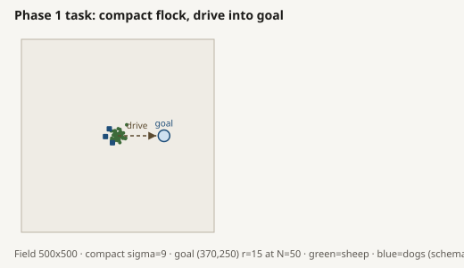

*Centre-to-goal drive of 120 units on the midline.*

##### Radius

At N = 50 the goal radius is 15: big enough that sheep are not jammed into a tiny disk, but not so big that the task becomes trivial. We grow the radius with `sqrt(N)` so goal *area per sheep* stays roughly constant. A fixed radius would squeeze large flocks. We do **not** reuse the Strombom Collect radius as the goal size (that Collect rule is controller-specific).

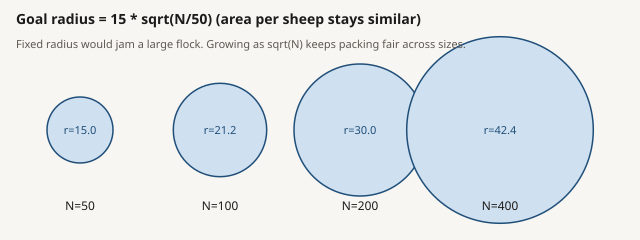

*Goal radius `15 * sqrt(N/50)` keeps goal area per sheep roughly constant.*

##### Flock-size and dog-count grid

**Why these flock sizes (N):** N = 5 is the smallest size where the same collective measures still make sense. We sample more densely around N = 100, include 300 and 400 for large flocks, and skip 250 and 350 because each extra N needs a full sweep over dog counts.

**Why these dog counts (D):** fine steps at low D (where the minimum usually sits), then larger jumps to see whether "many more dogs" help or hurt. The top of the list is 35 because the central question is about a *few* shepherds. That is a grid ceiling for this study, not a physical farm limit, and not proof that overcrowding cannot appear above 35 ([Future work](#future-work-measuring-collapse-beyond-d--35)).

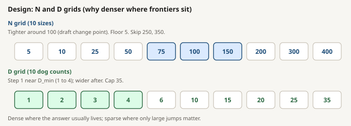

*N denser near 100; D unit steps at low counts, then larger steps up to 35.*


*Primary bar: R >= 0.90. Sensitivity thresholds 0.50 and 0.70 are reported but do not define D_min.*

##### Claim flock sizes (which N each RQ uses)

Not every RQ sweeps the full frozen N grid. Each claim uses a smaller N set chosen for that question.

**RQ1 (structure)** uses `structure_flock_sizes` = `{50, 100, 200}` and all four initial layouts. At these sizes, split can form clear separate clumps and outlier_rich can place stragglers far from the core, so layout differences are meaningful. We do not run the structure claim below N = 50: very small flocks cannot show the same structure contrast (for example, split at N below 12 only has room for two clumps), and tiny compact flocks are already covered by the RQ2 size map. N = 300 and N = 400 are optional follow-ups only after the three-size map is done, and mainly if every layout still sits at the lowest D on the grid (so larger N is needed to see whether structure ever raises D_min).

**RQ5 (information)** uses `rq5_flock_sizes` = `{100, 200}`. N = 50 is left out because the baseline D_min there is already 1: if less information cannot push D_min below 1 on this grid, that size cannot show a measurable information cost.

### Initial layouts

We hold flock size fixed and change only how sheep are placed at the start:

| Layout | Picture | How we build it |
|--------|---------------|-------------------------|
| `compact` | Tight clump | Narrow Gaussian (sigma 9) |
| `wide` | Very spread out | Wide Gaussian (sigma 60) |
| `split` | Two or three separate clumps | Gaps of at least 10 units |
| `outlier_rich` | Main flock plus far stragglers | About 80% core, 20% far outliers |

Checks: compact should look tighter than wide; split should look more broken than compact; outlier_rich should show more outliers than compact. Points that land outside the field or inside the goal are redrawn (not stuck on the wall).

A connectivity radius of 5 links nearby compact neighbors but does not bridge the split gaps.

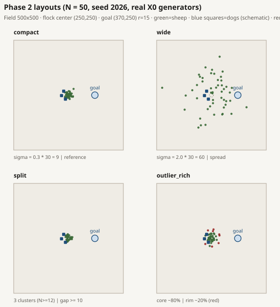

*Compact, wide, split, and outlier_rich at the same N.*

### Frontier, regimes, and failure labels

**Control demand** means: how many dogs do you need so that herding succeeds often enough? We measure that mainly with the useful dog range around `D_min`, and with whether too many dogs start to hurt.

`D_min` is not a property of sheep in nature. It depends on the task, time limit, sensing, success rule, and other frozen settings.

We only test the dog counts on the frozen list (not every integer).

Success rate `R` is estimated over locked random seeds for a given method, protocol, N, D, time limit, start layout, and information setting.

| Label | Meaning |
|-------|----------------|
| `D_min` | Smallest tested dog count with `R >= 0.90` |
| `D_overcrowd` | After a reliable band, the first tested D where that D and the next tested D are both below 0.90 |
| `D_max` | Largest still-reliable D before overcrowding; if there is no overcrowding, the top of the tested list (a ceiling) |
| `B*` | Among reliable choices, the one with the shortest median dog walking distance (ties: fewer dogs, then faster finish) |
| Hard failure | No tested D reaches 0.90 |
| Under-resourced | Too few dogs; `R` below 0.90 |
| Efficient | Reliable and path is not much above `B*` |
| Wasteful | Reliable, but dogs walk a lot more than at `B*` (default: 20% more path; we also report 10% and 30%) |
| Overcrowding | After a reliable band, success falls again when D is high |

#### HerdSim definitions vs the 2025 draft

Draft wording for comparison: [Prior draft paper](#2-prior-draft-paper).

**HerdSim `D_overcrowd`:** after a reliable band (`R >= 0.90`), the first tested dog count D such that both that D and the next tested D have `R < 0.90`.

**Draft `D_overcrowd`:** the smallest D above `D_min` where success rate *starts decreasing* (first drop), even if R is still above 90%.

**Why HerdSim does not follow the draft for `D_overcrowd`:**

- The draft marks overcrowding as soon as success *goes down a bit*, even if it is still above 90%. We wait until success is actually below 90%.
- One bad dog count is not enough. With fewer seeds (scout uses 30), or with big jumps in the dog list, one cell can look bad by chance and then look fine again at the next D. We need two bad counts in a row before we say overcrowding has started.
- Later steps depend on this label. We only run the longer deadline (T1), reseed claim cells, and open RQ3 when overcrowding is confirmed. One bad cell would not trigger those.
- Example: in RQ5, N = 200 with D = 10 under communication failed once at scout depth. That is one dip, so we do *not* call it overcrowding ([Information ladders](#13-information-ladders)).

**HerdSim `D_max`:** the largest tested D that is still reliable before `D_overcrowd`. If no overcrowding appears, `D_max` is the top of the tested dog list (here 35): a ceiling, not a measured collapse.

**Draft `D_max`:** the smallest D above `D_min` with success rate below 90%; if none is observed, the grid ceiling (35).

**Why HerdSim does not follow the draft for `D_max`:**

- The draft asks: "where does success first fall below 90%?" We ask: "what is the largest dog count that still works at 90%?" Those are different numbers.
- If only one dog count dips below 90% and the next one recovers, the draft would end the good range there. We keep `D_max` as the last D that still passed 90%, and we only end the good range after two failing counts in a row (`D_overcrowd`).
- So the range from `D_min` to `D_max` is the dog counts that still clear the 90% bar on the tested list. A single noisy fail does not cut that range short.
- If there is no overcrowding, both the draft and HerdSim may report 35. That only means "we stopped testing at 35," not "things break at 35." Detail: [Upper frontier status](#upper-frontier-status).

**Waste vs overcrowding:**

- **Waste:** still succeed often, but extra dogs mostly walk more.
- **Overcrowding:** after a good winning band, success falls under 90% again for two steps in a row.

If there is no overcrowding, a reported `D_max = 35` only means "still OK at the largest D we tested," not "collapse begins at 35."

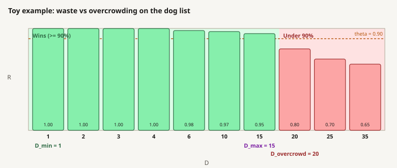

*Waste: R stays at or above theta while path grows. Overcrowding: after a reliable band, R falls below theta for two consecutive tested D.*

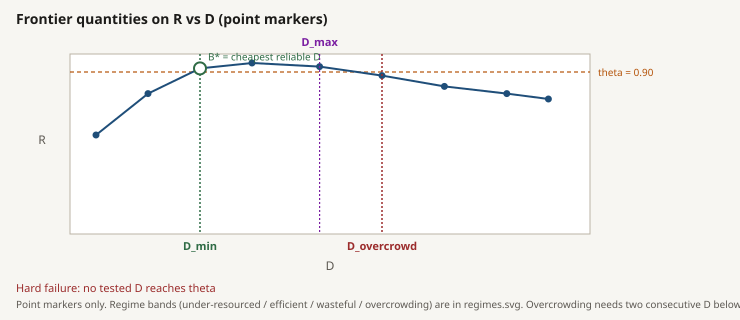

*Point markers: `D_min`, `B*`, `D_overcrowd`, `D_max`, and theta. Regime bands are in the next figure.*

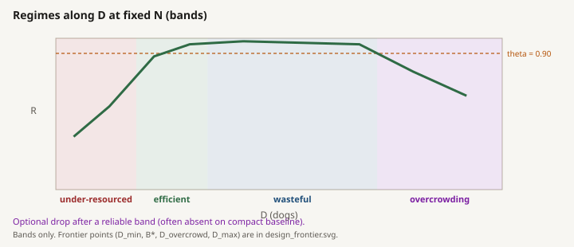

*Colored bands only: under-resourced, efficient, wasteful, overcrowding (frontier markers stay above).*

Failure labels:

- Stacking: Dogs pile on one point.
- Split: Flock stays in pieces.
- Scatter: Cohesion distances high.
- Oscillation: GCM flips, little progress.
- Stuck: GCM barely moves to goal.
- Timeout: still unfinished at T0.

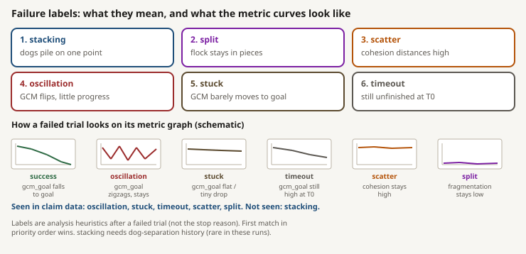

*How failed trials are labelled from flock and dog state (stacking, split, scatter, oscillation, stuck).*

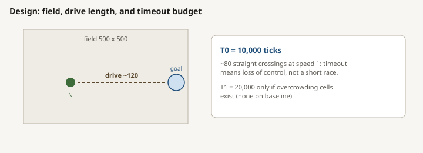

*Timeout: the run is still unfinished at T0; other labels can appear on early failure too.*

---

## 6. Campaign design

### Design overview

Two tables below: what is shared by every simulation campaign, then what each RQ actually ran. Parameter detail and reasons sit in [Shared protocol](#5-shared-protocol). Run-level trial lists sit in [Trial counts by run](#trial-counts-by-run).

#### Shared design (same for every simulation RQ)

| Piece | Setting |
|-------|---------|
| Task | `drive_to_goal` |
| Arena | 500 by 500; flock centre (250, 250); goal (370, 250); drive length 120 |
| Goal radius | `15 * sqrt(N/50)` |
| Reliability bar | `R >= 0.90` (also report 0.50 and 0.70; they do not define `D_min`) |
| Full N grid | `{5, 10, 25, 50, 75, 100, 150, 200, 300, 400}` |
| Full D grid | `{1, 2, 3, 4, 6, 10, 15, 20, 25, 35}` |
| Layouts | `compact`, `wide`, `split`, `outlier_rich` |
| Timeouts | T0 = 10,000 (main); T1 = 20,000 (only if overcrowding cells appear) |
| Smoke grid | N = `{5, 10, 25, 50, 100}`; D = `{1, 2, 3, 4, 6, 10}`; 5 seeds (pipeline check only) |
| Seed depths | SMOKE: 5; SCOUT: 30; CLAIM: 100; soft edge: 200 |
| Master seed | 2026 (`2026 + i` per trial) |
| Claim windows | around scout `D_min` (that D and neighbors); if overcrowding, the two failing D plus last reliable D; if hard fail, the two largest tested D |
| Merge rule | one grade per cell: claim rows replace scout rows on reseeded cells; other cells keep scout; never mix scout and claim seeds in the same cell |
| Bootstrap | 1,000 resamples of locked seeds for the `D_min` interval; raise soft edges to 200 real seeds when the interval is wider than one D step |
| Trial totals | 43,250 simulations run; 37,070 rows in claim merges (reseeded cells drop their scout rows) |

#### Per-RQ design and trials

Trials = cells x seeds (and x layouts or ladder factors when used). Claim columns are reseed trials only, not the merged table. Full arithmetic per run is in [Trial counts by run](#trial-counts-by-run).

| RQ | Method | Smoke grid | Scout grid | Claim | SMOKE | SCOUT | CLAIM | Total | Status |
|----|--------|------------|------------|-------|------:|------:|------:|------:|--------|
| RQ1 | `strombom_multi` | 4 layouts x smoke N x smoke D x 5 seeds | 4 layouts x `{50,100,200}` x full D x 30 | 24 window cells x 100 | 600 | 3,600 | 2,400 | 6,600 | DONE |
| RQ2 | `strombom_multi` | compact x smoke N x smoke D x 5 seeds | compact x full N x full D x 30 | 22 window cells x 100; T1 skipped | 150 | 3,000 | 2,200 | 5,350 | DONE |
| RQ3 | (analyse) | (none) | (none) | no new sims; needs overcrowding contrast | 0 | 0 | 0 | 0 | SKIPPED |
| RQ4 | `kubo`, then `fat` | (none) | per method: size = compact x full N x full D x 30; structure = 4 layouts x `{50,100,200}` x full D x 30 | size windows 21 / 20 cells x 100; structure 24 cells x 100 (`kubo` structure also 9 cells x 200) | 0 | 13,200 | 10,500 | 23,700 | DONE |
| RQ5 | `strombom_multi` | (none) | compact x `{100,200}` x `{1,2,3,4,6,10}` x ladder factors x 30 | ladder windows x 100 (12 / 16 / 12 cells) | 0 | 3,600 | 4,000 | 7,600 | DONE |
| RQ6 | (analyse) | (none) | (none) | no new sims; fits on claim frontiers | 0 | 0 | 0 | 0 | DONE |
| RQ7 | (analyse) | (none) | (none) | no new sims; earlier claim timeseries | 0 | 0 | 0 | 0 | DONE |
| **All** | | | | | **750** | **23,400** | **19,100** | **43,250** | |

Smoke N / D are the shared smoke grid above. Scout builds the cheap map; claim reseeds only window cells; merge follows the shared merge rule. RQ3 was skipped (no overcrowding). RQ6 and RQ7 reuse earlier merges.

### Why we run it this way

We need accurate success rates near the important edges (where `D_min` sits, and where overcrowding might start). Running every cell at 100 seeds would waste budget: cells that always succeed or always fail teach little at that depth.

So each simulation campaign uses the same staged idea:

1. **SMOKE (5 seeds):** pipeline check on the fixed smoke grid N = `{5, 10, 25, 50, 100}`, D = `{1, 2, 3, 4, 6, 10}` (RQ2: compact only = 150 trials; RQ1: all 4 layouts = 600 trials).
2. **SCOUT (30 seeds):** map the planned scientific grid cheaply so we can see where reliability lives (23,400 trials).
3. **CLAIM (100 seeds, or 200 on soft edges):** reseed only the window cells that matter (19,100 trials).

That is why scout trials outnumber claim trials even though claim is deeper per cell: scout covers the whole map; claim covers a small window. The same staging is used for size, structure, transfer, and the information ladders. Grades and steps are defined next.

### Grades

| Grade | Role | Seeds | Grid used here | Cite for claims? |
|-------|------|------:|----------------|------------------|
| SMOKE | Pipeline check (paths, resume, metrics) | 5 | N = `{5, 10, 25, 50, 100}`, D = `{1, 2, 3, 4, 6, 10}` (layouts as in that RQ) | No |
| SCOUT | Broad map; choose claim windows | 30 | Full scientific grid for that RQ (see tables above) | No (planning / diagnostics only) |
| CLAIM | Precision on planned cells | 100 (200 on soft edges) | Claim windows only (cell list from scout) | Yes |

Do not promote a SCOUT figure to a claim verdict.

### Shared pipeline (worked example: RQ2)

Every simulation campaign uses the same cycle: pilot, scout, claim plan, claim reseed, merge, then reuse or stop. Below is the real RQ2 baseline size map (`strombom_multi`, compact). Other RQs change the grid or method, not the cycle.

Stop after scout if the map is broken, the grid must change, or the bootstrap interval is too wide. Fix the protocol, then continue.

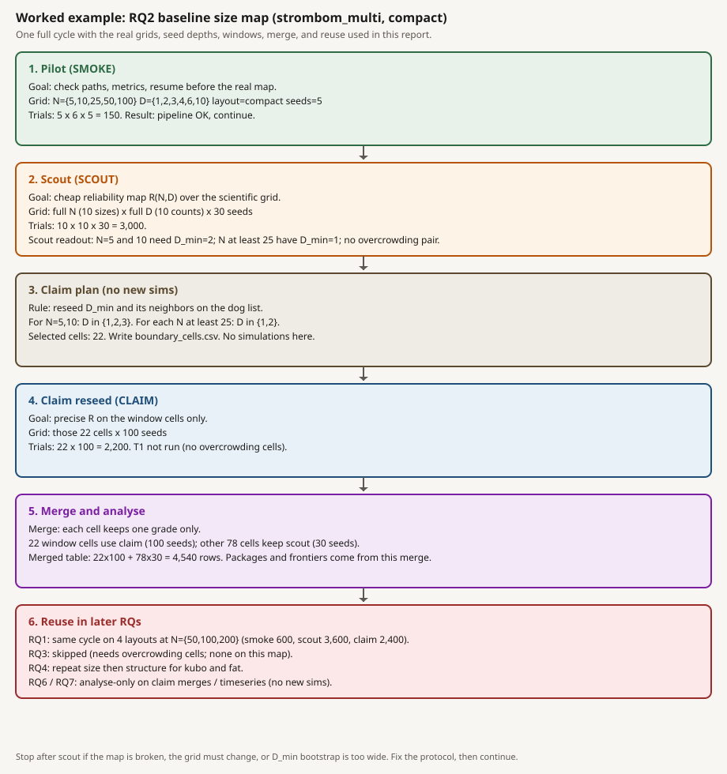

*RQ2 worked example: smoke 150, scout 3,000, claim plan 22 cells, claim 2,200, merge 4,540 rows, then reuse or skip later RQs.*

#### Step by step (RQ2 numbers)

**1. Pilot (SMOKE).** Confirm host, paths, metrics, and resume on the smoke grid only: N = `{5, 10, 25, 50, 100}`, D = `{1, 2, 3, 4, 6, 10}`, compact, 5 seeds. Trials: `5 x 6 x 5 = 150`. This is not a scientific map; it only answers "can we run?"

**2. Scout (SCOUT).** Map reliability cheaply on the full scientific grid: 10 N x 10 D x 30 seeds = 3,000 trials. Scout readout used later:

| N | Scout `D_min` (theta 0.90) | Scout note at low D |
|---|---------------------------:|---------------------|
| 5 | 2 | R at D = 1 about 0.03; R at D >= 2 is 1.00 |
| 10 | 2 | R at D = 1 about 0.27; R at D >= 2 is 1.00 |
| 25 to 400 | 1 | R at D = 1 is already 1.00 |
| any | no `D_overcrowd` | no two consecutive D below 0.90 after the good band |

**3. Claim plan (no new sims).** From that scout map, write the cells to reseed:

- around scout `D_min`: that D, plus the previous and next dog counts on the list
- if overcrowding starts (two steps below 0.90): those two D and the last reliable D
- if nothing reaches 0.90: the two largest tested D

On RQ2 that selected **22 cells**: for N = 5 and 10, D in `{1, 2, 3}`; for each of the eight larger N, D in `{1, 2}`.

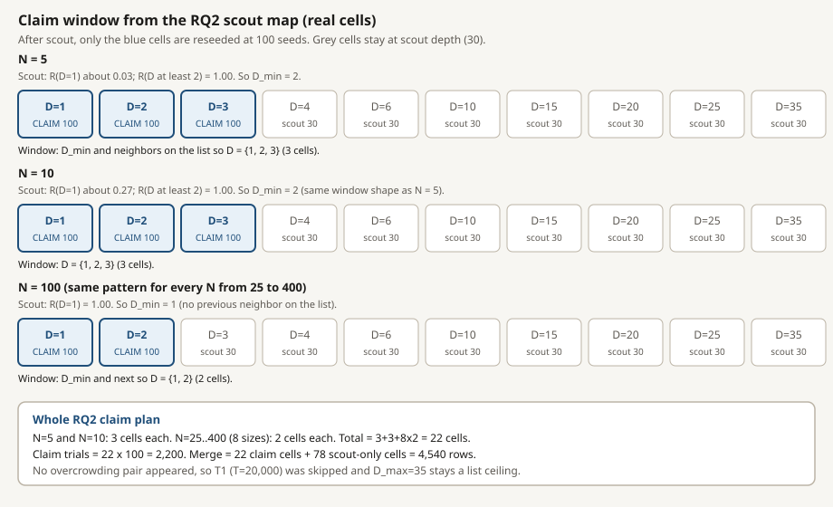

*Blue cells are claim-reseeded at 100 seeds. Grey cells keep scout depth 30. Whole plan: 22 cells.*

**4. Claim reseed (CLAIM).** Run only those 22 cells at 100 seeds: `22 x 100 = 2,200` trials. T1 at T = 20,000 was skipped because no overcrowding cells appeared.

**5. Merge and analyse.** One grade per cell: claim rows replace scout rows on the 22 window cells; the other 78 cells keep their 30 scout seeds. Merged table: `22 x 100 + 78 x 30 = 4,540` rows. Frontiers, regimes, and figures for RQ2 come from this merge, not from scout alone.

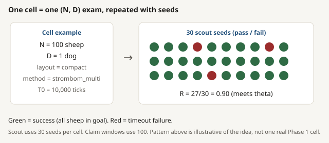

*A single (N, D) cell: scout depth versus claim depth.*

**6. Reuse or stop.** The same cycle is reused with a different grid or method:

- RQ1: four layouts at N = `{50, 100, 200}` (smoke 600, scout 3,600, claim 2,400)
- RQ3: skipped here (needs overcrowding cells; RQ2 found none)
- RQ4: size then structure for `kubo` and `fat`
- RQ6 / RQ7: analyse-only on claim merges / timeseries

### Bootstrap on `D_min` (analysis, then maybe more seeds)

**Purpose.** `D_min` comes from a finite bag of seeds. Bootstrap asks: if we redraw those same locked trials many times, how much does `D_min` jump? That gives a 95% interval around the point estimate. It is analysis on existing rows, not 1,000 new simulations.

**How it runs (five steps):**

1. Start from the locked success/fail seeds already stored for each D near the frontier (scout or claim).
2. Draw 1,000 resamples **with replacement** from that bag (same size as the original bag each time).
3. On each resample, rebuild `R(D)` and recompute `D_min*` (smallest D with `R >= 0.90`). If a resample never clears 0.90, it stays right-censored above the tested grid.
4. Sort the 1,000 `D_min*` values. The 2.5% and 97.5% percentiles are the bootstrap interval. Width zero means every resample agreed.
5. Decision: if the interval spans more than one dog-count step, raise that window to 200 **real** seeds, then bootstrap again. Soft edges can stay wide even after that.

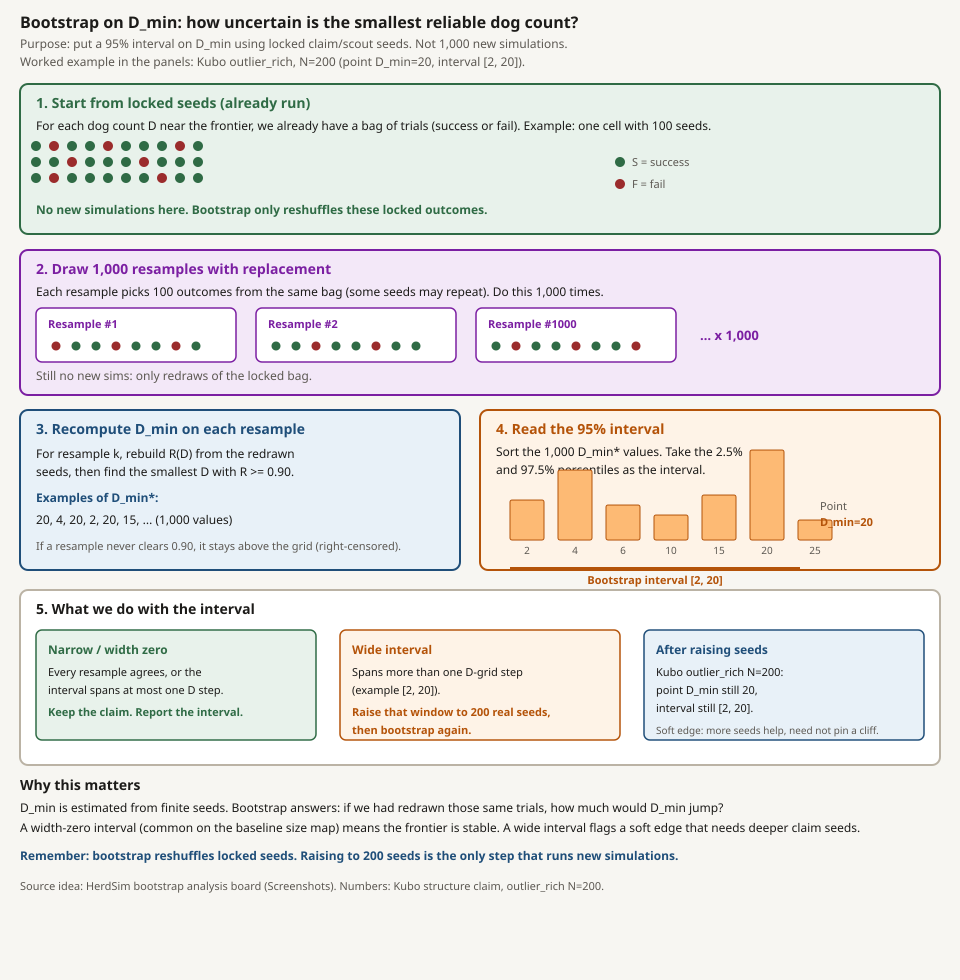

*Five-step bootstrap on locked seeds. Worked numbers: Kubo outlier_rich N=200, point D_min=20, interval [2, 20].*

**Worked case (RQ4 Kubo).** `outlier_rich`, `N=200` had a wide interval, so those D cells were raised to 200 seeds. After the deeper bag, the point estimate is still `D_min=20` and the bootstrap interval is still `[2, 20]`. Details under [`kubo`](#kubo).

### How each RQ uses the pipeline

| RQ | What is specific | Scout asks | Claim spends seeds on |
|----|------------------|------------|------------------------|
| RQ2 | Baseline size map (`strombom_multi`, compact) | Where does `R(N, D)` live on the frozen grids? | Frontiers and hard-failure cells |
| RQ1 | Four layouts at `N` in `{50, 100, 200}` | How does `X0` move `D_min` and cost? | Structure windows at those three sizes |
| RQ3 | Analyse only | (none) | Needs matched efficient vs overcrowding cells from RQ2 (size) or RQ1 (structure) |
| RQ4 | Repeat size and structure for `kubo` and `fat` | Same maps per transfer method | Same window logic per method |
| RQ5 | Three separate ladders (obs, range, comm), not a product | Does a ladder step lower `D_min`? | Windows on each ladder at `N` in `{100, 200}` |
| RQ6 | Analyse only | (none) | Needs claim-grade frontier maps |
| RQ7 | Analyse only | (none) | Needs claim-grade timeseries |

RQ-specific notes:

- RQ2 (size): full frozen `N` x `D` grids; T1 skipped here because no overcrowding cells appeared.
- RQ1 (structure): structure scout and claim only; no new size grid.
- RQ3: skipped for the baseline because RQ2 found no overcrowding cells to contrast.
- RQ4: size then structure, once per transfer method (`kubo`, then `fat`).
- RQ5: observation scout/claim first, then range, then communication; low-D band as in [Information ladders](#13-information-ladders).
- RQ6 and RQ7: no new simulation campaigns; they consume earlier merges (and timeseries for RQ7).

### Trial counts by run

Counts are completed simulation trials from each protocol folder (`status.json`, checked against `trials.csv`). Claim rows are reseed trials only, not the merged table. Analyse-only RQs have no new trials. Trials = (layouts x N x D x extra factors x seeds), or (window cells x seeds) for claim.

| RQ | Run | Grade | Layouts | N | D | Extra factors | Seeds | Cells | How counted | Trials | Status |
|----|-----|-------|---------|---|---|----------------|------:|------:|-------------|-------:|--------|
| RQ2 | Pilot | SMOKE | compact | `{5,10,25,50,100}` | `{1,2,3,4,6,10}` | (none) | 5 | 30 | 5 N x 6 D x 5 | 150 | DONE |
| RQ2 | Scout | SCOUT | compact | full N (10) | full D (10) | (none) | 30 | 100 | 10 x 10 x 30 | 3,000 | DONE |
| RQ2 | Claim reseed | CLAIM | compact | windows | windows | (none) | 100 | 22 | 22 x 100 | 2,200 | DONE |
| RQ2 | T1 | CLAIM | (none) | (none) | (none) | overcrowding at T = 20,000 | (n/a) | 0 | no overcrowding cells | 0 | SKIPPED |
| RQ1 | Pilot (state) | SMOKE | all 4 | `{5,10,25,50,100}` | `{1,2,3,4,6,10}` | (none) | 5 | 120 | 4 x 5 x 6 x 5 | 600 | DONE |
| RQ1 | Scout | SCOUT | all 4 | `{50,100,200}` | full D (10) | (none) | 30 | 120 | 4 x 3 x 10 x 30 | 3,600 | DONE |
| RQ1 | Claim reseed | CLAIM | all 4 | windows | windows | (none) | 100 | 24 | 24 x 100 | 2,400 | DONE |
| RQ3 | Mechanism | (analyse) | (none) | (none) | (none) | Package C | (n/a) | 0 | no new sims | 0 | SKIPPED |
| RQ4 | Kubo size scout | SCOUT | compact | full N (10) | full D (10) | (none) | 30 | 100 | 10 x 10 x 30 | 3,000 | DONE |
| RQ4 | Kubo size claim | CLAIM | compact | windows | windows | (none) | 100 | 21 | 21 x 100 | 2,100 | DONE |
| RQ4 | Kubo structure scout | SCOUT | all 4 | `{50,100,200}` | full D (10) | (none) | 30 | 120 | 4 x 3 x 10 x 30 | 3,600 | DONE |
| RQ4 | Kubo structure claim | CLAIM | all 4 | windows | windows | soft edge 200 | 100 or 200 | 31 | 22 x 100 + 9 x 200 | 4,000 | DONE |
| RQ4 | FAT size scout | SCOUT | compact | full N (10) | full D (10) | (none) | 30 | 100 | 10 x 10 x 30 | 3,000 | DONE |
| RQ4 | FAT size claim | CLAIM | compact | windows | windows | (none) | 100 | 20 | 20 x 100 | 2,000 | DONE |
| RQ4 | FAT structure scout | SCOUT | all 4 | `{50,100,200}` | full D (10) | (none) | 30 | 120 | 4 x 3 x 10 x 30 | 3,600 | DONE |
| RQ4 | FAT structure claim | CLAIM | all 4 | windows | windows | (none) | 100 | 24 | 24 x 100 | 2,400 | DONE |
| RQ5 | Observation scout | SCOUT | compact | `{100,200}` | `{1,2,3,4,6,10}` | 3 obs modes | 30 | 36 | 2 x 6 x 3 x 30 | 1,080 | DONE |
| RQ5 | Observation claim | CLAIM | compact | windows | windows | obs modes in window | 100 | 12 | 12 x 100 | 1,200 | DONE |
| RQ5 | Range scout | SCOUT | compact | `{100,200}` | `{1,2,3,4,6,10}` | 4 sensing ranges | 30 | 48 | 2 x 6 x 4 x 30 | 1,440 | DONE |
| RQ5 | Range claim | CLAIM | compact | windows | windows | ranges in window | 100 | 16 | 16 x 100 | 1,600 | DONE |
| RQ5 | Communication scout | SCOUT | compact | `{100,200}` | `{1,2,3,4,6,10}` | 3 comm modes | 30 | 36 | 2 x 6 x 3 x 30 | 1,080 | DONE |
| RQ5 | Communication claim | CLAIM | compact | windows | windows | comm modes in window | 100 | 12 | 12 x 100 | 1,200 | DONE |
| RQ6 | Scaling fits | (analyse) | (none) | (none) | (none) | Package F | (n/a) | 0 | no new sims | 0 | DONE |
| RQ7 | Early warning | (analyse) | (none) | (none) | (none) | Package G | (n/a) | 0 | no new sims | 0 | DONE |
| | **Total simulations** | | | | | | | | | **43,250** | |

Obs modes: `bearing_only`, `local_positions`, `global`. Sensing ranges: `{32.5, 65, 97.5, 130}`. Communication modes: `none`, `neighbour_broadcast`, `global_shared`. The claim merges used for analysis hold 37,070 rows (fewer than the total because a reseeded cell drops its scout rows from the merge). Integrity notes: [`TRUST_AUDIT.md`](../results/TRUST_AUDIT.md).

---

## 7. Methods and results

The shared rules (field, grids, 90% bar, scout/claim staging) are defined once in [Shared protocol](#5-shared-protocol) and [Campaign design](#6-campaign-design). This section covers each controller, then its results, with a short **Meaning** under each figure.

"Farthest" differs by controller:

- **Strombom Collect:** sheep farthest from the *flock centre*
- **Kubo:** sheep farthest from the *goal* (among those the dog can sense)
- **FAT:** sheep farthest from the *dog itself*

### `strombom_multi`

Dogs first gather stragglers (Collect), then push the whole flock toward the goal (Drive). They switch using a radius that grows with flock size (`r_a * N^(2/3)`). That Collect radius is wider than the goal disk, so a Strombom failure is not read as sheep failing to pack into the goal.

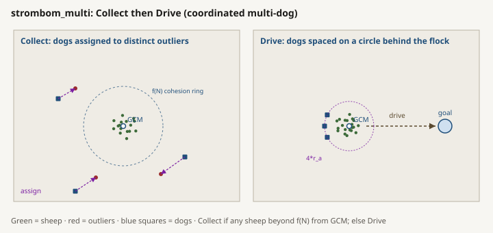

*Multi-dog Collect assigns outliers; Drive places dogs on an arc behind the flock toward the goal.*

**Published inspiration**

Strombom et al. (2014) describe a single shepherd that alternates between 2 actions. In Collect, it moves behind the sheep farthest from the flock center and pushes that outlier inward. In Drive, it moves behind the flock center relative to the goal and pushes the cohesive flock forward.

The switch uses:

```
f(N) = r_a * N^(2/3)
```

If any sheep is farther than `f(N)` from the global center of mass, the flock is treated as spread and the shepherd collects. Otherwise it drives. The published model also supplies the sheep attraction, repulsion, inertia, grazing, noise, and shepherd stop rules used as a basis of HerdSim's Strombom sheep.

Ref: paper

**HerdSim Implementation**

HerdSim separates sheep dynamics from the dog controller.

The named `strombom` preset combines:

- `sheep_model=strombom`;
- `dog_controller=collect_drive`;
- one shepherd by default.

The completed scaling study did not use that preset. It used `strombom_multi`, which combines the same Strombom sheep with `dog_controller=collect_drive_multi`.

**Sheep**

When every active dog is farther than `r_s`, a sheep grazes. It normally stays still and takes a random step with probability `graze_move_prob`. When a dog is within `r_s`, the sheep combines previous heading, attraction to a neighbor center, short-range sheep repulsion, repulsion from active dogs, and random noise, then moves by `sheep_speed`.

Defaults used by the method bundle include:

- `r_a = 2`: Sheep interaction length used in packing and collect threshold calculations.
- `r_s = 65`: Distance within which sheep react to a shepherd; base sensing range.
- `sheep_speed = 1.0`: Sheep displacement per tick.
- `shepherd_speed = 1.5`: Shepherd displacement per tick.
- `noise_strength = 0.3`: Strength of random angular jitter added when a sheep updates its heading. Higher values make paths wobble more; 0.3 is the Strombom-style default used in this bundle.
- `inertia = 0.5`: Weight on the sheep's previous heading when forming the new direction (the rest comes from attraction, repulsion, dog push, and noise). At 0.5, half of the update keeps the prior facing, which smooths turns.
- Collect threshold: `r_a * N^(2/3)` - Radius switch between collect and drive.

The coverage radius is `sensing_range` when an information factor sets it, otherwise the method's `r_s`. It is not the sheep-sheep repulsion distance.

**Multi-dog controller**

Under the global observations used in the completed scaling runs, each active dog sees the full flock and computes the same centroid and threshold.

In Collect:

- sheep beyond `f(N)` are sorted by distance from the centroid;
- dog `i` is assigned outlier `i mod k`, where `k` is the number of outliers;
- its base target is `r_a` behind that sheep relative to the centroid;
- a tangential offset of `2 * r_a` per slot spreads dogs that approach the same outlier.

In Drive:

- the base target is `r_a * sqrt(N)` behind the centroid relative to the goal;
- dogs are placed at equal angles on a circle of radius `4 * r_a` around that base target.

Each dog stops when it is closer than `shepherd_stop_multiple * r_a` to any sheep in its working view. The default is `shepherd_stop_multiple = 3`, so the stop distance is `3 * r_a = 6` with `r_a = 2`. Dog motion includes the Strombom angular noise.

The outlier assignment, tangential Collect spacing (`2 * r_a = 4` per slot), and Drive circle (radius `4 * r_a = 8` around the base drive target) are HerdSim additions. They are not part of the single-shepherd 2014 algorithm and are not claimed as a port of another published multi-shepherd controller.

`strombom_multi` is the baseline controller. It uses the [shared protocol](#5-shared-protocol) and [campaign design](#6-campaign-design): RQ2 size map (compact) and RQ1 structure map. Observation mode in the completed comparison: global. The experiment overrides the preset dog count as it sweeps `D`. It keeps the controller equations and the Strombom defaults listed above.

#### Results

**Compact size map**

At the 90% reliability threshold:

- `D_min = 2` for `N=5` and `N=10`;
- `D_min = 1` for every tested `N` from 25 through 400;
- no overcrowding; `D_max=35` is the grid ceiling (meaning: [Upper frontier status](#upper-frontier-status)).


*Success-rate surface R(N, D) for `strombom_multi` on compact starts only.*

Meaning: almost the whole N by D surface is at or near R = 1.00. The clear low-R band is only N = 5 and N = 10 at D = 1 (R about 0.07 and 0.24). Once D >= 2, every tested size clears theta. That is why the size story here is a floor, not a rising dog-count curve.


*`D_min` (and ceiling `D_max`) on the compact size map. No overcrowding curve appears.*

Meaning: `D_min` steps from 2 down to 1 at N = 25 and stays at 1 through N = 400. `D_max` sits on the top of the grid (35) for every N because no overcrowding pair appears. The plot is a lower frontier plus a ceiling label, not a measured upper collapse.


*Finish time stays roughly flat once runs succeed; total path grows with D.*

Meaning: median finish time is about 183 ticks (p90 about 198) and does not fall much as D grows. Total shepherd path rises with D; for N >= 25, median path per dog is about 148. Extra dogs therefore buy little time and mainly add walking: the waste pattern.


*How trials end on the compact size claim merge (4,540 rows).*

Meaning: overall success is about 0.963 (169 failures). Failures concentrate at the two under-resourced cells: oscillation (111) and stuck (58), mainly N = 5 / N = 10 at D = 1. Successful cells dominate the rest of the map.


*Regime labels on the 100 size-by-dog cells.*

Meaning: 88 wasteful overspend, 10 efficient, 2 under-resourced (N = 5 and N = 10 at D = 1), 0 overcrowding. Most of the reliable band is already past `B*`: more dogs keep R high but raise path.

**Starting structure**

At `N=50, 100, 200`, all four layouts have `D_min=1`, with bootstrap width zero. Structure changed cost rather than the minimum reliable dog count:

- wide starts took about 11 to 20 times the compact completion time and about 19 to 36 times the compact path at 1 dog;
- `outlier_rich`, `N=200` took a median 1,228 ticks and path 1,647 at 1 dog;
- on wide starts, the minimum-path reliable choice `B*` was 2 dogs for all 3 tested sizes.


*Median total path by layout at one dog. Wide and large outlier_rich starts dominate cost.*

Meaning: compact and split sit near each other (split is not a hard contrast in these medians). Wide is the expensive start (path about 2,900 to 5,200). `outlier_rich` grows sharply with N (path about 209 at N = 50 to about 1,647 at N = 200). Structure here is a cost factor, not a `D_min` factor.


*Success rate R(D) for each layout at the three structure sizes. Markers and a small vertical dodge separate stacked curves; true values are still R = 1.00 where noted.*

Meaning: at N = 50, 100, and 200, all four layouts (compact, split, outlier_rich, wide) have `D_min = 1` and R = 1.00 already at D = 1, and stay at or above theta through D = 35. On the raw values the four curves coincide, which is why an undodged plot looked like a single line. Layout does not open a reliability gap on the baseline at any of these sizes; the structure effect is delayed finish and longer path, not failure to hit 90%.


*On wide starts, `B*` = 2: the second dog cuts median path while staying reliable.*

Meaning: for wide at N = 50, 100, and 200, median total path falls from about 2,925 to 2,337, 4,319 to 3,003, and 5,213 to 3,694 when D goes from 1 to 2, with R still at or above theta. The second dog is an efficiency choice (`B*`), not a reliability rescue.

**Limitations and non-claims**

- The claim-grade baseline is HerdSim's `strombom_multi`, not the published single-shepherd algorithm without modification.
- The easy compact task produces a ceiling effect. One dog succeeds for all tested `N>=25`, so these data do not support a growing dog-count scaling law. Upper-frontier meaning (grid ceiling vs collapse): [Upper frontier status](#upper-frontier-status).
- The split layout behaved much like compact in the completed analysis (matched medians for ticks and path at D = 1). Mean fragmentation stays near 1.0, so the intended initial separation is weakly expressed in the recorded state. No strong split-layout mechanism claim is made until the generator separation is confirmed.

Compact-start frontier at SR >= 90% (baseline RQ2 size claim merge), same columns as the draft Table A3 above:

| N | D_min | D_max | Maximum SR |
|---:|---:|---|---:|
| 5 | 2 | not reach | 100% |
| 10 | 2 | not reach | 100% |
| 25 | 1 | not reach | 100% |
| 50 | 1 | not reach | 100% |
| 75 | 1 | not reach | 100% |
| 100 | 1 | not reach | 100% |
| 150 | 1 | not reach | 100% |
| 200 | 1 | not reach | 100% |
| 300 | 1 | not reach | 100% |
| 400 | 1 | not reach | 100% |

Here "not reach" means no overcrowding appeared before D = 35, so `D_max` is only the tested-grid ceiling (35), not a measured collapse. Maximum SR is the best success rate over tested D at that N. Bootstrap width on every baseline `D_min` above is zero. Artefacts: RQ2 size claim frontier and reliability under `scaling/results/phase1/claim/packages/a/`.

### `kubo`

There is no Collect/Drive switch. Sheep and dogs move under continuous forces (push, align, pull) with local sensing and speed limits. Each dog focuses on the sheep farthest from the goal among those it can sense. Dogs also push each other apart so they do not stack on one spot.


*Continuous forces; each dog presses the in-range sheep farthest from the goal, with dog-dog repulsion spreading the team.*

**Published inspiration**

Kubo et al. (2022) model sheep and multiple dogs through continuous force sums rather than a discrete Collect/Drive switch. Sheep combine neighbor repulsion, velocity alignment, cohesion, and dog repulsion. Each dog targets an in-range sheep farthest from the goal, while target repulsion, goal repulsion, and dog-dog repulsion shape its motion. Dog-dog repulsion can spread the team behind the flock.

Ref. paper.

**HerdSim implementation**

The `kubo` method bundle combines:

- `sheep_model=kubo`;
- `dog_controller=kubo_forces`;
- default counts of 40 sheep and 4 dogs outside experiment overrides.

It does not use Strombom sheep and has no Collect/Drive state.

**Sheep force step**

For each sheep, HerdSim finds sheep and dogs within `radius`. It computes:

- mean inverse-square sheep repulsion;
- mean unit velocity of moving neighbors;
- mean unit attraction toward neighboring sheep;
- mean inverse-cube repulsion from dogs.

The weighted velocity uses sheep gains `K_s1..K_s4` (defaults below). These are the method-bundle force gains carried from the Kubo-style continuous model; this study does not retune them per N or layout. Magnitude is clamped to `sheep_speed_max` so a single force spike cannot produce an unbounded step. Position advances by `dt * velocity` with `dt = 0.05`, so one simulation tick is a fixed integration step rather than a unit displacement as in Strombom-family sheep.

**Dog force step**

For each active dog with a nonempty observation:

- Build the observation-limited local state.
- Keep sheep inside `radius`.
- Select the in-range sheep farthest from the goal.
- Combine attraction to that target, inverse-cube repulsion from it, repulsion from the goal, and inverse-cube repulsion from other in-range dogs.
- Weight the terms with dog gains `K_f1..K_f4` (defaults below). Same rule as the sheep gains: published-style bundle defaults, not re-optimized for each cell.
- Clamp speed to `dog_speed_max` and advance by `dt * velocity`.

If the observation contains no sheep, the controller leaves that dog stationary for the tick. Sheep update before dogs in the simulation step. HerdSim also applies its scenario goal, bounded arena behavior, per-agent response and cohesion factors, and observation pipeline around these forces.

Defaults used by the method bundle:

- `radius = 60`: Local sensing radius.
- `K_s1 = 10`: Sheep-sheep repulsion gain.
- `K_s2 = 0.5`: Sheep velocity-alignment gain.
- `K_s3 = 2`: Sheep cohesion gain.
- `K_s4 = 5000`: Sheep repulsion from dogs.
- `K_f1 = 10`: Dog attraction to the target sheep.
- `K_f2 = 200`: Dog repulsion from the target sheep.
- `K_f3 = 8`: Dog repulsion from the goal.
- `K_f4 = 3000`: Dog-dog repulsion.
- `dt = 0.05`: Force-integration time step.
- `sheep_speed_max = 5`: Sheep speed clamp.
- `dog_speed_max = 10`: Dog speed clamp.

Kubo is an RQ4 transfer method on the [shared protocol](#5-shared-protocol) size and structure maps (global observation, staged scout/claim). Method-specific precision: `outlier_rich`, `N=200`, `D` in `{1, 2, 3, 4, 6, 10, 15, 20, 25}` was raised to 200 seeds; `D=35` remained at 30 scout seeds.

The experiment overrides the preset counts with each tested `(N, D)` cell. It does not retune Kubo's force gains for each flock size or layout.

#### Results

**Compact size map**

- `D_min=3` at `N=5`; `D_min=1` from `N=10` through 400
- no overcrowding; `D_max=35` is the grid ceiling ([Upper frontier status](#upper-frontier-status))
- Overall success in the Kubo size claim merge was 0.991 (4428 successes and 42 failures in 4470 rows). Every failure has `failure_mode = timeout`; no oscillation or stuck labels appear in that merge.


*Success-rate surface R(N, D) for `kubo` on compact starts only.*

Meaning: like the baseline, most of the compact surface is high R. The weak corner is small N at low D (N = 5 needs D_min = 3; at D = 1 and D = 2, R is about 0.77 and 0.71 before clearing at higher D). From N = 10 upward the map is already reliable at D = 1.


*`D_min(N)` on compact starts; `D_max` at the grid top where no overcrowding appears.*

Meaning: after N = 5 (`D_min = 3`), the frontier sits at 1 through N = 400. No overcrowding curve is drawn: `D_max = 35` is the tested-grid ceiling for every size cell. Compact-size transfer with the baseline is shared on that lower frontier for N >= 10.


*Finish time and path against dog count on the Kubo compact size map.*

Meaning: once cells are reliable, adding dogs does not create an overcrowding collapse on this map. Path still tends to grow with D while finish time stays in a successful band, matching the waste pattern used for the baseline upper frontier (Kubo ticks are not physically comparable to Strombom-family ticks).


*How trials end on the Kubo compact size claim merge (4,470 rows).*

Meaning: 42 failures, all labelled timeout; no oscillation or stuck labels in that merge. Overall success is about 0.991. Failures are rare and time-budget limited, not oscillation-dominated as on FAT.


*Regime labels on the 100 Kubo size-by-dog cells.*

Meaning: 87 wasteful overspend, 11 efficient, 2 under-resourced, 0 overcrowding. Same qualitative mix as the baseline compact map: most reliable cells are past the useful dog count on path.

**Scaling structure**

- Compact and split: `D_min=1` at `N=50, 100, 200`
- `outlier_rich`: `D_min=1` at `N=50, 100`.
- `outlier_rich`, `N=200`: point estimate `D_min=20`.
- Wide: hard failure at all 3 sizes. Best reliability over tested dog counts is about 0.47 to 0.54, below 0.90. Failures are mainly timeout or scatter: the flock stays too spread for the local-force dogs to finish by T0. Adding dogs raises R toward about 0.5 but does not cross the 0.90 bar inside D <= 35, so the label is hard failure, not overcrowding.


*Success rate R(D) for each layout at the three structure sizes.*

Meaning: compact and split stay above theta across D at all three N. Wide stays in a mid band (best R about 0.47 to 0.54) and never clears 0.90 at N = 50, 100, or 200, so transfer fails on spread-out starts. `outlier_rich` stays at `D_min = 1` for N = 50 and 100, then only clears theta at high D when N = 200 (see next figures). Compact `D_min` sharing with the baseline therefore does not extend to every layout.


*Median path (and related cost) by layout at one dog.*

Meaning: where R is already high at D = 1 (compact / split), cost is the secondary contrast. Wide and large `outlier_rich` are the expensive or unreliable starts; for wide, cost at D = 1 is not a success story because those cells never reach theta at any tested D.

For `outlier_rich`, `N=200`, the shared raise-to-200 rule applied ([Bootstrap on D_min](#bootstrap-on-d_min-analysis-then-maybe-more-seeds)): those D cells were reseeded at 200 simulation seeds, then bootstrap was run again on that deeper bag. The 200-seed cells gave `R=0.935` at `D=20` and `R=0.910` at `D=25`. The bootstrap interval for `D_min` is still `[2, 20]`: several D below 20 have R near theta, so resamples can pull the estimate downward even when the full-depth point estimate is 20. Report `D_min = 20` with `[2, 20]`. Deeper seeding did not collapse the soft edge to a one-step cliff.

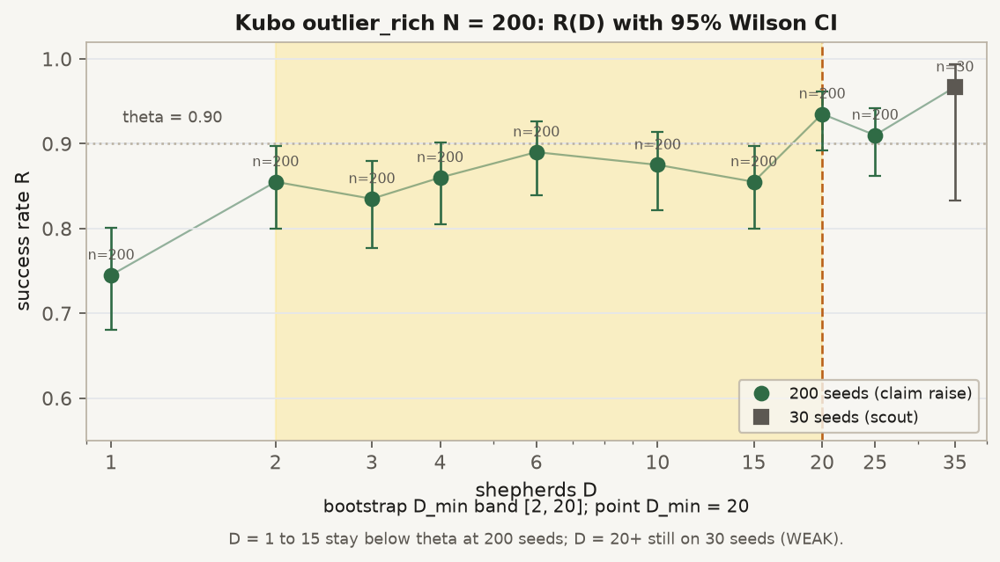

*R(D) with Wilson 95% intervals. Point D_min = 20 clears theta; after 200 seeds the bootstrap lower edge remains [2, 20].*

Meaning: R climbs through the teens and first clears 0.90 at D = 20 (R = 0.935), then stays above at D = 25 (0.910) and D = 35 (0.967 at scout depth 30). Several lower D sit near the bar, which is why the bootstrap interval stays wide even at 200 seeds. Treat `D_min = 20` as a point estimate with that uncertainty, not a sharp cliff.

**Limitations and non-claims**

- Shared compact `D_min` does not imply full transfer. Kubo failed the 90% criterion on every wide cell and shifted sharply at `outlier_rich`, `N=200`.
- The `[2, 20]` bootstrap interval makes the `D_min=20` boundary uncertain on its lower side.
- Hard failure on wide means no tested `D <= 35` reached the reliability threshold. It is not evidence that more dogs always make Kubo worse.
- Kubo ticks are not physically comparable with Strombom-family ticks because Kubo uses `dt` integration.
- HerdSim's bounded arena, spawn geometry, goal disk, and experiment counts are study choices, not claims about the paper's exact setup.

### `fat`

Sheep still use the Strombom sheep model, but dogs have a simpler rule. Each dog looks at the sheep it can see, picks the one farthest from itself, and stands behind that sheep toward the goal. Dogs do not switch Collect/Drive, and they do not actively space themselves apart.

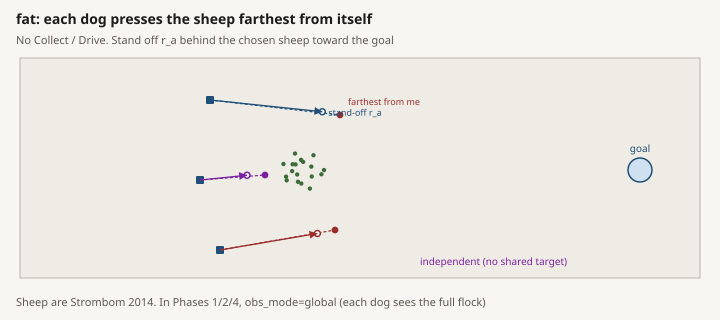

*Each dog independently presses the observed sheep farthest from itself; no Collect/Drive switch and no dog-dog spacing rule.*

**Published inspiration**

FAT is inspired by the local-camera shepherding rule discussed by Tsunoda et al. (2018): act on the farthest agent in the herder's visible set without requiring global flock coordinates.

HerdSim does not implement that paper's complete camera model, positional-error treatment, sheep dynamics, navigation law, or experimental calibration. The published contribution is therefore inspiration for target selection, not a claim of full model reproduction.

Ref paper.

**HerdSim implementation**

The `fat` method bundle combines:

- `sheep_model=strombom`
- `dog_controller=fat`
- 2 dogs by default outside experiment overrides.

Sheep therefore use HerdSim's Strombom grazing, flocking, repulsion, and fixed-displacement update. The dog controller has no Collect/Drive switch and no flock-cohesion test.

For each active dog on each tick:

- Read that dog's observation after observation-mode and sensing filters.
- If no sheep are visible, leave the dog stationary.
- Choose the observed sheep farthest from the dog itself.
- Place a target `r_a` behind that sheep on the ray from the goal through the sheep.
- Move toward that target at `shepherd_speed`, with Strombom angular noise.
- Stop if any sheep in the dog's working view is closer than `shepherd_stop_multiple * r_a`.

Each dog makes this choice independently. FAT has no dog-dog repulsion, assignment negotiation, or explicit spacing. "Farthest" means farthest from the dog, which differs from Strombom Collect (farthest from the flock center) and Kubo (farthest from the goal).

**Experiment scope**

FAT is an RQ4 transfer method on the [shared protocol](#5-shared-protocol) size and structure maps (global observation, staged scout/claim). No coordination is added by the FAT controller.

The global observation setting is important. Although the target-selection idea is motivated by local sensing, completed RQ2, RQ1, and RQ4 runs gave each FAT dog the full flock view. Those results do not test the local-camera information limit. RQ5 information ladders were run on the baseline only, not on FAT ([Information ladders](#13-information-ladders)).

**Results**

**Compact size map**

- `D_min=1` at `N=5` and `N=10`.
- For every tested `N>=25`, no dog count through 35 reached `R >= 0.90`.
- The latter cells are hard failures: `D_min` and `D_max` are undefined, not zero and not 35.
- Best reliability by size for `N=50` through 400 was about 0.40 to 0.53.
- About half of FAT size trials failed. The summary attributes about 39% of all trials to oscillation failures and 7% to stuck failures.


*Success-rate surface R(N, D) for `fat` on compact starts only.*

Meaning: only the smallest flocks show a high-R band (N = 5 and N = 10 reach theta at D = 1). For N >= 25 the surface stays below 0.90 across the whole D grid; best R by size for N = 50 through 400 is about 0.40 to 0.53, with some cells as low as about 0.17. Adding dogs does not paint a reliable band on this compact map.


*Where no D reaches theta, `D_min` is undefined (hard failure), not zero.*

Meaning: `D_min = 1` only at N = 5 and N = 10. For every larger N the frontier is empty (hard failure): there is no `D_min` and no `D_max` to plot as a collapse. That is the opposite of the baseline/Kubo compact floor.


*Finish time and path against dog count on the FAT compact size map.*

Meaning: cost curves on hard-failure sizes are not an efficiency story. Many runs never succeed, so path and time describe failed or mixed cells rather than a wasteful reliable band. Do not read rising path here as the same "waste after D_min" pattern used for Strombom and Kubo.


*How trials end on the FAT compact size claim merge (4,400 rows).*

Meaning: 2,206 failures (about half of trials). Labels are mostly oscillation (1,707; about 39% of all trials), then stuck (295; about 7%), then timeout (204). Failure mode is not "ran out of time only"; oscillation dominates.


*Regime labels on the 100 FAT size-by-dog cells.*

Meaning: 80 hard failure, 17 wasteful overspend, 3 efficient, 0 overcrowding. The map is dominated by cells that never reach theta, not by a long reliable waste band.

**Starting structure**

FAT did not reach 90% reliability in any structure cell at `N=50, 100, 200`.

- Compact best `R`: 0.47, 0.40, 0.47 for `N=50, 100, 200`.
- Split best `R`: 0.50, 0.47, 0.40.
- `outlier_rich` best `R`: 0.10, 0.00, 0.00.
- Wide best `R`: 0.00 at all three sizes.


*Success rate R(D) for each layout at the three structure sizes.*

Meaning: at N = 50, 100, and 200, every layout stays below theta for all tested D. Compact/split best R is about 0.40 to 0.50; `outlier_rich` and wide stay near 0 (especially at larger N). Structure does not rescue FAT here; the size-map hard failure continues across starts and sizes.


*Path (and related cost) by layout at one dog.*

Meaning: with R far below theta, these costs are mainly failed or unreliable runs. Layout ranking is secondary to the fact that no structure cell at these sizes clears the reliability bar.

The completed summary also reports a strong negative association between FAT trial interference and success on the size merge, with Pearson `r` about `-0.87`. This is observational. It does not establish interference as the cause of failure.


*Median mean I_dir on the FAT compact size map. Pearson r(I_dir, success) on that merge is about -0.87 (observational only).*

Meaning: FAT mean I_dir is much higher than baseline or Kubo on the size maps (about 0.40 overall at N = 100 versus about 0.05 and 0.10). The plot tracks interference against D; the association with failure is correlational only, so it is a candidate signature for later mechanism work, not a completed RQ3 contrast.

**Limitations and non-claims**

- This is a minimal HerdSim FAT controller on Strombom sheep, not the full Tsunoda et al. model.
- The completed results use global observations. They do not measure camera occlusion bearing-only control, position error, or lost-track recovery.
- Hard failure means no tested count reached the study's 90% bar before `T0`. It does not prove FAT can never work at larger `D`, under another timeout, or on another task.
- Increasing dog count did not rescue larger flocks on this grid. That observation does not isolate a causal mechanism.
- The interference correlation is not a controlled causal test.

---

## 8. Findings synthesis

### At a glance

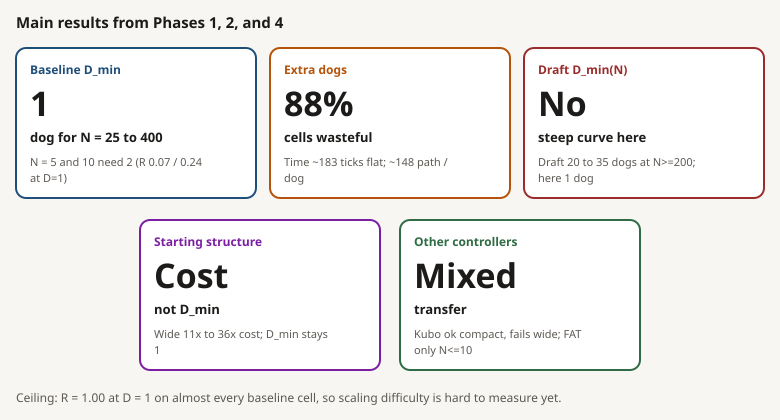

| Verdict | Finding | Key numbers |
|----------|----------------|-------------|
| Lower frontier (`D_min`) | On the baseline with a tight start, one dog is enough from 25 to 400 sheep. | Tiny flocks N = 5 and 10 need 2 dogs. At one dog their success rates are only about 0.07 and 0.24. |
| Upper frontier (more dogs) | Adding dogs past the minimum does not break success on that map; it mostly adds walking. `D_max = 35` is "top of our list," not a measured collapse. | 88 of 100 cells are wasteful; 0 overcrowding. Typical finish about 183 ticks; path per dog about 148 for N >= 25. |
| Structure is cost, not dog count | Messy starts make the run slower and longer, but still succeed with one dog on the baseline. | Wide starts take about 11x to 20x more time and 19x to 36x more path than compact at 1 dog. For wide, the cheapest reliable choice is 2 dogs (`B* = 2`). |
| Partial transfer | Kubo and FAT do not copy the baseline story everywhere. | Kubo looks like baseline on tight starts, but fails on wide starts (best R about 0.47 to 0.54). FAT hits 90% only for N <= 10. |
| Draft not reproduced | The draft's "large flocks need many dogs" pattern does not show up on this compact baseline map. | Draft: about 20 to 35 dogs for large N. Here: one dog finishes N = 400 in roughly 168 to 183 ticks. |
| Information (RQ5) | Local sensing (radius 65) works as well as a full view on compact N = 100 and 200. Other ladder steps did not test what they were meant to. | Local and global both have `D_min = 1`. Details in [section 13](#13-information-ladders). |
| Early warning (RQ7) | Not testable on this RQ2 size-map data. | At tick 1,000 (first check), almost every successful run has already finished. Details in [section 15](#15-prediction-and-early-warning). |

### Contrast with the 2025 draft


*Same broad question and 90% bar; different task, arena, and controller family. This is a contrast, not a matched replication.*

Smallest reliable dog count (`D_min`) on compact starts at the 90% bar:

| N | Baseline (`strombom_multi`) | Kubo | FAT | 2025 draft |
|---:|---:|---:|---:|---:|
| 5 | 2 | 3 | 1 | 1 |
| 10 | 2 | 1 | 1 | 1 |
| 25 | 1 | 1 | none <= 35 | 1 |
| 50 | 1 | 1 | none <= 35 | 1 |
| 100 | 1 | 1 | none <= 35 | 1 |
| 150 | 1 | 1 | none <= 35 | 3 |
| 200 | 1 | 1 | none <= 35 | 20 |
| 300 | 1 | 1 | none <= 35 | 20 |
| 400 | 1 | 1 | none <= 35 | 35 |

`none <= 35` means: no dog count we tested reached 90% success. On *this* protocol, the draft's "large N needs many dogs" story does not appear on the baseline compact size map.

### Baseline cost and regimes

Headline numbers are in [At a glance](#at-a-glance). Per-method plots are in [Methods and results](#7-methods-and-results). The figure below only compares frontiers across methods (and the draft):


*Baseline and Kubo stay near one dog for large compact flocks; the draft rises sharply. FAT has no D_min for N >= 25.*

### Upper frontier status

RQ2 also asks: if you *already* have enough dogs, does adding more still help, do nothing useful, or start to hurt? (Definitions: [Frontier, regimes, and failure labels](#frontier-regimes-and-failure-labels).) Inside our list through D = 35:

| Method | Compact `D_min` | Overcrowding? | What `D_max` means here | Do extra dogs hurt success? |
|--------|----------------:|---------------|-------------------------|-----------------------------|
| `strombom_multi` | 2 at N=5,10; else 1 | no | 35 = top of tested list | No: success stays high; extra dogs mainly walk more (waste) |
| `kubo` | 3 at N=5; else 1 | no | 35 = top of tested list | No on compact. Structure is different (wide fails; large outlier_rich needs many dogs) |
| `fat` | 1 only for N=5,10; undefined for N>=25 | no | undefined when nothing reaches 90% | Not an overcrowding story: large N never reaches 90% at any tested D |

So `D_max = 35` means "still OK at the largest D we tried," **not** "collapse begins at 35." Claim codes C2a / C2b and RQ3 status: [Answers from the runs](#4-answers-from-the-runs) and [Claims](#11-claims).

The only place in the program where success fell as dogs were added is in the RQ5 communication ladder (scout-grade N = 200, D = 10 under sharing). That is not counted as overcrowding; see [Information ladders](#13-information-ladders).

### Future work: measuring collapse beyond D = 35

Not run. This extension would allow more than 35 dogs and test whether success eventually falls (a real upper collapse), or whether path waste keeps rising without collapse.

| Question | Why it matters | How we would run it |
|----------------|------------|---------------------|
| After a good band, does success fall for some D > 35? | Turns "ceiling" into a measured collapse point | Extend the dog-count list past 35 on selected N |
| If success stays high, does path waste keep rising? | Shows a waste-only upper band even with many dogs | Same extended sweep; report path and regimes |
| Does a longer deadline (T1) rescue high-D failures at T0? | Separates "too slow" from "true overcrowding" | T1 only on candidate overcrowding cells |
| Do efficient and overcrowding cells differ in interference or splitting? | Unlocks RQ3 | Matched tests at the same N |
| Does that upper story transfer across methods? | RQ4 for the upper band | Repeat under Kubo / FAT (later `communication_free`) |

Another path without raising the dog cap: port the draft-style harder task and see whether overcrowding appears inside D <= 35 ([If we rerun a draft-style method](#if-we-rerun-a-draft-style-method)). Status: not scheduled; no claim-grade D > 35 cells in this report.

---

## 9. Cross-method transfer

Same grids and layouts. For each feature we ask: does it look like the baseline, shift, or disappear?

### Compact size map

| Case | What we see |
|------|-------------|
| Shared | Strombom and Kubo both need only 1 dog for N >= 25 (Kubo needs 3 at N = 5, then 1 from N = 10). |
| Absent (FAT) | For every N >= 25, FAT never reaches 90% success with any D <= 35. Best R is about 0.40 to 0.53. |
| Ceiling, not collapse | Strombom and Kubo: no overcrowding on compact starts; `D_max = 35` is the list ceiling ([Upper frontier](#upper-frontier-status)). |

### Structure map (`D_min` at theta 0.90)

| Layout | N | Strombom | Kubo | FAT |
|--------|---:|---:|---:|---:|
| compact | 50 | 1 | 1 | none (best R = 0.47) |
| compact | 100 | 1 | 1 | none (best R = 0.40) |
| compact | 200 | 1 | 1 | none (best R = 0.47) |
| split | 50 | 1 | 1 | none (best R = 0.50) |
| split | 100 | 1 | 1 | none (best R = 0.47) |
| split | 200 | 1 | 1 | none (best R = 0.40) |
| outlier_rich | 50 | 1 | 1 | none (best R = 0.10) |
| outlier_rich | 100 | 1 | 1 | none (best R = 0.00) |
| outlier_rich | 200 | 1 | 20 | none (best R = 0.00) |
| wide | 50 | 1 | none (best R = 0.49) | none (best R = 0.00) |
| wide | 100 | 1 | none (best R = 0.54) | none (best R = 0.00) |
| wide | 200 | 1 | none (best R = 0.47) | none (best R = 0.00) |

`none` means no dog count up to 35 reached 90% success.

Meaning: sharing `D_min = 1` on compact starts does **not** mean full transfer. Wide starts and large outlier-rich starts show method dependence. FAT clears no structure cell at these sizes. Kubo `outlier_rich`, N = 200 detail (point `D_min = 20`, bootstrap `[2, 20]`) is under [`kubo`](#kubo).


*Side-by-side success curves at N = 200 across methods and layouts. Per-method structure plots are in each method section above.*

---

## 10. Scaling fits

After we have `D_min` for each flock size, RQ6 asks which simple formula best predicts a left-out N.

On the baseline compact map, `D_min` is almost only two values: 2 for N = 5 and 10, and 1 for everything larger. Error below is leave-one-N-out RMSE (lower is better):

| Model | RMSE | Meaning |
|-------|-----:|---------------|
| Constant | 0.44 | Pretend one flat dog count |
| Linear | 0.44 | Straight line in N |
| Power law | 0.25 | Smooth curve on log-log axes |
| Piecewise | 0.13 | Two levels with a break near N = 10 |

The piecewise model wins because it matches that step, not because we measured a rich growth law. We cannot test "slope below 1 on a growth band" (C6b): there is no rising `D_min` band to fit. These fits are not a universal scaling law.


---

## 11. Claims

Verdicts use claim-grade evidence only. Labels:

- **SUPPORTED**: the stated condition holds inside this protocol
- **REJECTED**: we looked and it does not hold
- **INCONCLUSIVE**: we cannot decide (often the needed contrast is missing)
- **SKIPPED**: the trigger to run the test never appeared

Recorded verdicts match the [progress tracker](progress_tracker.md). Weight notes for C5 and C7 are in sections 13 and 15.

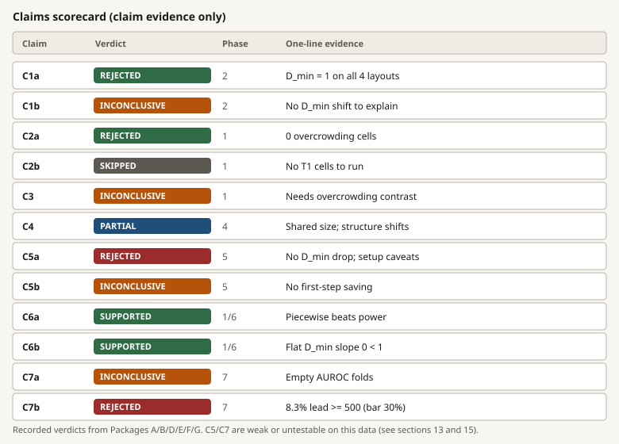

*Visual summary of claim verdicts. Detail in the table below.*

| Claim | RQ | Verdict | Evidence meaning |
|-------|----|---------|------------------|
| C1a | RQ1 | REJECTED | Baseline structure: `D_min=1` for all four layouts at N in `{50, 100, 200}`; bootstrap width 0. |
| C1b | RQ1 | INCONCLUSIVE | No baseline `D_min` shift across layouts, so state-vs-(N, D) predictor superiority is not evaluable. Cost still depends strongly on layout. |
| C2a | RQ2 | REJECTED | Baseline size map: 0 overcrowding cells at theta 0.90. |
| C2b | RQ2 | SKIPPED | No overcrowding cell to extend to T=20,000. |
| C3 | RQ3 | INCONCLUSIVE | Baseline mechanism contrast undefined without overcrowding cells. |
| C4 | RQ4 | SUPPORTED (partial) | Strombom and Kubo share compact `D_min` for N >= 25; FAT absent for N >= 25; Kubo wide absent; Kubo `outlier_rich`, N=200 shifts to point `D_min=20` with bootstrap `[2, 20]`. |
| C5a | RQ5 | REJECTED | Package E: no ladder step lowers a defined `D_min`; local/global both at 1; range and communication flat at 1; bearing-only hard-fails. Better read as weakly tested ([section 13](#13-information-ladders)). |
| C5b | RQ5 | INCONCLUSIVE | No first-step dog saving to compare (`median_first_step_delta = 0` on every ladder). |
| C6a | RQ6 | SUPPORTED | Leave-one-N-out RMSE: power 0.247 > piecewise 0.132; only two observed `D_min` levels. |
| C6b | RQ6 | SUPPORTED | Compact N in `{25..400}`: `D_min = 1` flat, so log-log slope = 0 (< 1). |
| C7a | RQ7 | INCONCLUSIVE | Package G: held-out AUROC could not be computed (folds empty). Untestable on this data ([section 15](#15-prediction-and-early-warning)). |
| C7b | RQ7 | REJECTED | Package G: 14 of 169 failures (8.3%) have lead time >= 500 (bar 30%). |

These checks only support statements inside the tested protocol. They do not support a universal law, an untested task, real-farm performance, or a dog-count difference smaller than one step on our D list.

---

## 12. Limits and threats

Limits of what this report can say:

| Limit | How we treat it |
|-------|-----------------|
| One simulated task | Results are for `drive_to_goal` under the frozen protocol only. |
| Method dependence | We check transfer (RQ4) before general claims; transfer is only partial. |
| Start shape can confuse size | We match N and use fixed layouts; on baseline, `D_min` did not move with layout. |
| Discrete dog-count list | We cannot resolve effects finer than one step on that list. |
| Soft reliability edges | Locked seeds, claim windows, bootstrap; raise to 200 seeds when uncertainty is wide. |
| Conditional analyses | If the trigger never appears, we mark skipped/inconclusive (not "proven null"). |
| Time across methods | Do not treat Kubo ticks as the same physical time as Strombom-family ticks. |
| Collect switch wider than the goal | Do not read a Strombom failure as "sheep could not pack into the goal." |
| Simulated controllers | No farm or biology validity claim. |
| Grid ceiling | `D_max = 35` is the top of our list, not a measured collapse ([Upper frontier](#upper-frontier-status); [Future work](#future-work-measuring-collapse-beyond-d--35)). |
| Easy compact map | Many baseline cells succeed at D = 1 with R near 1.00, so rising dog-count laws are hard to see. It also left little room for information to save dogs (RQ5) and few overlapping success/failure times for early warning (RQ7). |
| Split layout | Behaves like compact so far; the generator's separation still needs a hard check. |
| Interference correlation | FAT `I_dir` link to failure is observational, not a controlled cause test. |
| RQ5 setup | Bearing-only froze dogs; range settings had no effect under global observation; communication duplicated sheep lists. See [Information ladders](#13-information-ladders). |
| RQ7 timing | Warning checks start after almost every successful run has finished. See [Prediction and early warning](#15-prediction-and-early-warning). |

---

## 13. Information ladders

Status: **all six runs complete** (three scouts, three claims; 7,600 trials). Results below answer RQ5 only in a narrow way.

RQ5 asks whether better sensing can replace dogs while keeping the same reliability. We test three separate ladders (not every combination at once):

- **Observation content:** bearing only → local positions → global view
- **Sensing range:** 32.5, 65, 97.5, 130 (0.5x to 2x Strombom's `r_s` of 65)
- **Communication:** none → neighbour broadcast → global shared

All three ladders use `strombom_multi`, compact starts, N = 100 and 200, and the low dog band `{1, 2, 3, 4, 6, 10}`. Scout uses 30 seeds per cell; claim reseeds windows at 100 seeds.

### What the runs recorded

| Ladder | N = 100 | N = 200 | Package E summary |
|--------|---------|---------|-------------------|
| Observation | bearing only: hard failure; local: `D_min = 1`; global: `D_min = 1` | same | No defined `D_min` was lowered |
| Range | `D_min = 1` at all four ranges | same | `median_delta_dmin = 0` |
| Communication | `D_min = 1` for none, neighbour, and global sharing | same | `median_delta_dmin = 0` |

Tracker verdicts: C5a REJECTED, C5b INCONCLUSIVE. Three of the four comparisons did not test the intended factor (details below).

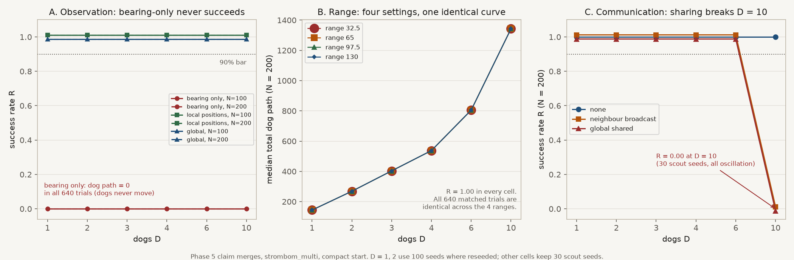

*A: success by observation mode. B: median dog path at N = 200 for four sensing ranges (curves coincide). C: success at N = 200 by communication mode.*

### Local positions vs global view

This comparison is clean. With dogs limited to sheep within 65 units, results match a full flock view: R = 1.00 in every cell, `D_min = 1` at both sizes, and median path within about 1%. On tight starts at these sizes, a local view costs nothing. It does not speak to wide or outlier-rich starts.

### Bearing-only, range, and communication caveats

- **Bearing-only:** all 640 claim-merge trials have dog path 0 (dogs never moved). Bearing-only input places synthetic sheep one unit away, so the Collect/Drive stop rule (`3 * r_a = 6`) always fires. This tests controller incompatibility, not information quality.
- **Sensing range:** range runs used default global observation, so range did not change what dogs saw; matched cells are identical across the four ranges.
- **Communication:** also under global observation. Sharing still changed behaviour (shorter paths at some D; all 30 scout runs failed at N = 200, D = 10 under sharing while `none` succeeded). Likely cause: shared sheep lists are stacked without de-duplication, so the controller can treat D copies of the flock. That D = 10 cell is scout-grade and a single-step drop, not overcrowding.

### What RQ5 does and does not tell us

- It shows local sensing matches global view on compact N = 100 and 200.
- It cannot show that better information saves dogs: the working configurations are already at `D_min = 1`, and the other steps had setup problems.
- C5a follows the written rule but is better read as weakly tested.

A fairer RQ5 rerun would pair range with `local_positions`, merge shared lists by sheep identity, use a bearing-aware controller, and preferably a layout or method where more than one dog is needed.

---

## 14. Outcomes and state metrics

What we record on each run:

- **Success:** did every sheep reach the goal in time? (yes/no)
- **Finish time (`t_s`):** first tick when that happens
- **Dog path:** total distance all dogs walked; also path per dog
- **Cohesion:** how tightly sheep sit around the flock centre
- **Fragmentation:** size of the largest connected sheep group, divided by N
- **Outliers / spread / extent / hull size / density / aspect ratio:** other shape summaries of the flock
- **`I_dir` (interference):** near 0 if dogs move the same way; near 1 if their headings cancel (push against each other)
- **Coverage:** fraction of outer sheep that sit within dog influence range

Technical notes: if no dog moves, `I_dir = 0`. Velocities include wall effects. Missing coverage radius yields NaN.


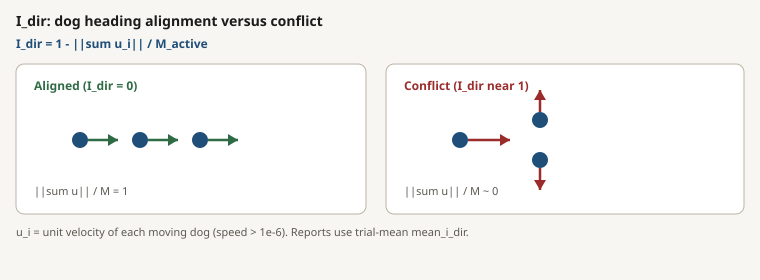

---

## 15. Prediction and early warning

Status: **run** (Package G on RQ2 size claim timeseries). Results exist but cannot answer RQ7 cleanly, for timing reasons.

RQ7 asks whether recent flock and dog state can warn that a run is about to fail, better than a baseline that knows only N and D. Setup (frozen in the plan): at check times from tick 1,000 to 8,000 in steps of 200, use only the last 200 ticks of state; predict failure within the next 500 ticks; leave-one-N-out versus an (N, D) baseline.

| Quantity | Value |
|----------|------:|
| Trials with timeseries | 2,200 |
| Failures | 169 |
| Held-out AUROC (state and N,D) | not computed |
| Leave-one-N-out folds | empty |
| Failures with measured lead time | 14 of 169 |
| Share with lead time >= 500 | 8.3% (bar: 30%) |

So C7a is INCONCLUSIVE and C7b is REJECTED.

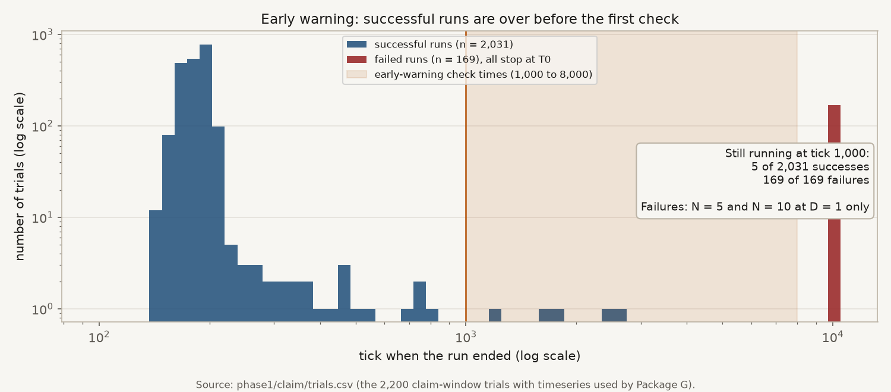

*Successful runs finish around 180 ticks; failures run to the 10,000-tick deadline. The shaded band is where warning checks happen.*

Successful runs finish in about 183 ticks (median); only 5 of 2,031 successes are still running at tick 1,000. All 169 failures are N = 5 or 10 with one dog and run to timeout. At every check time the remaining runs are almost all failures, so folds empty and long lead times are hard to interpret.

A fair RQ7 test needs failures and successes overlapping in time (harder layout or method, or earlier check times). With current RQ2 size-map data, RQ7 stays open.

---

## 16. Commands run

Simulation campaigns from the repo root (set `WORKERS` to match the host). Claim-plan steps are omitted; reseed targets use the existing window plans under `scaling/results/`.

```bash
# RQ2: baseline size map (strombom_multi, compact)
make -C scaling scaling-pilot WORKERS=16
make -C scaling scaling-scout WORKERS=16
make -C scaling scaling-claim-reseed WORKERS=16

# RQ1: baseline structure map
make -C scaling scaling-phase2-scout WORKERS=16
make -C scaling scaling-phase2-claim-reseed WORKERS=16

# RQ4: transfer size and structure (kubo, then fat)
make -C scaling scaling-transfer-size-scout TRANSFER_METHOD=kubo WORKERS=16
make -C scaling scaling-transfer-size-claim-reseed TRANSFER_METHOD=kubo WORKERS=16
make -C scaling scaling-transfer-structure-scout TRANSFER_METHOD=kubo WORKERS=16
make -C scaling scaling-transfer-structure-claim-reseed TRANSFER_METHOD=kubo WORKERS=16
make -C scaling scaling-transfer-size-scout TRANSFER_METHOD=fat WORKERS=16
make -C scaling scaling-transfer-size-claim-reseed TRANSFER_METHOD=fat WORKERS=16
make -C scaling scaling-transfer-structure-scout TRANSFER_METHOD=fat WORKERS=16
make -C scaling scaling-transfer-structure-claim-reseed TRANSFER_METHOD=fat WORKERS=16

# RQ5: observation, range, and communication ladders (scout then claim)
bash scaling/results/phase5/run_all_ladders.sh   # WORKERS=18
```
