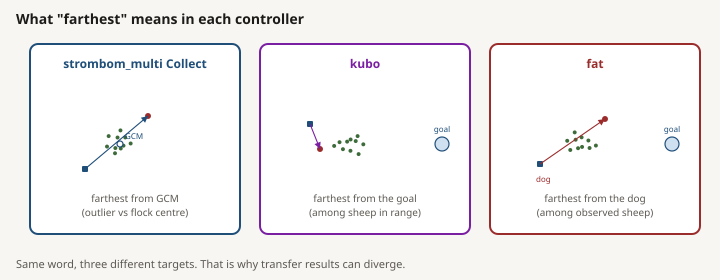

# Methods used in `scaling_v2`

This directory explains the three controller families evaluated in the completed scaling study. Each guide keeps four things separate:

1. the published idea that inspired the method;
2. the exact controller and sheep model implemented in HerdSim;
3. the frozen `scaling_v2` experiment setup;
4. the completed results observed under that setup.

That separation matters. The study compares simulated controllers on HerdSim's `drive_to_goal` task. It is not a reproduction of every experiment or numerical result in the cited papers.

## Guides

| Method guide | Published basis | HerdSim method used by `scaling_v2` |
|---|---|---|
| [Strombom Collect/Drive](strombom.md) | Strombom et al. (2014) | `strombom_multi`, not the single-shepherd `strombom` preset |
| [Kubo force model](kubo.md) | Kubo et al. (2022) | `kubo` |
| [FAT](fat.md) | Farthest visible agent idea from Tsunoda et al. (2018) | `fat`, with Strombom sheep |

Vietnamese versions are available in [README_vi.md](README_vi.md), [strombom_vi.md](strombom_vi.md), [kubo_vi.md](kubo_vi.md), and [fat_vi.md](fat_vi.md).

*Strombom Collect: farthest from the flock centre. Kubo: farthest from the goal. FAT: farthest from the dog.*

## Shared `scaling_v2` setup

All completed method comparisons use the same operational task and frontier definitions:

- task: place every sheep inside a goal disk before `T0 = 10000` ticks;
- arena: 500 by 500 continuous world units;
- flock center: `(250, 250)`;
- goal center: `(370, 250)`;
- goal radius: `15 * sqrt(N / 50)`;
- sheep counts: `{5, 10, 25, 50, 75, 100, 150, 200, 300, 400}` for size maps;
- dog counts: `{1, 2, 3, 4, 6, 10, 15, 20, 25, 35}`;
- structure counts: `N` in `{50, 100, 200}`;
- layouts: `compact`, `wide`, `split`, and `outlier_rich`;
- reliability: `R`, the fraction of independent seeds that succeed by `T0`;
- frontier: `D_min`, the smallest tested dog count with `R >= 0.90`;
- staging: 30 scout seeds across the full grid, then 100 claim seeds in selected windows, with the documented 200-seed exception for Kubo `outlier_rich`, `N = 200`.

The claim merge replaces scout rows on reseeded cells and retains scout rows elsewhere. A reported `D_max = 35` with no overcrowding is only the top of the tested dog grid, not a measured failure threshold.

Frozen configuration: [`../../configs/canonical_grid.yaml`](../../configs/canonical_grid.yaml).

## Completed evidence

The completed claim-grade comparisons are:

- baseline size and structure: `strombom_multi`, Phases 1 and 2;
- transfer size and structure: `kubo` and `fat`, Phase 4.

The main evidence is in:

- [`../../results/phase1/claim/`](../../results/phase1/claim/)
- [`../../results/phase2/claim/`](../../results/phase2/claim/)
- [`../../results/phase4/`](../../results/phase4/)
- [`../../results/summary/SUMMARY_REPORT.md`](../../results/summary/SUMMARY_REPORT.md)

Use the method guides for interpretation, but cite measured CSV files for numerical claims.

## Shared limits

- Results apply to one simulated task, one frozen geometry, one timeout, and one primary reliability threshold.
- Tick counts are not physically comparable between Kubo and Strombom-family methods because Kubo integrates velocity using `dt = 0.05`, while Strombom-family methods use fixed displacement per tick.
- The NetLogo registry contains twins for `strombom_multi` and `kubo`, but the completed report does not claim tick-for-tick parity or a published quantitative parity score.
- FAT has no registered NetLogo twin.
- No completed result establishes field performance, biological realism, or universal scaling laws.
