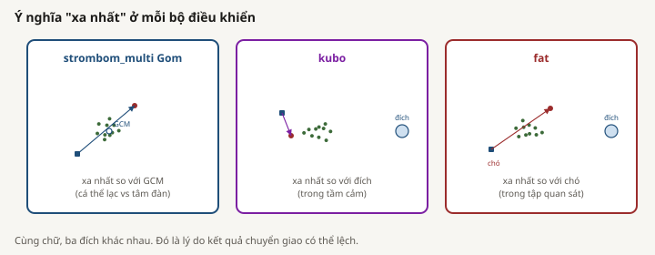

# Các phương pháp trong `scaling_v2`

Thư mục này giải thích ba họ bộ điều khiển đã được đánh giá trong nghiên cứu scaling đã hoàn tất. Mỗi hướng dẫn tách rõ bốn lớp:

1. ý tưởng đã công bố truyền cảm hứng cho phương pháp;
2. bộ điều khiển và mô hình cừu chính xác trong HerdSim;
3. thiết lập thí nghiệm đóng băng `scaling_v2`;
4. kết quả đã quan sát từ các lần chạy hoàn tất.

Việc tách các lớp này là cần thiết. Nghiên cứu so sánh các bộ điều khiển mô phỏng trên nhiệm vụ `drive_to_goal` của HerdSim. Nghiên cứu không tái tạo toàn bộ thí nghiệm hay kết quả định lượng của các bài báo được trích.

## Hướng dẫn

| Hướng dẫn | Cơ sở công bố | Phương pháp HerdSim trong `scaling_v2` |
|---|---|---|
| [Strombom Collect/Drive](strombom_vi.md) | Strombom và cộng sự (2014) | `strombom_multi`, không phải preset một người chăn `strombom` |
| [Mô hình lực Kubo](kubo_vi.md) | Kubo và cộng sự (2022) | `kubo` |
| [FAT](fat_vi.md) | Ý tưởng cá thể nhìn thấy xa nhất của Tsunoda và cộng sự (2018) | `fat`, dùng cừu Strombom |

Bản tiếng Anh: [README.md](README.md), [strombom.md](strombom.md), [kubo.md](kubo.md), và [fat.md](fat.md).

*Strombom Collect: xa nhất so với tâm đàn. Kubo: xa nhất so với đích. FAT: xa nhất so với chó.*

## Thiết lập chung của `scaling_v2`

Tất cả so sánh hoàn tất dùng cùng nhiệm vụ và định nghĩa biên:

- nhiệm vụ: đưa mọi con cừu vào đĩa đích trước `T0 = 10000` tick;
- sân: 500 x 500 đơn vị không gian liên tục;
- tâm đàn: `(250, 250)`;
- tâm đích: `(370, 250)`;
- bán kính đích: `15 * sqrt(N / 50)`;
- số cừu cho bản đồ kích thước: `{5, 10, 25, 50, 75, 100, 150, 200, 300, 400}`;
- số chó: `{1, 2, 3, 4, 6, 10, 15, 20, 25, 35}`;
- số cừu cho bản đồ cấu trúc: `N` trong `{50, 100, 200}`;
- bố cục: `compact`, `wide`, `split`, và `outlier_rich`;
- độ tin cậy: `R`, tỷ lệ seed độc lập thành công trước `T0`;
- biên: `D_min`, số chó nhỏ nhất đã thử có `R >= 0.90`;
- phân tầng: 30 seed scout trên toàn lưới, sau đó 100 seed claim trong cửa sổ đã chọn, với ngoại lệ 200 seed cho Kubo `outlier_rich`, `N = 200`.

Bản merge claim thay các dòng scout tại ô được chạy lại và giữ dòng scout ở các ô còn lại. `D_max = 35` khi không có overcrowding chỉ là đỉnh lưới đã thử, không phải ngưỡng thất bại đã đo.

Cấu hình đóng băng: [`../../configs/canonical_grid.yaml`](../../configs/canonical_grid.yaml).

## Bằng chứng hoàn tất

So sánh đạt cấp claim gồm:

- kích thước và cấu trúc cơ sở: `strombom_multi`, Giai đoạn 1 và 2;
- kích thước và cấu trúc chuyển giao: `kubo` và `fat`, Giai đoạn 4.

Bằng chứng chính:

- [`../../results/phase1/claim/`](../../results/phase1/claim/)
- [`../../results/phase2/claim/`](../../results/phase2/claim/)
- [`../../results/phase4/`](../../results/phase4/)
- [`../../results/summary/SUMMARY_REPORT_vi.md`](../../results/summary/SUMMARY_REPORT_vi.md)

Hướng dẫn phương pháp giúp diễn giải, nhưng kết luận định lượng nên trích CSV đã đo.

## Giới hạn chung

- Kết quả chỉ áp dụng cho một nhiệm vụ mô phỏng, một hình học đóng băng, một timeout, và một ngưỡng tin cậy chính.
- Không nên so sánh vật lý số tick giữa Kubo và họ Strombom. Kubo tích phân vận tốc với `dt = 0.05`, còn họ Strombom dịch chuyển cố định mỗi tick.
- Registry NetLogo có twin cho `strombom_multi` và `kubo`, nhưng báo cáo hoàn tất không khẳng định parity từng tick hay điểm parity định lượng đã công bố.
- FAT không có twin NetLogo trong registry.
- Không có kết quả hoàn tất nào chứng minh hiệu năng ngoài đồng, độ trung thực sinh học, hay quy luật scaling phổ quát.
